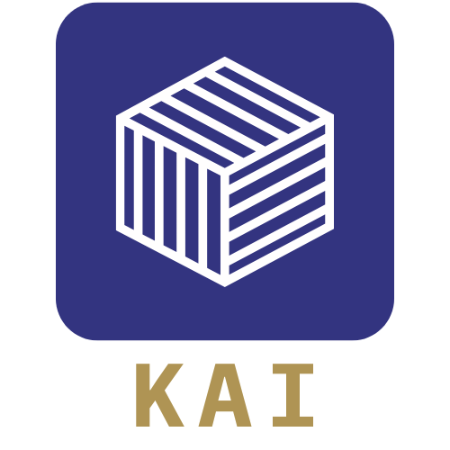

# Kai (Konveyor AI)

<!-- trunk-ignore-begin -->

  

<!-- trunk-ignore-end -->

 

Kai [(/kaɪ/, rhymes with pie)](https://www.howtopronounce.com/ka%C3%AC-4) - An
AI-enabled tool that simplifies the process of modernizing application source
code to a new platform. It uses **Large Language Models** (LLMs) guided by
**static code analysis**, along with **data from Konveyor**.

> **Looking for the Kai IDE extension?** Head to the
> [editor-extensions](https://github.com/konveyor/editor-extensions) repository
> for installation, configuration, usage instructions, and releases.
>
> This repository contains the **backend components and documentation** that
> support the IDE extension.

## For End Users

Install the Kai IDE extension from the
[editor-extensions releases](https://github.com/konveyor/editor-extensions/releases)
page and follow the
[extension README](https://github.com/konveyor/editor-extensions/blob/main/vscode/core/README.md)
for setup and usage.

Migration scenarios and walkthroughs are available in the
[docs/scenarios/](docs/scenarios/) directory.

## For Developers

See [CONTRIBUTING.md](CONTRIBUTING.md) for development setup, coding standards,
and how to submit pull requests.

### Repository Components

- **[`kai_mcp_solution_server/`](kai_mcp_solution_server/)** - MCP (Model
  Context Protocol) solution server for storing and retrieving solved migration
  examples. Self-contained Python project with its own `pyproject.toml`. See its
  [README](kai_mcp_solution_server/README.md) for details.

- **[`kai_analyzer_rpc/`](kai_analyzer_rpc/)** - Go-based analyzer RPC plugin
  that serves code analysis over RPC, used by the IDE extension.

## Conference Talks and Blog Posts

- 2025 April 01: [Project Lightning Talk: Revolutionizing Legacy Migrations with
  Konveyor AI - Jonah Sussman](https://kccnceu2025.sched.com/event/1tcwv)
- 2024 November 22: [Konveyor AI: supporting application
  modernization](https://www.cncf.io/blog/2024/11/22/konveyor-ai-supporting-application-modernization/)
- 2024 August 29: [Incident Storage in Kai - A Deep
  Dive](https://www.konveyor.io/blog/kai-incident-storage-2024/)
- 2024 July 23: [Embracing the Future of Application Modernization with
  KAI](https://shaaf.dev/post/2024-07-23-embracing-the-future-of-app-mod-with-konveyor-ai/)
- 2024 May 07: [Apply generative AI to app modernization with Konveyor
  AI](https://developers.redhat.com/articles/2024/05/07/modernize-apps-konveyor-ai)

## Contributing

Our project welcomes contributions from any member of our community. To get
started contributing, please see our [Contributor Guide](CONTRIBUTING.md).

## Code of Conduct

Refer to Konveyor's Code of Conduct
[here](https://github.com/konveyor/community/blob/main/CODE_OF_CONDUCT.md).

## License

This project is licensed under the Apache License 2.0 - see the
[LICENSE](LICENSE) file for details.
