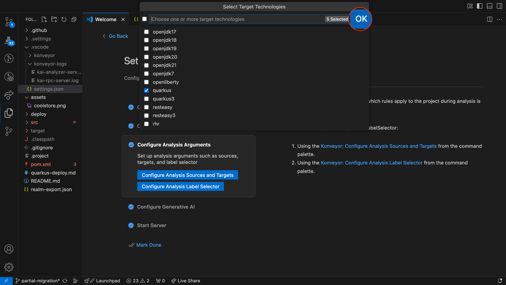

# Configuring the Kai-IDE Plugin

## Running Kai RPC server

1. Users will land on the welcome page after installation as shown below. If the Welcome Page does not appear, proceed to the step 2.
   
   If "Set up Konveyor" is not available in the list, click the More button for additional options.
   
2. If the welcome page does not appear, open the command palette by pressing Command + Shift + P. This will bring up a list of commands.
   
   From the command palette, locate and select the "Set up Konveyor" option. This will guide you through the configuration process.
   
3. Configure Konveyor for your project.
   - User has an option to override binaries and custom rules, however it comes with the default packaged binaries and custom rules.
     
   - The Konveyor extension allows you to add custom rules to the analyzer. This is useful when you want to apply your own rules during analysis.
   - Configuring analysis arguments is necessary to determine which rules apply to the project during analysis. Set up analysis arguments specific to your project by selecting the appropriate options and pressing "OK" or "Enter" to save the changes.
     - To confirm your arguments, navigate to your project directory and open `/.vscode/settings.json`.
       
   - Next, set up the Generative AI key for your project. This step will open the `provider-settings.yaml` file. By default, it is configured to use OpenAI. To change the model, update the anchor `&active` to the desired block. Modify this file with the required arguments, such as the model and API key, to complete the setup. Sample of the `provider-settings.yaml` can be found [here.](https://github.com/konveyor/editor-extensions/blob/main/vscode/resources/sample-provider-settings.yaml)
4. Once the configuration is done, click on start server button. Logs are collected at output channel named konveyor-analyzer.
   

## Advanced Configuration

To navigate to **Advanced Settings**, open:  
**Settings** > **Settings...** > **Settings**

This will bring you to the screen shown below.  
 

### Understanding the Settings

#### **Log Level**

Defines the logging level for server binaries. Logs can be found in your project directory under `/.vscode/konveyor-logs`. The verbosity of event logs can be increased or decreased using this option.

#### **Kai RPC Server Path**

Allows the user to specify a custom binary path. If not provided, the default binary will be used.

#### **Analyzer Path**

Allows the user to specify a custom analyzer binary path. If not provided, the default analyzer binary will be used.

### **Analysis Settings**

- **Use Default Rulesets**: Users can choose to **disable bundled rulesets** and customize them instead.
- **Custom Rules**: Allows users to define **custom rules** for more personalized analysis results.
- **Label Selector**: Defines source and target technologies to flag relevant incidents.
- **Analyze on Save**: Enables real-time analysis upon saving a file. Users can disable this feature if needed.
- **Analyzer Dependencies**: Kai can analyze dependency-related errors detected in LLM-generated responses.
- **Analyzer Known Libraries**: Allows Kai to analyze well-known open-source libraries.
- **Code Snippet Limit**: Sets the maximum number of code lines included in incident reports.
- **Context Lines**: Defines the number of context lines included in incident reports, which improves LLM accuracy.
- **Incident Limit**: Specifies the **maximum number of incidents** to be reported.

### **Diff Editor Type**

Allows users to change the **diff editor view** when resolving proposed solutions.

### **Kai Settings**

- **Get Solution Max Effort**: Defines the effort level for generating solutions. This can be adjusted depending on the type of incidents. Higher values **increase processing time**.
- **Get Solution Max LLM Queries**: Specifies the **maximum number of LLM queries** made per solution request.
- **Get Solution Max Priority**: Determines the **maximum priority level** of issues to be considered in a solution request.
- **Cache Directory**: Path to a directory containing **cached responses**.
- **Demo Mode**: Enables Kai’s **demo mode**, which uses cached LLM responses for learning and testing functionality.
- **Trace Enabled**: Enables tracing of communication with the model. If enabled, traces will be stored under `/.vscode/konveyor-logs/traces`.

### **Logging Settings**

- **Trace Message Connection**: Enables tracing of JSON-RPC calls between the extension and the Kai server.
