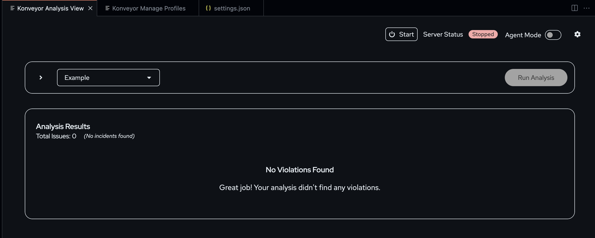

# Configuring the Kai-IDE Plugin

You can configure two kinds of settings: profile configurations that are mandatory to run multiple analyses and Kai settings in the VS Code that is common for all analyses you perform.

For running an analysis, you must configure a profile that contains reusable configurations and start the RPC server.

## Running Kai RPC server

1. Users will land on the following page after installing Kai extension as shown below. 
   
2.  Open the `Konveyor View Analysis` page. You can either click the screen icon on the `Konveyor Issues` pane or type `Ctrl + Shift + P` to open the Command Palette and enter `Konveyor:Open Konveyor Analysis View`.
   
3. To configure a Kai profile for your project, click the settings button on the `Konveyor View Analysis` page. The `Get Ready to Analyze` pane has the basic configurations required for an analysis. All configurations can be edited on the Profile Manager page.
   
   - Create a profile that you can reuse for multiple analyses. The profile name is part of the context provided to the LLM for analysis. 
   - Configuring analysis arguments such as source or target technologies is necessary to determine which rules apply to the project during analysis. If you want to use a custom rule that specifies a label for a new source or a target technology, you can enter the same label to create the source/target technology for Kai.
   - User has an option to enable default rules and select custom rules. The Konveyor extension allows you to add custom rules to the analyzer. This is useful when you want to apply your own rules during analysis.
   - Next, set up the Generative AI key for your project. This step will open the `provider-settings.yaml` file. By default, Kai is configured to use OpenAI. To change the model, update the anchor `&active` to the desired block. Modify this file with the required arguments, such as the model and API key, to complete the setup. Sample of the `provider-settings.yaml` can be found [here.](https://github.com/konveyor/editor-extensions/blob/main/vscode/resources/sample-provider-settings.yaml)
4. Once the profile configuration is done, close the `Get Ready to Analyze` pane, select the profile from the dropdown, and click the start server button. Logs are collected at output channel named konveyor-analyzer.
   

## Advanced Kai Configuration

To navigate to **Kai Settings**, open:  
**Extensions** > **Konveyor AI Extension for VSCode** > **Settings**

This will bring you to the screen shown below.  
 

### Understanding the Settings

#### **Log Level**

Defines the logging level for server binaries. Logs can be found in your project directory under `/.vscode/konveyor-logs`. The verbosity of event logs can be increased or decreased using this option.

#### **Kai RPC Server Path**

Allows the user to specify a custom binary path. If not provided, the default binary will be used.

#### **Analyzer Path**

Allows the user to specify a custom analyzer binary path. If not provided, the default analyzer binary will be used.

### **Solution Server Settings**

 - **Solution Server:URL**: Allows you to set the MCP solution server URL. 
 - **Solution Server:Enabled**: The MCP solution server is enabled by default. This setting uses Retrieval Augmented Generation to analyze and discover issues in the code and suggest fixes.

### **Analysis Settings**

- **Use Default Rulesets**: Users can choose to **disable bundled rulesets** and customize them instead.
- **Custom Rules**: Allows users to define **custom rules** for more personalized analysis results.
- **Label Selector**: Defines source and target technologies to flag relevant incidents.
- **Analyze on Save**: Enables real-time analysis upon saving a file. Users can disable this feature if needed.
- **Analyzer Dependencies**: Kai can analyze dependency-related errors detected in LLM-generated responses.
- **Analyzer Known Libraries**: Allows Kai to analyze well-known open-source libraries.
- **Code Snippet Limit**: Sets the maximum number of code lines included in incident reports.
- **Context Lines**: Defines the number of context lines included in incident reports, which improves LLM accuracy.
- **Incident Limit**: Specifies the **maximum number of incidents** to be reported.

### **Diff Editor Type**

Allows users to change the **diff editor view** by selecting the diff or the merge view when resolving proposed solutions.

### **Kai Settings**

- **Agent mode**: Enable the agent mode to run automated Kai analysis that shares the reasoning, the files to be changed, and the fix suggestions. When you accept the suggestions, Kai updates the code and reruns the analysis to fix more issues that may include diagnostic issues triggered by the tools you installed in the IDE.
- **Super agent mode**:
- **Excluded diagnostic resources**: The resources that must be excluded from the automated agentic AI analysis. You can include such resources in the settings.json file.
- **Get Solution Max Effort**: Defines the effort level for generating solutions. This can be adjusted depending on the type of incidents. Higher values **increase processing time**.
- **Get Solution Max LLM Queries**: Specifies the **maximum number of LLM queries** made per solution request.
- **Get Solution Max Priority**: Determines the **maximum priority level** of issues to be considered in a solution request.
- **Cache Directory**: Path to a directory containing **cached responses**.
- **Demo Mode**: Enables Kai’s **demo mode**, which uses cached LLM responses for learning and testing functionality.
- **Trace Enabled**: Enables tracing of communication with the model. If enabled, traces will be stored under `/.vscode/konveyor-logs/traces`.

### **Debug Webview**

Enables debug level logging for Webview message handling in VS Code. 

<!-- - **Trace Message Connection**: Enables tracing of JSON-RPC calls between the extension and the Kai server. -->
