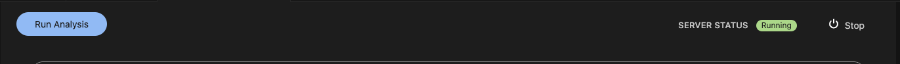
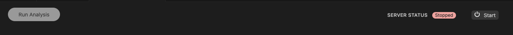
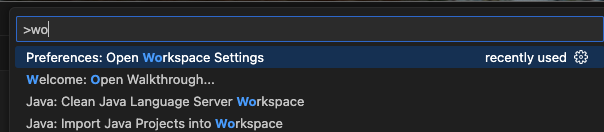
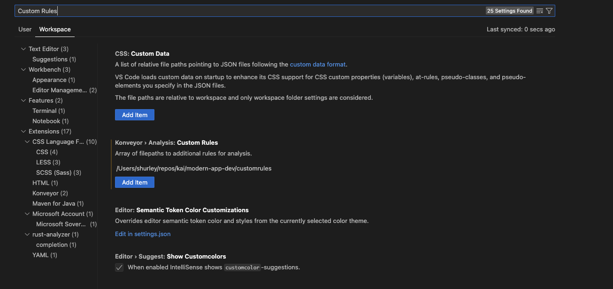
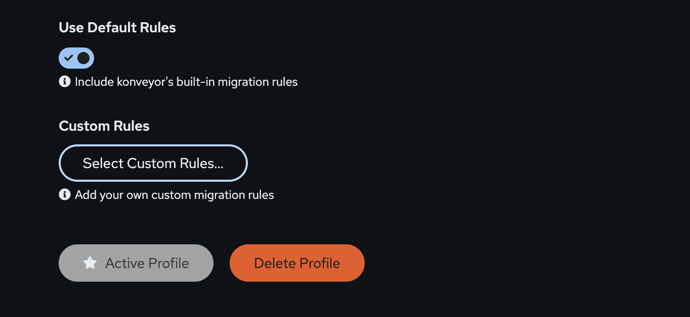

# Custom Rules Integration

When you have written custom rules and would like to add them to your issues to be solved by Kai's reactive code plan you will need to take a few steps to make this work.

## Steps to Add Custom Rulesets

### Stop the Running Server

If the server is running you will need to stop it. To see if the server is running.

You will need to click the `Stop` button here and see the server is not running.

Once the server is stopped, you can move on to the next step.

### Adding Custom Rulesets

To add your custom rulesets, you will need to have a directory, containing `ruleset.yaml` and the subsequent rule files. You can find good examples of that [here](https://github.com/konveyor/rulesets/tree/main/default/generated) as well as docs around [rules and rulesets](https://github.com/konveyor/analyzer-lsp/blob/main/docs/rules.md).

> [!IMPORTANT]
> For the next example of how to add, we will assume a ruleset at `/Users/user/rulesets/custom-ruleset` you will need to change this to point to your ruleset directory.

First you will need to open up the settings for the workspace. you can do this with `CMD + SHIFT + P` on mac and `CTRL + SHIFT + P` on Windows and Linux.

Next, search for the custom rules and find the `Konveyor > Analysis: Custom Rules` setting option.

Then you can click `Add Item` and enter in your path, we will use the example path.

Once you click ok the ruleset is added!

### Running Analysis

Now you will have to go back to the `Konveyor` view and start the server.

You can now click Run Analysis and your custom ruleset will be used.

> [!WARNING]
> You will need to make sure that the rules or rulesets have a target or source label that is selected. If the ruleset does not match a selected target or source, it will be filtered out and skipped.
