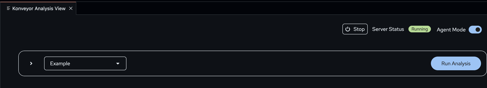

# Custom Rules Integration

When you have written custom rules and would like to add them to your issues to be solved by Kai's reactive code plan you will need to take a few steps to make this work.

## Steps to Add Custom Rulesets

### Stop the Running Server

If the server is running you will need to stop it. To see if the server is running.



You will need to click the `Stop` button here and see the server is not running.


Once the server is stopped, you can move on to the next step.

### Adding Custom Rulesets

To add your custom rulesets, you will need to have a directory, containing `ruleset.yaml` and the subsequent rule files. You can find good examples of that [here](https://github.com/konveyor/rulesets/tree/main/default/generated) as well as docs around [rules and rulesets](https://github.com/konveyor/analyzer-lsp/blob/main/docs/rules.md).

> [!IMPORTANT]
> For the next example of how to add, we will assume a ruleset at `/Users/user/rulesets/custom-ruleset` you will need to change this to point to your ruleset directory.

First you will need to open up the settings for the workspace. you can do this with `CMD + SHIFT + P` on mac and `CTRL + SHIFT + P` on Windows and Linux.


Next, search for the custom rules and find the `Konveyor > Analysis: Custom Rules` setting option.


Then you can click `Add Item` and enter in your path, we will use the example path.


Once you click `OK` the ruleset is added!

### Running Analysis

Now you will have to go back to the `Konveyor` view and start the server.


You can now click `Run Analysis` and your custom ruleset will be used.

> [!WARNING]
> You will need to make sure that the rules or rulesets have a target or source label that is selected. If the ruleset does not match a selected target or source, it will be filtered out and skipped.

## Creating Rules and Rulesets

### Creating Rules

To create your own rules, first you need to know of a change that must happen to complete a migration. This could be because of a framework or library that you are using (either an internal one or external/open source one). For this section, I am going to create a rule and ruleset for an open source framework but the process should be similar for any custom rule.

#### Finding A Rule

To find a place for a rule, we are going to look at the release notes of the quarkus framework. If we see the [section](https://github.com/quarkusio/quarkus/wiki/Migration-Guide-3.18#kubernetes-client-fabric8) here. If we follow this to the migration guide for this dependency, we can see this [section](https://github.com/fabric8io/kubernetes-client/blob/main/doc/MIGRATION-v7.md#kubernetes-model-artifact-removed-).

> The Maven artifact io.fabric8:kubernetes-model has been removed from the project and is no longer published.
> This artifact was just an aggregator of some of the Kubernetes model artifacts and had no specific purpose. It is no longer published, the io.fabric8:kubernetes-client-api or io.fabric8:kubernetes-openshift-uberjar artifacts should be used instead.

So for this, we will need to make sure that if the dependency `io.fabric8:kubernetes-model` is being used, that we alert the user, and tell them what they should be using instead.

#### Creating a Rule

Now we need to look up the rules and what the java provider can do. The [rules](https://github.com/konveyor/analyzer-lsp/blob/main/docs/rules.md#rule-metadata) documentation states that we will need to set up the metadata first. In this case, we will use the below yaml for this.

```yaml
- ruleID: "fabric8-remove-kubernetes-model-00001"
  labels:
    - "konveyor.io/target=quarkus"
  effort: 1
  category: mandatory
```

Next, we will add a description. This description is going to be used by the front end to show the user what the issue entails, I think that the migration docs do a good job of describing this, so we can just use what they have.

```yaml
description: |
  The Maven artifact io.fabric8:kubernetes-model has been removed from the project and is no longer published.

  This artifact was just an aggregator of some of the Kubernetes model artifacts and had no specific purpose. It is no longer published, the io.fabric8:kubernetes-client-api or io.fabric8:kubernetes-openshift-uberjar artifacts should be used instead."
```

Next we need to decide what `Action` to take. The [actions](https://github.com/konveyor/analyzer-lsp/blob/main/docs/rules.md#rule-actions) are very useful but it worth noting that for KAI, the only action that will be used, is message.

> [!WARNING]
> If you use only the tag action, or if you don't set effort, then the rule's violations will not be used by kai.

We need to note, that the message is used by the LLM to generate a fix for the issue. In this case, I still think the migration guide docs do a good job.

> [!NOTE]
> This process may require some iteration to determine the optimal message for generating the fix that you want for your issue and model.

```yaml
  message: |
  	The Maven artifact io.fabric8:kubernetes-model has been removed from the project and is no longer published.

  	This artifact was just an aggregator of some of the Kubernetes model artifacts and had no specific purpose. It is no longer published, the io.fabric8:kubernetes-client-api or io.fabric8:kubernetes-openshift-uberjar artifacts should be used instead."
```

Now that we have all the information captured in our rule for using it in kai, we need to add when this should be triggered. This is the `when` clause for a rule. We usually call these [conditions](https://github.com/konveyor/analyzer-lsp/blob/main/docs/rules.md#rule-conditions), you can do a lot of different things here based on providers. Today in kai, we only have two providers, the java and builtin providers.

For this issue, we are looking at dependencies, and so we will choose to the use the `java.dependency` [capability](https://github.com/konveyor/analyzer-lsp/blob/main/docs/rules.md#provider-condition).

```yaml
  when:
  	java.dependency:
  		name: io.fabric8.kubernetes-model
```

Now, we should save this file in a directory for this ruleset, and we will need to create a ruleset.yaml in the same directory.

Creating the [ruleset.yaml](https://github.com/konveyor/analyzer-lsp/blob/main/docs/rules.md#ruleset) is a special file that will help group these rules together to help manage them easier. For this rule we will use this ruleset.

```yaml
name: quarkus-3-18
description: These rules are created from the 3.18 migration guide.
labels:
  - "konveyor.io/target=quarkus"
```

This full rule should now be usable, you can see it [here](./custom-ruleset-example), with the ruleset.yaml that would be needed. To use this ruleset, now follow the [adding custom rules](#steps-to-add-custom-rulesets) section to use this ruleset!
