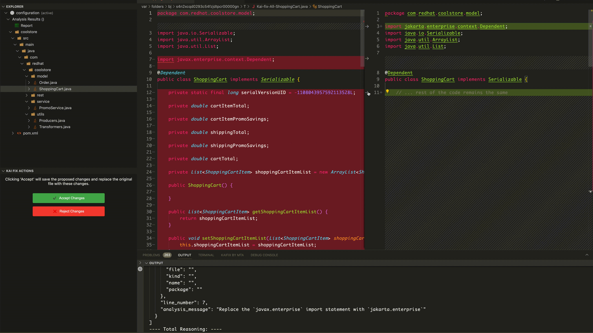

# Kai Demo

Konveyor AI (kai) is Konveyor's approach to easing modernization of application source code to a new target by leveraging LLMs with guidance from static code analysis augmented with data in Konveyor that helps to learn how an Organization solved a similar problem in the past (Source: https://github.com/konveyor-ecosystem/kai/blob/main/README.md)

In this demo, we are going to migrate a partially migrated JavaEE application to Quarkus, and deploy it in OpenShift

## Pre-req

- Podman
- VSCode
- Git
- OpenShift cluster
- GenAI credentials
- mvn
- Quarkus 3.10

## Step 1: Setup

- Follow along the steps listed in [here](https://github.com/konveyor-ecosystem/kai/tree/main/ide) to intergrate Kai IDE plugin with VSCode.

- Before starting the Kai server, Select model `mistralai/mistral-7b-instruct-v0-2` by adding this to `kai/config.toml` file

```yaml
provider = "IBMOpenSource"
args = { model_id = "mistralai/mistral-7b-instruct-v0-2" }
```

## Step 2: Demo

In this demo, we will be migrating few files as shown below,

- `src/main/java/com/redhat/coolstore/model/Order.java`
- `src/main/java/com/redhat/coolstore/model/ShoppingCart.java`
- `src/main/java/com/redhat/coolstore/service/PromoService.java`

### 2.1 Get the coolstore app

1. Clone the coolstore demo repo -
   `git clone https://github.com/savitharaghunathan/coolstore.git`

2. Checkout the partially migrated branch -
   `git checkout mig`

### 2.2 Run Analysis

1. Open VSCode and load coolstore project if it is not already loaded.
2. Follow steps from 1 through 4 from https://github.com/konveyor-ecosystem/kai/tree/main/ide#usage-summary
3. Once the analysis is complete you will see incidents listed on the following files

   - `src/main/java/com/redhat/coolstore/model/Order.java`
   - `src/main/java/com/redhat/coolstore/model/ShoppingCart.java`
   - `src/main/java/com/redhat/coolstore/service/PromoService.java`

4. Right Click on the `src/main/java/com/redhat/coolstore/model/Order.java` and select `Kai Fix-All`.

   - Note: Sometimes, the output will have comments that says "code remains the same" or something similar. In that case, please make sure to click on `->` to make sure the target file is correct.
     
   - Accept the changes.
     

5. Repeat step 4 for `src/main/java/com/redhat/coolstore/model/ShoppingCart.java` and `src/main/java/com/redhat/coolstore/service/PromoService.java`

### 2.3 Deploy app to OpenShift

Now, its time to deploy the coolstore quarkus app on OpenShift cluster.

- Make sure you can access the cluster from your terminal
- Navigate to the coolstore project folder
- Deploy a postgres container

```bash
oc new-app -e POSTGRESQL_USER=quarkus \
            -e POSTGRESQL_PASSWORD=quarkus \
            -e POSTGRESQL_DATABASE=coolstore \
            openshift/postgresql:latest \
            --name=coolstore-database
```

- Once the postgres container is deployed, deploy the coolstore app using the following command

```mvn
mvn clean compile package -Dquarkus.kubernetes.deploy=true
```


