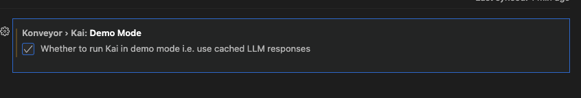

# Demo Mode

There may be times when you have to give a demo of Kai in a restricted network setting. This could be because you don't have access to LLMs, the network will be too slow to contact them, or you don't want to wait for the LLM while showcasing what Kai can do for you!

If this situation sounds familiar, we will walk through how to set up demo mode, which will allow you to cache the LLM responses and replay them as you go through the workflow to solve issues in a code base.

## Enabling Demo Mode

Demo Mode consists of two parts. The first part is the cache, where we store all the LLM calls. We use a hash of input data to determine when to re-use a particular LLM call. This cache can be stored anywhere on your filesystem for later use.

> [!NOTE]
> This uses the model you have selected to segregate the cached responses. If you change the model configuration, you cannot use the cache generated for a different model.

The second part is the Demo Mode setting you will need to enable. This will tell Kai to look at the cache for a matching LLM call and use what is there.

You will need both configured to use demo mode to use the cache responses from the LLM.

### Configure Cache Directory

To configure the cache directory, you will need to open up the settings panel.

Once here, search for `kai.cached` and find and click the `Edit in settings.json` link.

Now, you will need to add the path you would like to use for the cache to the JSON dictionary.

The key to use is `konveyor.kai.cacheDir`, and the value is an absolute path to a location on your hard drive. In the example, I am putting the cache to `/Users/shurley/repos/kai/cache,` but you can change this to wherever you would like to store it.

### Configure Demo Mode

To configure demo mode, you must open the settings panel again.
See the first step [here](#configure-cache-directory) if needed.

Now, you will search for `kai.demo` and find the setting for demo mode.

Select the checkbox if it is not already selected, and you should be all set!

## Seeding Demo Mode

Now that you have configured demo mode, you can use Kai to generate the fixes you want to show in your demo!

> [!WARNING]
> Once you have done this, solve the same incidents and issues in the same file in order. If you fix incidents in the same file in a different order, the hash of the input will be different, and you will not find the call in the cache.
