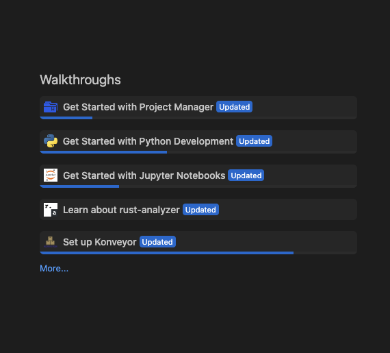
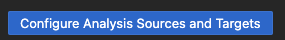
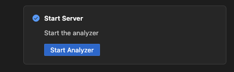
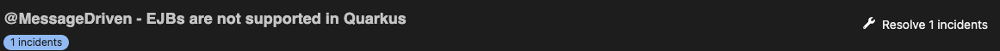

# Getting Started

- [Getting Started](#getting-started)
  - [Overview](#overview)
  - [Installation](#installation)
  - [Configuration](#configuration)
  - [Start](#starting-the-server)
  - [Usage](#usage)

## Overview

Running Kai consists of:

1. Installing the Kai VSCode extension
1. Configuring Kai for your desired use case
1. Running analysis and accepting/rejecting generated code fixes

## Installation

See the [installation guide](./installation.md) for details on installing the
IDE extension.

## Configuration

Once the VSCode extension is installed, you are presented with the "Set up
Konveyor" page. This page is where you as a user can configure Kai to suit your
needs. This page can also be accessed by clicking "Help"->"Welcome" and finding
"Set up Konveyor" in the "Walkthroughs" section.

### Options

All of the following settings can be configured via the setup page or via
modifying `settings.json`. For more details; see [configuration](./contrib/configuration.md) for a full list of
available settings.

#### Override Analyzer Binary

This allows you as a user to configure custom analyzer and Kai binaries as
opposed to the default packaged ones. This shouldn't be necessary for most
users. This can be useful for testing changes, please see the [contributing guide](contrib/dev_environment.md) for more information.

#### Configure Custom Rules

This allows you as a user to configure custom rules for the Konveyor analyzer
to use when running static code analysis. This can be done by selecting a
directory where these rules exist.

For information on creating custom rules you can see the [documentation](https://github.com/konveyor/analyzer-lsp/blob/main/docs/rules.md#rules)

#### Configure Analysis Arguments

This allows you as a user to define the sources and targets for static code
analysis.

These are mutually exclusive options, you should select one or the other.

Sources and Targets are special [labels](https://github.com/konveyor/analyzer-lsp/blob/main/docs/labels.md#labels). Selecting the sources and targets will generate the label selector for you.

> [!NOTE]
> These source and target labels are only coming from the [default rulesets](https://github.com/konveyor/analyzer-lsp/blob/main/docs/labels.md#labels). If you want to use custom labels you must create the label selector manually.

To use this option click

If you need/want to specify the label selector manually, you as a user can define a specific label selector to
use when querying the rulesets.

To understand the label selector syntax see the [documentation](https://github.com/konveyor/analyzer-lsp/blob/main/docs/labels.md#rule-label-selector)

To use this option click

#### Configure Generative AI

This is where you set up the model configuration for kai to use. To see more information about this see the [llm selection](./llm_selection.md) documentation.

## Starting the server

Click "Start Analyzer" to launch the RPC server. You can then click "Mark Done"
to close the setup page.

## Usage

Now that Kai is installed and started, using the extension consists of running
static code analysis and generating code fixes. Once analysis is performed, you
are presented with a list of violations and their associated incidents. Kai
currently allows the user to generate code fixes based on incidents.

### Running analysis

To start, the analysis view allows you to run a full analysis of the codebase
based on the prior configured analysis arguments. After analysis completes, you
will see violations and incidents generated as a result. On the left side of
the extension, you will see a tree view of these incidents and the files where
those incidents are present.

### Generating fixes

Now that you have violations from analysis, you will want to begin generating
code fixes based on these incidents. This can be done by selecting the `Resolve Incident` button. You can choose to resolve any number of incidents at a time by clicking the button associated with the number.

You can see more details if there are more than one incident by expanding the row. Here you will have more options for resolving incidents.

Once the fix is generated, you will be presented with a list of files that
would be changed, and you are given the option to view, accept, or reject those
changes. You can view this from an in-view diff editor via the analysis view,
or from the _Konveyor Resolutions_ tab. When these changes are accepted, the changes will be reflected in the source code
directly. Anytime a change is accepted, Kai will automatically rerun a partial
analysis of the codebase that has changed to update whether an incident was
resolved.

## Guided Scenario

Now that you understand how to get started with Kai, we suggest running through
a [guided scenario](./scenarios/README.md) to get a better idea of how Kai can assist
with the migration of an application.
