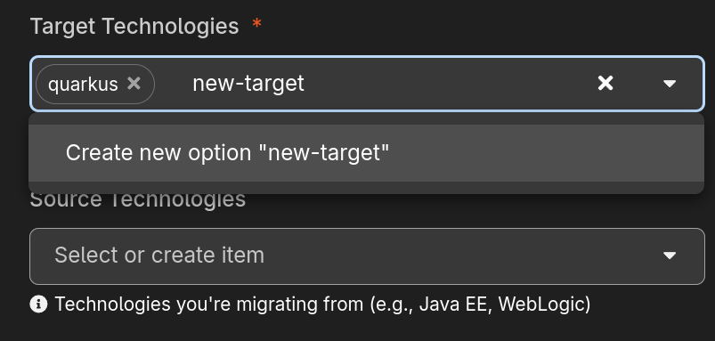
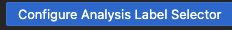
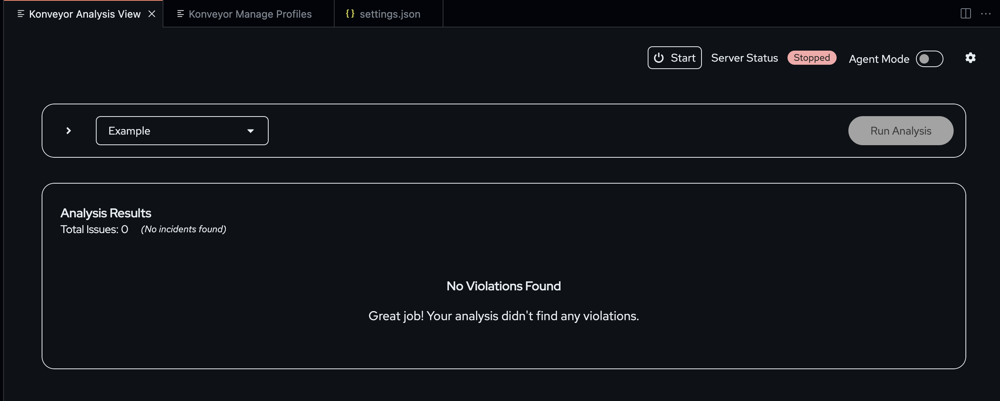
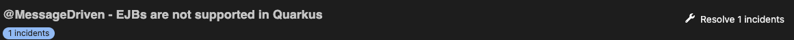

# Getting Started

- [Getting Started](#getting-started)
  - [Overview](#overview)
  - [Installation](#installation)
  - [Configuration](#configuration)
  - [Start](#starting-the-server)
  - [Usage](#usage)

## Overview

Before you install Kai, you must:

- Create an API key for an LLM model.
  - Supported LLM providers: **OpenAI**, Amazon Bedrock, **Azure OpenAI**, DeepSeek, Google Gemini, Ollama
  - OpenAI-API-compatible endpoints such as OpenShift AI

- Install Java v17 and later 
- Install Maven v3.9+
- Install Git and add it to the PATH variable
- Configure an application in Visual Studio Code 

Running Kai consists of:

1. Installing the Kai VSCode extension
1. Configuring Kai for your desired use case
1. Running analysis and accepting/rejecting generated code fixes

## Installation

See the [installation guide](./installation.md) for details on installing the
IDE extension.

## Configuration

<video src="https://youtube.com/IBa8B_RluGs" width="320" height="240" controls></video>

Click the Kai VSCode extension to perform the following tasks:
1. [Configure Kai settings](#configure-kai-settings)
1. [Configure settings for analysis](#configure-settings-for-analysis)
1. [Starting the RPC server](#starting-the-rpc-server)
1. [Using Kai for analysis and fixes](#using-kai-for-analysis-and-fixes)

> [!NOTE]
> You must open an application in your VSCode workspace to use the Kai extension.

### Configure Kai settings

<video src="https://www.youtube.com/watch?v=BgWZcFT7XjQ" width="320" height="240" controls></video>

Access the Kai settings from `Extensions > Konveyor AI Extension for VS Code settings icon > Settings`.

You can configure basic settings such as:
- Configure the solution server endpoint 
- Select the editor view for analysis: diff or merge
- (Optional) Choose the agent mode for automated analysis with manual review
- (Optional) Choose the demo mode to use cached responses from the LLM 

### Configure settings for analysis 

You can configure the initial profile and other settings on the `Get Ready to Analyze` page or by modifying `settings.json`. For more details; see [configuration](./contrib/configuration.md) for a full list of available settings.

<video src="https://www.youtube.com/watch?v=6YN_pGGMSW4" width="320" height="240" controls></video>

Go to the `Get Ready to Analyze` page from `Konveyor extension > Open Konveyor Analysis View (icon) > Settings (icon)`.

You can access the following configurations on the `Get Ready to Analyze` page: 

- Profile
- Label selector (source and target technologies)
- Set rules (default and custom)
- Configure the generative AI API key

Edit these settings by using the `Profile Manager` page to reuse the configuration for multiple analyses.

#### Override analyzer binary

You can configure custom analyzer and Kai binaries as opposed to the default packaged ones. This provision can be useful for testing changes though it shouldn't be necessary for most users. See the [contributing guide](contrib/dev_environment.md) for more information.

#### Configure custom rules

You can configure custom rules for the Konveyor analyzer to use when running static code analysis. To do so, edit `Set Rules` on the `Get Ready to Analyze` page to open the `Profile Manager`. You can select the directory that contains the custom rules.

For information about creating custom rules, see the [rules documentation](https://github.com/konveyor/analyzer-lsp/blob/main/docs/rules.md#rules).

#### Configure analysis arguments

On the `Profile Manager` page, you can select or create the sources and target technologies for the static code analysis. They are _**mutually exclusive**_ options: you should select one or the other.

Sources and Targets are special [labels](https://github.com/konveyor/analyzer-lsp/blob/main/docs/labels.md#labels) recognized by the analyzer. Selecting the sources or targets will generate the label selector that filters rules for the analysis.

> [!NOTE]
> These source and target labels are configured in the [default rulesets](https://github.com/konveyor/analyzer-lsp/blob/main/docs/labels.md#labels). If you want to use custom labels, you must create the label selector manually.

To use this option, type the name of the custom source or target technology:

If you need/want to specify the label selector manually, you can define a specific label selector to use when querying the rulesets.

To understand the label selector syntax see the [rule label selector documentation](https://github.com/konveyor/analyzer-lsp/blob/main/docs/labels.md#rule-label-selector)

To use this option click

#### Configure the generative AI API key

On the `Get Ready to Analyze` page, you can configure the LLM API key needed for Kai analysis. 

<video src="https://www.youtube.com/watch?v=F4Va8KFqYV4" width="320" height="240" controls></video>

To see more information about LLM provider configuration, see the [LLM selection](./llm_selection.md) documentation.

## Starting the RPC server

Click `Start` to start the RPC server on the `Konveyor Analysis View` page. This action activates the `Run Analysis` button. 

## Using Kai for analysis and fixes

Now that you installed and started Kai, you can use the Kai extension to run
static code analysis and generate code fixes. Once analysis is performed, you
can review a list of violations and their associated incidents. Kai
currently allows the user to generate code fixes based on incidents.

### Running analysis

After starting the RPC server on the `Konveyor Analysis View` page, Kai allows you to run a full analysis of the codebase based on the prior configured analysis arguments. After analysis completes, you will see violations and incidents generated as a result. In the `Konveyor Issues` pane, you will see a tree view of these incidents and the files that contain these incidents.

### Generating fixes

Now that you have violations from analysis, you will want to begin generating
code fixes based on these incidents. This can be done by selecting the `Resolve Incident` button. You can choose to resolve any number of incidents at a time by clicking the button associated with the number.

You can see more details if there are more than one incident by expanding the row. Here you will have more options for resolving incidents.

Once the fix is generated, you can see a list of files that will be changed, and you are given the option to view, accept, or reject those changes. You can view this from an in-view diff editor via the analysis view, or in the `Konveyor Resolutions` pane. When these changes are accepted, the changes will be reflected in the source code directly. Anytime a change is accepted, Kai will automatically rerun a partial analysis of the codebase that has changed to update whether an incident was resolved.

## Guided scenario

Now that you understand how to get started with Kai, we suggest that you go through
a [guided scenario](./scenarios/README.md) to get a better idea of how Kai can assist with the migration of an application.
