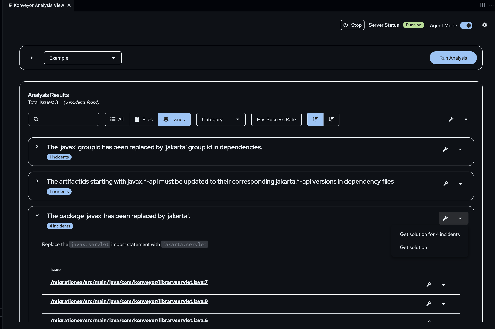

# Getting Started

- [Overview](#overview)
- [Install IDE Extension](#install-ide-extension)
- [Configure Analysis](#configure-analysis)
  - [Kai settings](#configure-kai-settings)
  - [Analysis settings](#configure-analysis-settings)
- [Starting the RPC Server](#starting-the-rpc-server)
- [Using Kai for Analysis and Fixes](#using-kai-for-analysis-and-fixes)
  - [Running Analysis](#running-analysis)
  - [Solution Server](#solution-server)
  - [Agent Mode](#agent-mode)
- [Guided scenarios](#guided-scenarios)

## Overview

#### Before you install Kai, you must:

- Create an API key for an LLM model.

  - Supported LLM providers: **OpenAI**, Amazon Bedrock, **Azure OpenAI**, DeepSeek, Google Gemini, Ollama, OpenAI-API-compatible endpoints such as OpenShift AI
  - To see more information about LLM provider configuration, see the [LLM selection](./llm_selection.md) documentation.

- Install Language Support for Java(TM) by Red Hat extension
- Install Java v17 and later
- Install Maven v3.9+
- Install Git and add it to the `$PATH` variable
- Configure an application in Visual Studio Code

#### Running Kai consists of:

1. Installing the Kai VSCode extension
1. Configuring Kai for your desired use case
1. Running analysis and accepting/rejecting generated code fixes

## Install IDE Extension

See the [installation guide](./installation.md) for details on installing the
IDE extension.

## Configure Analysis

> [!NOTE]
> You must open an application in your VSCode workspace to use the Kai extension.

[](https://youtu.be/IBa8B_RluGs)

<!-- <iframe width="560" height="315" src="https://www.youtube.com/embed/IBa8B_RluGs" title="Kai configuration walkthrough" frameborder="0" allowfullscreen></iframe> -->

### Configure Kai Settings

[](https://youtu.be/BgWZcFT7XjQ)

<!-- <iframe width="560" height="315" src="https://www.youtube.com/embed/BgWZcFT7XjQ" title="Kai configuration settings" frameborder="0" allowfullscreen></iframe> -->

Access the Kai settings from `Extensions > Konveyor AI Extension for VS Code settings icon > Settings`.

You can configure settings such as:

- The **solution server**. See [MCP Solution Server setup](../kai_mcp_solution_server/README.md)
- **Agent mode** for automated analysis with manual review
- **Demo mode** to use cached responses from the LLM. More details can be found [here](demo_mode.md).
- **Custom analyzer and Kai binaries** as opposed to the default packaged ones.
  - This provision can be useful for testing changes though it shouldn't be necessary for most users. See the [contributing guide](contrib/dev_environment.md) for more information.

#### Solution Server

example config in `settings.json`:

```json
  "konveyor.solutionServer": {
    "url": "http://localhost:8000/",
    "auth": {
      "enabled": true,
      "realm": "tackle",
      "insecure": true,
    },
    "enabled": true
  },
```

The solution server primarily provides two benefits:

- Contextual hints: It surfaces examples of past migration solutions, enabling Kai to offer hints for difficult or previously unsolved migration problems.
- Migration success metrics: It exposes success metrics for each rule, derived from past migrations. These metrics provide a "confidence level" for the likelihood of Kai successfully migrating a given code segment.

#### Agent Mode

In the agent mode, a planning agent creates the context for an issue and picks a sub-agent that is most suited to resolve the issue. The sub-agent runs an automated scan to describe how the issue can be resolved, and generates files with the updated resolutions.
You can approve or reject the changes to the code. The agent runs another automated analysis to detect new issues in the code that may have occurred because of the accepted changes.

### Configure Analysis Settings

You can configure the initial profile and other settings on the `Get Ready to Analyze` page or by modifying `settings.json`.
For more details, see [configuration](./contrib/configuration.md) for a full list of available settings.

To go to the `Get Ready to Analyze` page,

- Click `Konveyor extension > Open Konveyor Analysis View (icon) > Settings (icon)`.
- Type `Ctrl + Shift + P` to open the Command Palette and type "Konveyor:Manage Analysis Profile".

[](https://youtu.be/6YN_pGGMSW4)

<!-- <iframe width="560" height="315" src="https://www.youtube.com/embed/6YN_pGGMSW4" title="Kai profile settings" frameborder="0" allowfullscreen></iframe> -->

You can access the following analysis configurations on the `Get Ready to Analyze` page:

- Select Profile
- Configure a Label selector (source and target technologies)
- Set rules (default and custom)
- Configure the generative AI API key

Edit these settings by using the `Profile Manager` page to reuse the configuration for multiple analyses.

#### Configure Custom Rules

You can configure custom rules for the Konveyor analyzer to use when running static code analysis. To do so, edit `Set Rules` on the `Get Ready to Analyze` page to open the `Profile Manager`. You can select the directory that contains the custom rules.

For information about creating custom rules, see the [rules documentation](https://github.com/konveyor/analyzer-lsp/blob/main/docs/rules.md#rules).

#### Configure Sources/Targets

On the `Profile Manager` page, you can select or create the sources and target technologies for the static code analysis. They are _**mutually exclusive**_ options: you should select one or the other.

Sources and Targets are special [labels](https://github.com/konveyor/analyzer-lsp/blob/main/docs/labels.md#labels) recognized by the analyzer. Selecting the sources or targets will generate the label selector that filters rules for the analysis.

> [!NOTE]
> These source and target labels are configured in the [default rulesets](https://github.com/konveyor/analyzer-lsp/blob/main/docs/labels.md#labels). If you want to use custom labels for Kai analysis, you must create the label selector in the profile.

To use this option, type the name of the custom source or target technology:


If you need/want to specify the label selector manually, you can define a specific label selector to use when querying the rulesets.

To understand the label selector syntax see the [rule label selector documentation](https://github.com/konveyor/analyzer-lsp/blob/main/docs/labels.md#rule-label-selector)

<!-- To use this option click

 No longer found in the profile settings-->

## Starting the RPC Server

Click `Start` to start the RPC server on the `Konveyor Analysis View` page. This action activates the `Run Analysis` button.


## Using Kai for Analysis and Fixes

Now that you installed and started Kai, you can use the Kai extension to run static code analysis and generate code fixes. Once analysis is performed, you can review a list of violations and their associated incidents. Currently, you can generate code fixes based on incidents.

### Running Analysis

After starting the RPC server on the `Konveyor Analysis View` page, you can run a full analysis of the codebase based on the prior configured analysis arguments by clicking `Run Analysis`.

> [!NOTE]
> You must select a profile with necessary configurations such as source and target technologies before you run an analysis.

After analysis completes, you will see violations and incidents generated as a result. In the `Konveyor Issues` pane, you will see a tree view of these incidents and the files that contain these incidents.

#### Generating Fixes

Now that you have violations from analysis, you will want to begin generating
code fixes based on these incidents. You can generate fix suggestions by selecting the spanner button associated with a specific issue or all issues.



You can see more details if there are more than one incident by expanding the issues row. Here, you will have more options for resolving incidents.

Once the fix is generated, you can see a list of files that will be changed, and you are given the option to view, accept, or reject those changes. You can view this from an in-view diff editor via the analysis view, or in the `Konveyor Resolutions` pane. When you accept these changes, the changes are updated in the source code directly. Anytime you accept a change, Kai will automatically rerun a partial analysis of the updated codebase with the fix for an incident that was resolved.

## Guided Scenarios

Now that you understand how to get started with Kai, we suggest that you go through
a [guided scenario](./scenarios/README.md) to get a better idea of how Kai can assist with the migration of an application.
