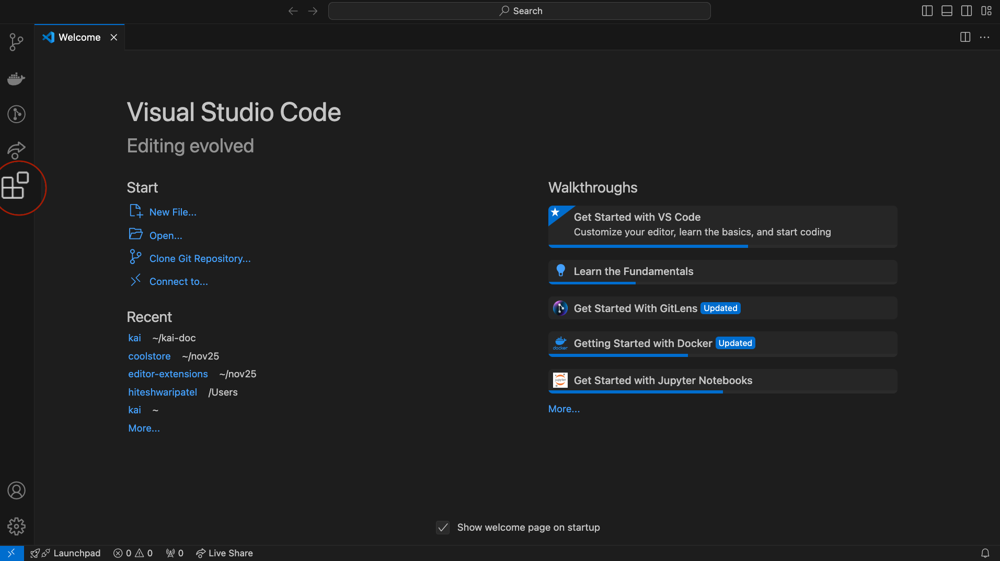
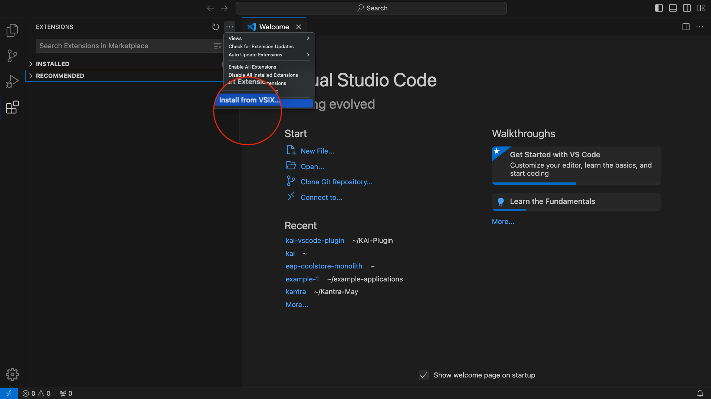
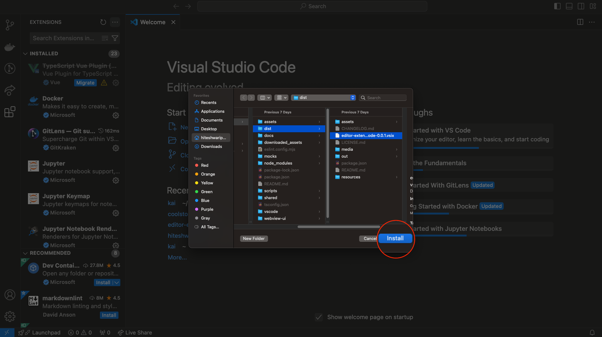
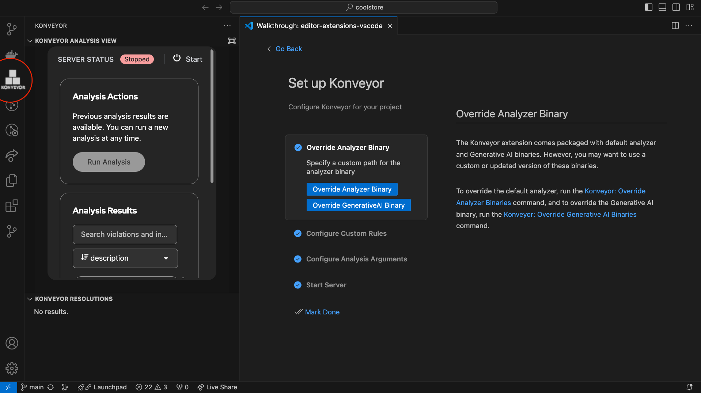
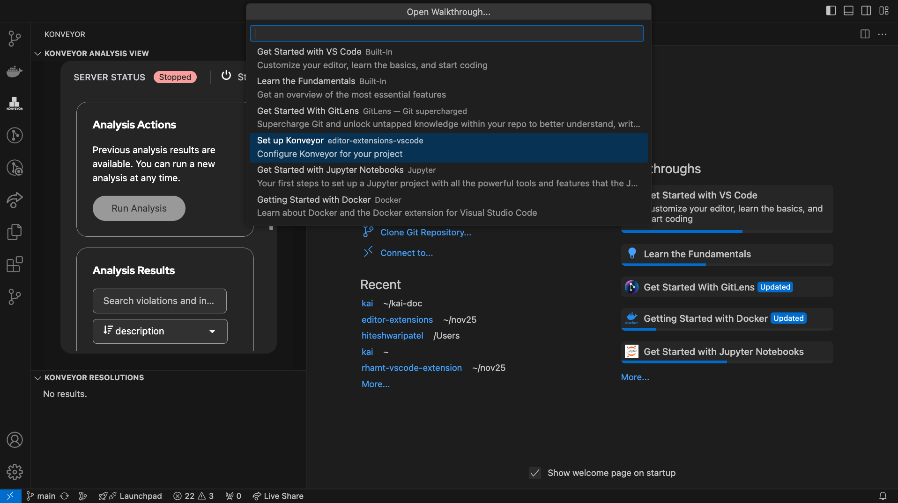

# Kai VSCode Extension

## IDE Builds
We provide pre-built versions of the IDE plugin as a `vsix` file at [editor-extensions/releases](https://github.com/konveyor/editor-extensions/releases). We recommend downloading the latest available version.


## Pre-requisite

1. Install **Java 17 or later** and the latest version of **Maven**.
2. Set up the required environment variables for the LLM service you plan to use. Refer to the [LLM Selection Guide](/docs/llm_selection.md) for details.

   - For OpenAI: `OPENAI_API_KEY=my-secret-api-key-value`
   - For IBM BAM: `GENAI_KEY=my-secret-api-key-value`


## IDE Plugin Installation Methods

You have a choice of installing the `vsix` file from the VSCode GUI or direct from the command line.

### Using VSCode GUI (recommended install option)

1. Open Visual Studio Code.
2. Navigate to the Extensions view by clicking on the square icon on the sidebar or by pressing `Ctrl+Shift+X` (Windows/Linux) or `Cmd+Shift+X` (macOS).

3. Click on the `...` (More Actions) button at the top right corner of the Extensions view and select **Install from VSIX...** from the dropdown menu.

4. Locate and select the .vsix file you downloaded and click **Install**.

5. Reload VSCode to activate the extension.


### Using Command Line (alternative installation method)

Only follow these steps if you decided to skip installing from the UI side and you want to install from CLI.

1. Install `vsce` by running `npm install -g vsce` in your terminal.
2. Install the .vsix file with the following command:
   ```bash
   code --install-extension path/to/your-extension.vsix 
    ```
3. Restart/reload VSCode.

# Using the IDE Plugin

### Get a Demo App

1. Clone the Cool-store application:
   ```bash
   git clone https://github.com/konveyor-ecosystem/coolstore.git
    ```
2. Navigate to File > Open in VSCode and locate the folder we just cloned.

### Running Kai RPC server 

1. Open walkthrough after installing the extension to setup Konveyor 

2. User has an option to override binaries and custom rules, however it comes with the defualt packaged binaries and custom rules. 

3. Configure analysis argument is necessary in order to know which rules apply to the project during analysis. 
4. Once the configuration is done, click on start server button. Logs are collected at output channel named konveyor-analyzer. 
