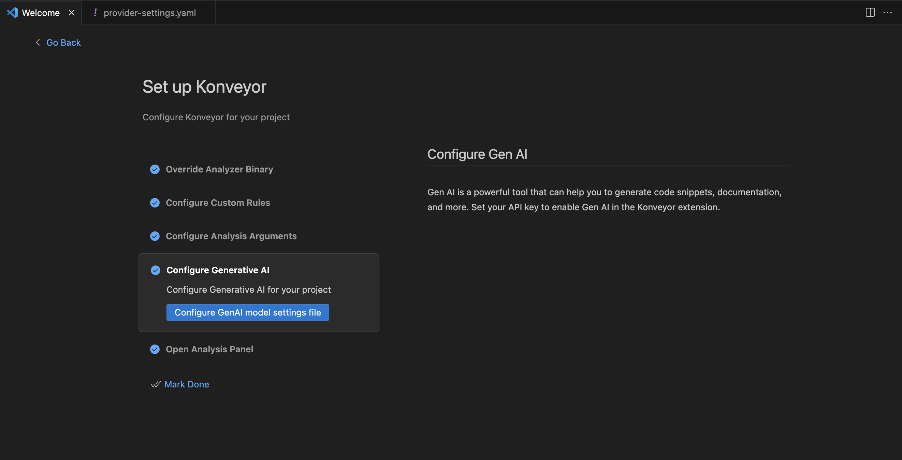
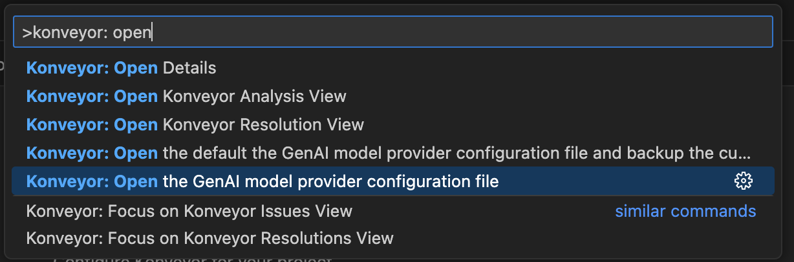
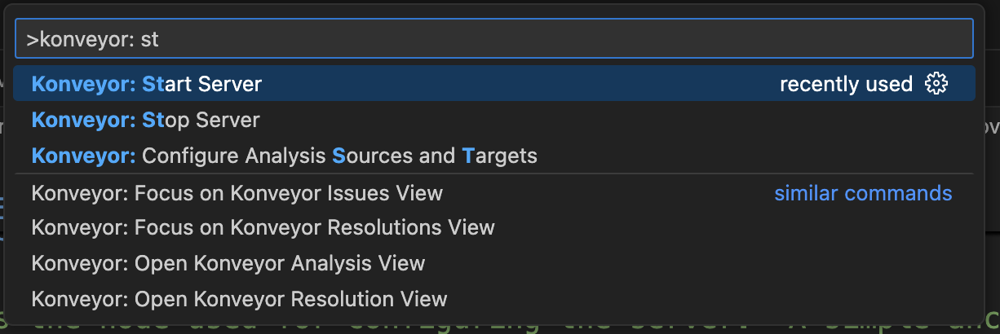
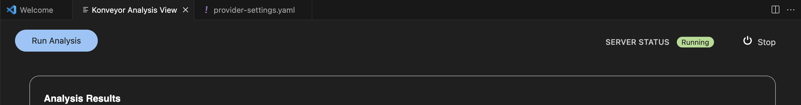

# Large Language Model (LLM) configuration

Kai is intended to be model agnostic in the sense of being able to connect to various Large Language Model (LLM) providers, yet it is important to understand the results from LLMs will vary widely and it's expected that smaller LLMs are less likely to provide satisfactory results.

The below will help to share examples of connecting to various LLM providers.

- [Basic LLM Configuration](#basic-llm-configuration)
  - [Edit the configuration file: provider-settings.yaml](#configuration-file-provider-settingsyaml)
  - [How do I make a specific provider setting active](#how-do-i-make-a-specific-provider-setting-active)
  - [How do I restart the Konveyor AI rpc-server](#how-do-i-restart-the-konveyor-ai-server)
- [Example LLM Provider Settings](#example-provider-settings)
  - [Amazon Bedrock](#amazon-bedrock)
  - [Azure OpenAI](#azure-openai)
  - [DeepSeek](#deepseek)
  - [Google Gemini](#google-gemini)
  - [Ollama](#ollama)
  - [OpenAI](#openai)
  - [OpenAI Compatible Alternatives](#openai-api-compatible-alternatives)
    - [OpenShift AI](#openshift-ai)
    - [MaaS](#maas---models-as-a-service)
    - [Podman Desktop](#podman-desktop)
- [Example Solution Server Env for LLM Provider Settings](#example-solution-server-provider-settings)
  - [Amazon Bedrock](#solution-server-amazon-bedrock)
  - [Azure OpenAI](#solution-server-azure-openai)
  - [Google Gemini](#solution-server-google-gemini)
  - [Ollama](#solution-server-ollama)
  - [OpenAI](#solution-server-openai)
  - [OpenAI Compatible Alternatives](#solution-server-openai-api-compatible-alternatives)
    - [OpenShift AI](#solution-server-openshift-ai)
    - [MaaS](#solution-server-maas---models-as-a-service)
    - [Podman Desktop](#solution-server-podman-desktop)

## Basic LLM configuration

### LLM Parameters

Kai requires access to a LLM to provide code suggestions. LLM access typically involves specifying a URL as well as authentication info such as an api key. The specific details of what is required will vary per LLM provider. Most provider values may be specified via parameters in the configuration file `provider-settings.yaml` or as specific environment variables which that provider plugin is aware of, i.e. `OPENAI_API_KEY`, `GOOGLE_API_KEY`, etc.

We attempt to share common patterns for accessing various providers, yet if you run into problems and need to dive deeper into how Kai is connecting to a provider you can look at [kai/llm_interfacing/model_provider.py](https://github.com/konveyor/kai/blob/main/kai/llm_interfacing/model_provider.py)

### Configuration file `provider-settings.yaml`

LLM configuration for the Kai IDE is controlled via a configuration file: `provider-settings.yaml`

The recommended way to find and open this file is to either:

- At the Kai IDE configuration screen click "Configure Generative AI"
  

- Use the IDE command palette to run: "Konveyor: Open the GenAI model provider configuration file"
  - Use the IDE shortcut to open command palette: Control (or Command) + SHIFT + P
  - Enter: "Konveyor: Open the GenAI model provider configuration file"
    

#### Location of `provider-settings.yaml` is platform dependent

`provider-settings.yaml` will be located where the IDE keeps global storage for the IDE plugin.
This file is located under the IDE plugins "global storage" path.

- For example on MacOS, `provider-settings.yaml` is found at:
  - `~/Library/Application Support/Code/User/globalStorage/konveyor.konveyor-ai/settings/provider-settings.yaml`

### How do I make a specific provider setting 'active'?

You will see several examples of possible LLM provider settings in the default `provider-settings.yaml` file.
The means of choosing a specific provider is done by using [YAML anchors and aliases](https://yaml.org/spec/1.2.2/#3222-anchors-and-aliases). An `&active` anchor is recommended to be placed only once at the provider configuration you wish to use.

```yaml
models:
  ChatOllama: &active
    provider: "ChatOllama"
    args:
      model: "granite-code:8b-instruct"

  AmazonBedrock:
    provider: "ChatBedrock"
    args:
      model_id: "us.anthropic.claude-3-5-sonnet-20241022-v2:0"

# This is the node used for configuring the server.  A simple anchor/reference
# pair is an easy way to to select a configuration.  To change configs, move the
# `&active` anchor to the desired block and restart the server.
active: *active
```

- For the above we can see that the `&active` tag is applied to the `ChatOllama` setting and NOT to the AmazonBedrock stanza, therefore the `ChatOllama` configuration is what will be used by Kai.
- As you change different LLM providers, move the yaml anchor `&active` to the selection you wish to use, then restart the Konveyor AI server.

### How do I restart the Konveyor AI server

If you have made a change to `provider-settings.yaml` you will want to ensure that you have restarted the Konveyor AI server. You may do this either by:

- Restart VSCode IDE
- Use the command palette (Control/Command + Shift + P) and "Konveyor: Stop Server" / "Konveyor: Start Server"
  
  - Note that as you "Stop" or "Start" the Kai RPC Server you will see the server status reflected in upper right corner of
    

## Example Provider Settings

### Amazon Bedrock

```yaml
models:
  AmazonBedrock: &active
    environment:
      ## May have to use if no global `~/.aws/credentials`
      AWS_DEFAULT_REGION: us-east-1
    provider: "ChatBedrock"
    args:
      model_id: "us.anthropic.claude-3-5-sonnet-20241022-v2:0"
      # Prefer using ~/.aws/credentials or environment variables instead of in-file secrets.
      # Uncomment only if needed for local testing (do not commit real values):
      # aws_access_key_id: "<your-access-key-id>"
      # aws_secret_access_key: "<your-secret-access-key>"
active: *active
```

- Note that authentication to Amazon Bedrock will look for environment variables `AWS_ACCESS_KEY_ID` and `AWS_SECRET_ACCESS_KEY` to handle authentication.
  - While not required, it's recommended to use the [aws cli](https://aws.amazon.com/cli/) and verify you have command line access to AWS services working before proceeding

### Azure OpenAI

```yaml
models:
  AzureChatOpenAI: &active
    environment:
      AZURE_OPENAI_API_KEY: "sk-secret"
    provider: "AzureChatOpenAI"
    args:
      azure_deployment: "gpt-35-turbo"
      azure_endpoint: "https://<azure-oai-name>.openai.azure.com/"
      api_version: "2025-04-01-preview"
      ## May have to use
      # azureOpenAIDeploymentName
      # azureOpenAIApiVersion
      # azureOpenAIEndpoint

active: *active
```

### DeepSeek

```yaml
models:
  ChatDeepSeek: &active
    environment:
      DEEPSEEK_API_KEY: "sk-secret"
    provider: "ChatDeepSeek"
    args:
      model: "deepseek-chat",

active: *active
```

### Google Gemini

```yaml
models:
  ChatGoogleGenerativeAI: &active
    environment:
      GOOGLE_API_KEY: "sk-secret"
    provider: "ChatGoogleGenerativeAI"
    args:
      model: "gemini-pro"

active: *active
```

### OpenAI

If you have a valid API Key for OpenAI you may use this with Kai.

1. Follow the directions from OpenAI
   [here](https://help.openai.com/en/articles/4936850-where-do-i-find-my-openai-api-key).
2. Edit `provider-settings.yaml` with a sample like the below

```yaml
models:
  OpenAI: &active
    environment:
      OPENAI_API_KEY: "sk-secret"
    provider: "ChatOpenAI"
    args:
      model: "gpt-4o"

active: *active
```

- Update your OpenAI API Key
  - Note if you have `OPENAI_API_KEY` set as an environment variable which VSCode is able to read then you can ignore explicitly setting it in your `provider-settings.yaml`.
- Update the model you wish to use

### Ollama

```yaml
models:
  ChatOllama: &active
    provider: "ChatOllama"
    args:
      model: "granite-code:8b-instruct"
      baseUrl: "127.0.0.1:11434"

active: *active
```

- Update `model` to reflect the local ollama model you have running and want to use

### OpenAI API Compatible Alternatives

In general Kai will work with OpenAI Compatible API alternatives. The general
pattern is to specify the `base_url` and environment variable for `OPENAI_API_KEY`

Below are examples of OpenAI API compatible services community members have
raised questions about in past. We are including a few examples to help share
information.

#### OpenShift AI

OpenShift AI or [OpenDataHub](https://opendatahub.io/) provides a means of running
models on your own Kubernetes cluster. Kai is able to connect to these models via
using an OpenAI compatible API.

You may find deeper guidance on deploying this kind of setup at: [github.com/jmontleon/openshift-ai-with-gpu-autoscaling](https://github.com/jmontleon/openshift-ai-with-gpu-autoscaling)

```yaml
models:
  openshift-kai-test-generation: &active
    environment:
      SSL_CERT_FILE: "<Server's SSL_CERT_FILE>"
      REQUESTS_CA_BUNDLE: "<Server's REQUESTS_CA_BUNDLE>"
      OPENAI_API_KEY: "<Server's OPENAI_API_KEY>"

    provider: "ChatOpenAI"
    args:
      model: "kai-test-generation"
      configuration:
        baseURL: "https://kai-test-generation-llms.apps.konveyor-ai.migration.example.com/v1"
```

#### MaaS - Models As A Service

Models As A Service https://github.com/rh-aiservices-bu/models-aas

- Example deployment: https://maas.apps.prod.rhoai.rh-aiservices-bu.com/

```yaml
parasols-maas-granite:
  environment:
    OPENAI_API_KEY: "KEYVALUE"
  provider: "ChatOpenAI"
  args:
    model: "granite-8b-code-instruct-128k"
    configuration:
      baseURL: "https://granite-8b-code-instruct-maas-apicast-production.apps.prod.rhoai.rh-aiservices-bu.com:443/v1"
```

- Note the `model` AND `base_url` both are related, i.e. for this service a different model also has a different and explicit endpoint, it is NOT sufficient to simply change the `model`

#### Podman Desktop

See [podman_with_local_models.md](podman_with_local_models.md) for more into walking through deploying local models with podman

```yaml
podman_mistral:
    provider: "ChatOpenAI"
     environment:
      OPENAI_API_KEY: "unused value"
    args:
      model: "mistral-7b-instruct-v0-2"
      configuration:
        baseURL: "http://localhost:35841/v1"
```

- Note above `configuration.baseURL` and `model` need to be updated to match what you have deployed in podman

## Example Solution Server Provider Settings

### Solution Server Amazon Bedrock

```bash
 export KAI_LLM_PARAMS='{"model": "anthropic.claude-v2", "model_provider": "bedrock", "region_name": "<region>", "aws_access_key_id": "<redacted>", "aws_secret_access_key": "<redacted>"}'
```

- Note that authentication to Amazon Bedrock will look for environment variables `AWS_ACCESS_KEY_ID` and `AWS_SECRET_ACCESS_KEY` to handle authentication.
  - While not required, it's recommended to use the [aws cli](https://aws.amazon.com/cli/) and verify you have command line access to AWS services working before proceeding
- You can use the `aws_access_key_id`, `aws_secret_access_key` and `region_name` if you don't have the environment variables or the config/credentials file from aws cli.

### Solution Server Azure OpenAI

```bash
export KAI_LLM_PARAMS='{"model": "shurley-gpt-4o-mini-deployment", "model_provider": "azure_openai", "api_key": "<redacted>", "api_version": "2024-04-01-preview", "azure_endpoint": "https://shurley.openai.azure.com/"}'
```

### Solution Server Google Gemini

```bash
export KAI_LLM_PARAMS='{"model": "gemini-2.5-pro", "model_provider": "google_genai", "google_api_key": "<redacted>"}'
```

### Solution Server OpenAI

If you have a valid API Key for OpenAI you may use this with Kai.

1. Follow the directions from OpenAI
   [here](https://help.openai.com/en/articles/4936850-where-do-i-find-my-openai-api-key).
2. Export the `KAI_LLM_PARAMS` with the values.

```bash
export KAI_LLM_PARAMS='{"model": "gemini-2.5-pro", "model_provider": "openai", }'
```

- Update your OpenAI API Key
- Update the model you wish to use

### Solution Server Ollama

```bash
export KAI_LLM_PARAMS='{"model": "llama3", "model_provider": "ollama", "base_url": "127.0.0.1:11434"}'
```

- Update `model` to reflect the local ollama model you have running and want to use

### Solution Server OpenAI API Compatible Alternatives

In general Kai will work with OpenAI Compatible API alternatives. The general
pattern is to specify the `base_url` and environment variable for `OPENAI_API_KEY`

Below are examples of OpenAI API compatible services community members have
raised questions about in past. We are including a few examples to help share
information.

#### Solution Server OpenShift AI

OpenShift AI or [OpenDataHub](https://opendatahub.io/) provides a means of running
models on your own Kubernetes cluster. Kai is able to connect to these models via
using an OpenAI compatible API.

You may find deeper guidance on deploying this kind of setup at: [github.com/jmontleon/openshift-ai-with-gpu-autoscaling](https://github.com/jmontleon/openshift-ai-with-gpu-autoscaling)

```bash
export SSL_CERT_FILE="<Server's SSL_CERT_FILE>"
export REQUESTS_CA_BUNDLE="<Server's REQUESTS_CA_BUNDLE>"
export OPENAI_API_KEY="<Server's OPENAI_API_KEY>"
export KAI_LLM_PARAMS='{"model": "kai-test-generation", "model_provider": "openai", "base_url": "https://kai-test-generation-llms.apps.konveyor-ai.migration.example.com/v1"}'

#### Solution Server MaaS - Models As A Service

Models As A Service https://github.com/rh-aiservices-bu/models-aas

- Example deployment: https://maas.apps.prod.rhoai.rh-aiservices-bu.com/

```bash
export OPENAI_API_KEY="KEYVALUE"
export KAI_LLM_PARAMS='{"model": "granite-8b-code-instruct-128k", "model_provider": "openai", "base_url": "https://granite-8b-code-instruct-maas-apicast-production.apps.prod.rhoai.rh-aiservices-bu.com:443/v1"}'
```

- Note the `model` AND `base_url` both are related, i.e. for this service a different model also has a different and explicit endpoint, it is NOT sufficient to simply change the `model`

#### Solution Server Podman Desktop

See [podman_with_local_models.md](podman_with_local_models.md) for more into walking through deploying local models with podman

```bash
export KAI_LLM_PARAMS='{"model": "mistral-7b-instruct-v0-2", "model_provider": "openai", "base_url": "http://localhost:35841/v1"}'
```

- Note above `configuration.baseURL` and `model` need to be updated to match what you have deployed in podman
