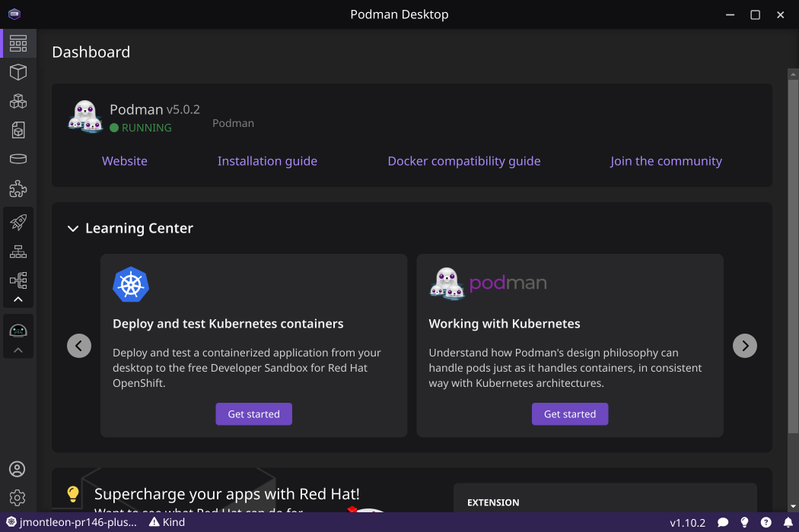
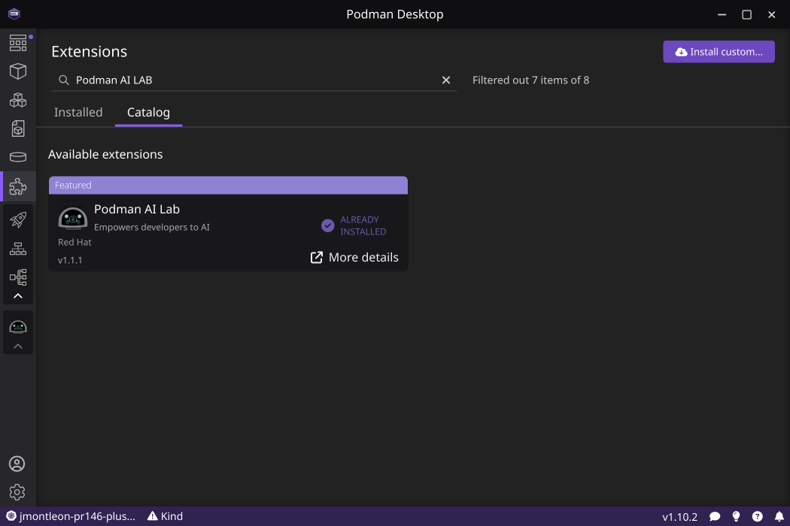
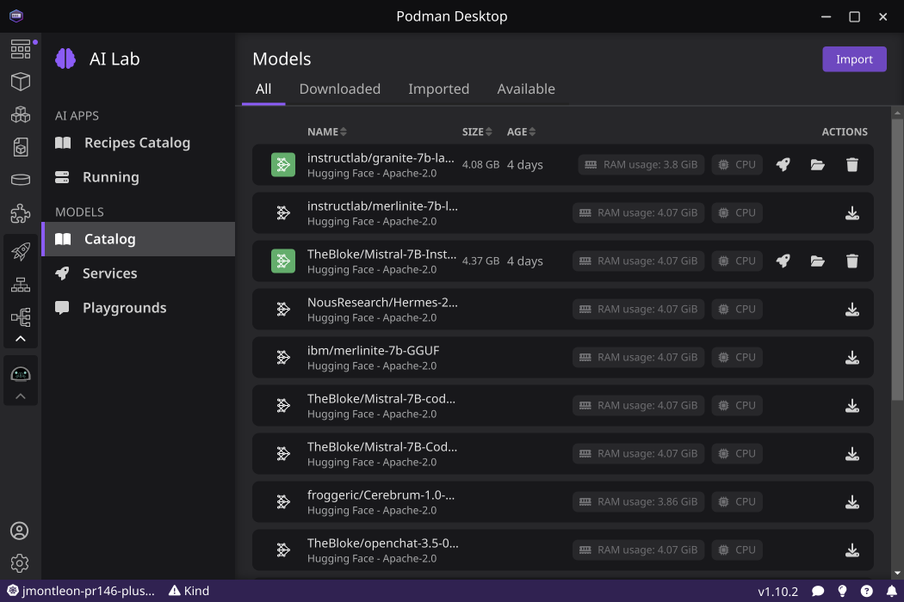
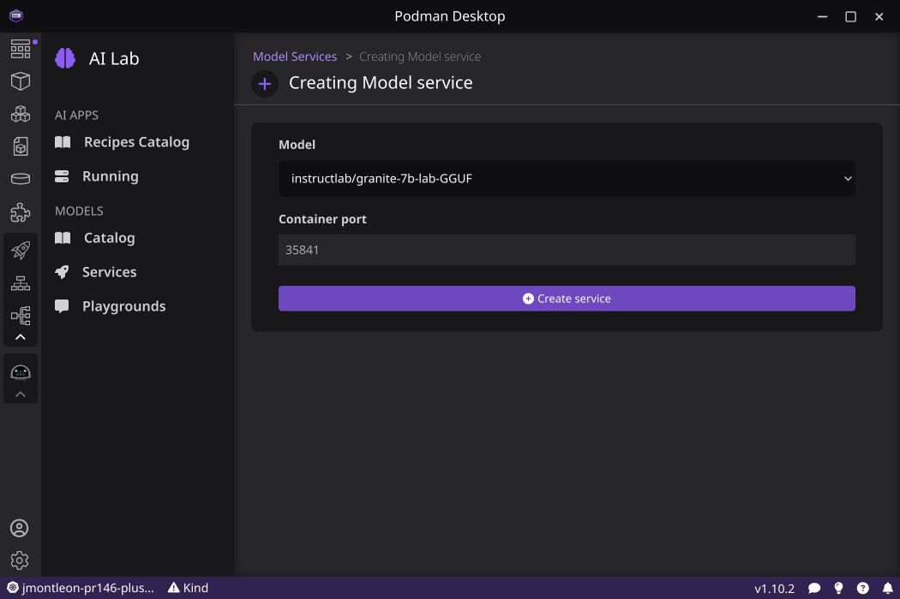
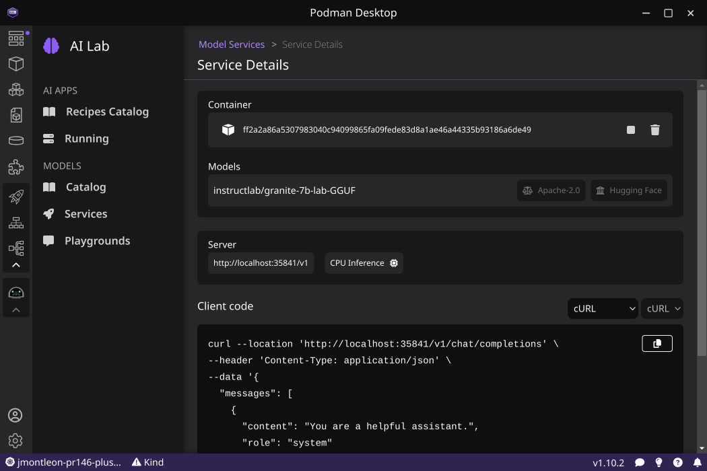

# Large Language Model (LLM) configuration

- [Large Language Model (LLM) configuration](#large-language-model-llm-configuration)
  - [LLM API Keys](#llm-api-keys)
    - [IBM BAM Service](#ibm-bam-service)
    - [OpenAI Service](#openai-service)
  - [Selecting a Model](#selecting-a-model)
    - [IBM-Served granite](#ibm-served-granite)
    - [IBM-Served mistral](#ibm-served-mistral)
    - [IBM-Served codellama](#ibm-served-codellama)
    - [IBM-Served llama3](#ibm-served-llama3)
    - [IBM-Served Ollama](#ibm-served-ollama)
    - [OpenAI GPT 4](#openai-gpt-4)
    - [OpenAI GPT 3.5](#openai-gpt-35)
  - [OpenAI API Compatible Alternatives](#openai-api-compatible-alternatives)
    - [Podman Desktop](#podman-desktop)
      - [Install](#install)
      - [Configuration](#configuration)
    - [OpenShift AI](#openshift-ai)
    - [Known Issues](#known-issues)

## LLM API Keys

We expect that you have configured the environment variables required for the
LLM you are attempting to use. For example:

- OpenAI service requires: `OPENAI_API_KEY=my-secret-api-key-value`
- IBM BAM service requires: `GENAI_KEY=my-secret-api-key-value`

### IBM BAM Service

The development team has been using the IBM BAM service to aid development and
testing:

> IBM Big AI Model (BAM) laboratory is where IBM Research designs, builds, and
> iterates on what’s next in foundation models. Our goal is to help accelerate
> the transition from research to product. Come experiment with us.

> [!WARNING]
> In order to use this service an individual needs to obtain a w3id
> from IBM. The kai development team is unable to help obtaining this access.

1. Login to https://bam.res.ibm.com/.
2. To access via an API you can look at ‘Documentation’ after logging into
   https://bam.res.ibm.com/. You will see a field embedded in the
   'Documentation' section where you can generate/obtain an API Key.
3. Ensure you have `GENAI_KEY=my-secret-api-key-value` defined in your shell

Related client tooling:

- [IBM Generative AI Python SDK](https://github.com/IBM/ibm-generative-ai)
- [LangChain
  integration](https://ibm.github.io/ibm-generative-ai/v2.2.0/rst_source/examples.extensions.langchain.html#examples-extensions-langchain)

### OpenAI Service

If you have a valid API Key for OpenAI you may use this with Kai.

1. Follow the directions from OpenAI
   [here](https://help.openai.com/en/articles/4936850-where-do-i-find-my-openai-api-key).
2. Ensure you have `OPENAI_API_KEY=my-secret-api-key-value` defined in your shell

## Selecting a Model

We offer configuration choices of several models via
[config.toml](/kai/config.toml) which line up to choices we know about from
[kai/model_provider.py](https://github.com/konveyor-ecosystem/kai/blob/main/kai/model_provider.py).

To change which llm you are targeting, open `config.toml` and change the
`[models]` section to one of the following:

### IBM-Served granite

```toml
[models]
  provider = "ChatIBMGenAI"

  [models.args]
  model_id = "ibm/granite-13b-chat-v2"
```

### IBM-Served mistral

```toml
[models]
  provider = "ChatIBMGenAI"

  [models.args]
  model_id = "mistralai/mixtral-8x7b-instruct-v01"
```

### IBM-Served codellama

```toml
[models]
  provider = "ChatIBMGenAI"

  [models.args]
  model_id = "meta-llama/llama-2-13b-chat"
```

### IBM-Served llama3

```toml
  # Note:  llama3 complains if we use more than 2048 tokens
  # See:  https://github.com/konveyor-ecosystem/kai/issues/172
[models]
  provider = "ChatIBMGenAI"

  [models.args]
  model_id = "meta-llama/llama-3-70b-instruct"
  parameters.max_new_tokens = 2048
```

### IBM-Served Ollama

```toml
[models]
  provider = "ChatOllama"

  [models.args]
  model = "mistral"
```

### OpenAI GPT 4

```toml
[models]
  provider = "ChatOpenAI"

  [models.args]
  model = "gpt-4"
```

### OpenAI GPT 3.5

```toml
[models]
  provider = "ChatOpenAI"

  [models.args]
  model = "gpt-3.5-turbo"
```

## OpenAI API Compatible Alternatives

In general Kai will work with OpenAI Compatible API alternatives. Two examples
are Podman Desktop and Oobabooga Text generation web UI. Once your alternative
is installed all that is necessary is to export `OPENAI_API_BASE` in addition to
`OPENAI_API_KEY`.

### Podman Desktop

#### Install

Installation will vary depending on your operating system and distribution and is documented on the Podman Desktop website.

https://podman-desktop.io/docs/installation

#### Configuration

- Start Podman Desktop
  
- Navigate to the Extensions
- Select the Catalog
- Search for `Podman AI Lab`
  
- Install the `Podman AI Lab` Extension
- Navigate to the AI Lab
- Under Models select Catalog
  
- Download one or more models
- Navigate to Services
- Click `New Model Service`
  
- Select a model to serve and click Create Service
- On the Service details page note the server URL to use with Kai
  
- Export the URL, for example `export OPENAI_API_BASE="http://localhost:35841/v1"`
- Note that the Podman Desktop service endpoint is not passworded, but the
  OpenAI library expects `OPENAI_API_KEY` to be set. In this case the value does
  not matter.
- Adjust your config.toml settings if necessary

```toml
[models]
  provider = "ChatOpenAI"

[models.args]
  model = "mistral-7b-instruct-v0-2"
```

### OpenShift AI

- OpenShift AI also provides an OpenAI compatible API with vLLM
- The vLLM runtime can be added to your cluster if not already available by following these [instructions](https://github.com/rh-aiservices-bu/llm-on-openshift/blob/main/serving-runtimes/vllm_runtime/README.md)
- Export the URL, for example `export OPENAI_API_BASE=https://mistralaimistral-7b-instruct-v02-kyma-workshop.apps.cluster.example.com/v1"`
- When vLLM serves models it does so from the `/mnt/models/` directory in the container, and this is where the model name is taken from, so in all cases use '/mnt/models/` for the model name.
- Adjust your config.toml

```toml
[models]
  provider = "ChatOpenAI"

[models.args]
  model = "/mnt/models/"
```

### Known Issues

We have experienced problems due to the model context being too short for our
inputs with some models. [It is currently possibly, though somewhat difficult to
workaround this
issue](https://github.com/containers/podman-desktop-extension-ai-lab/issues/1074).
