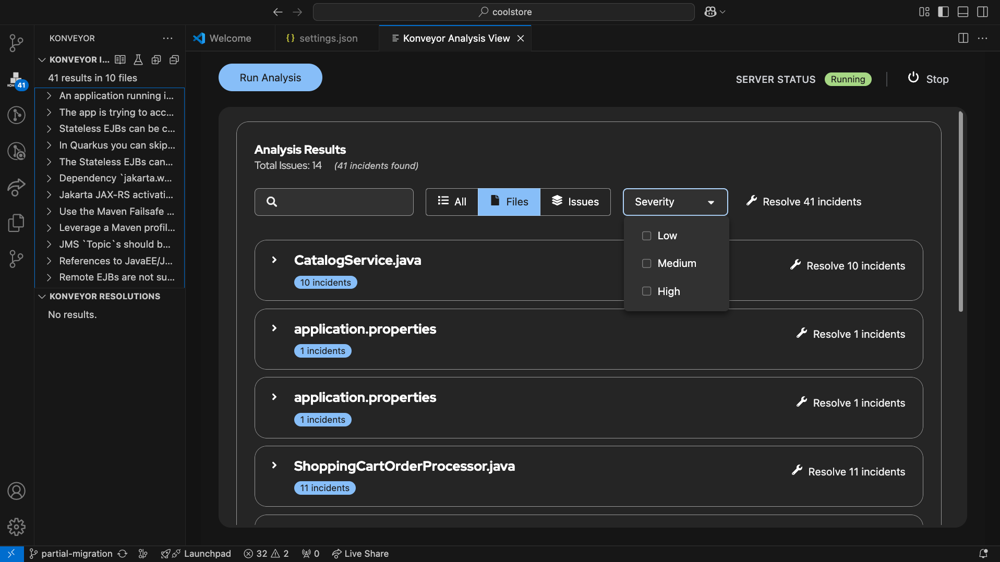
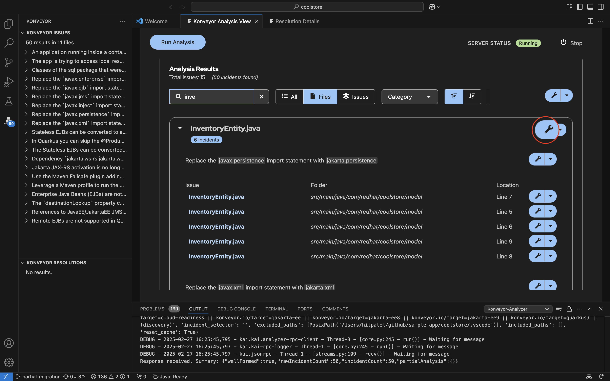
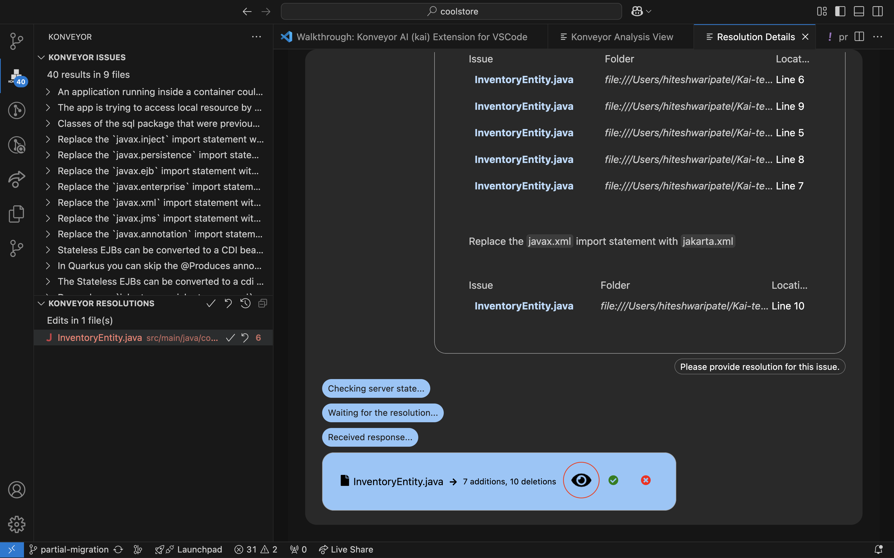
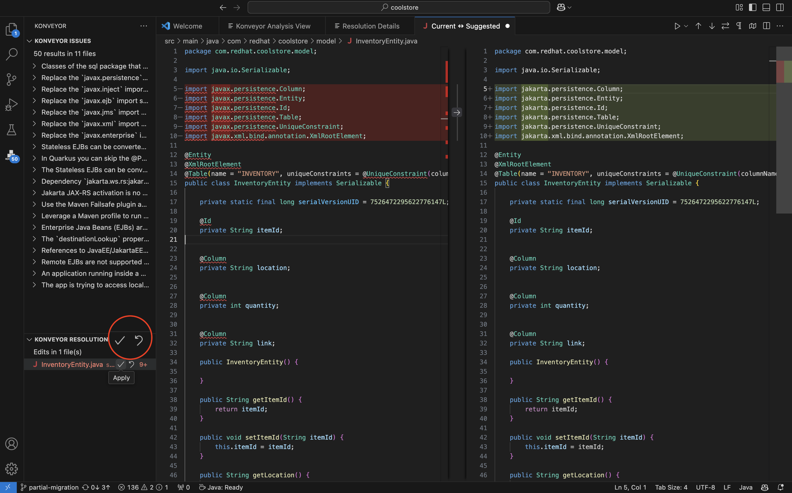
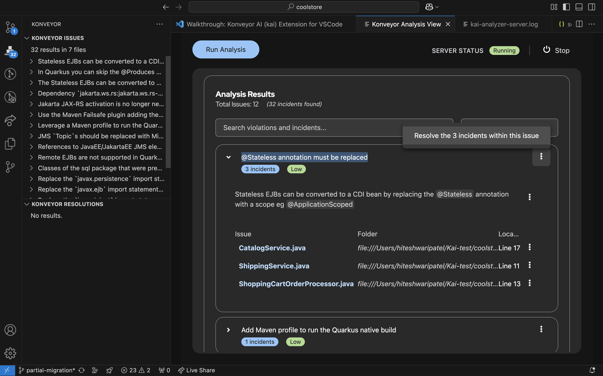
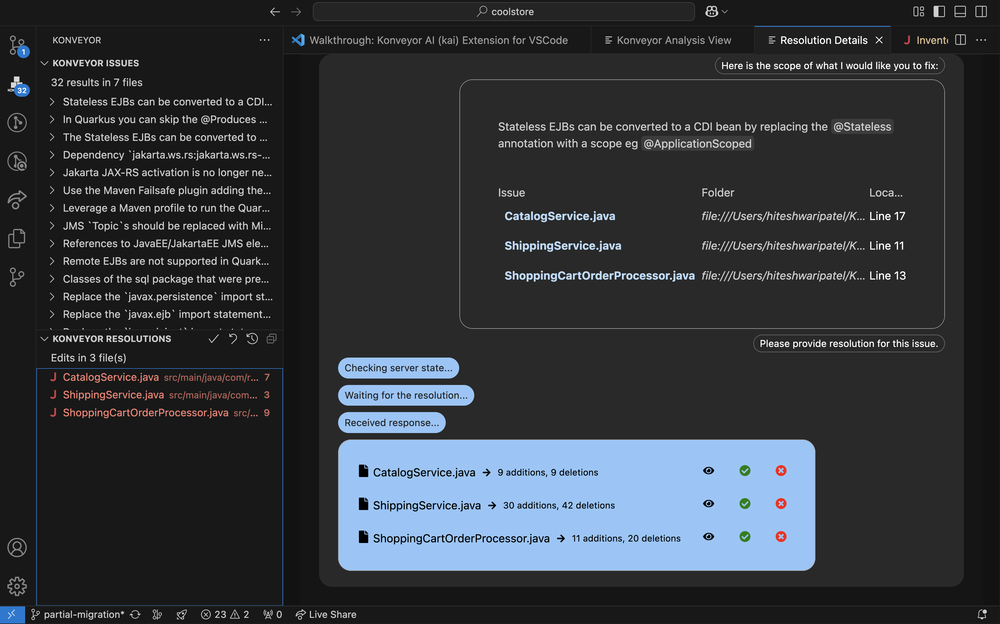
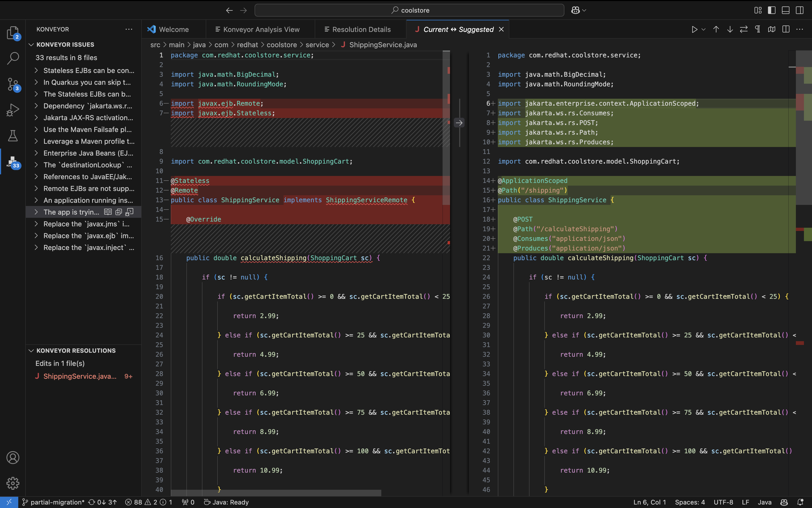
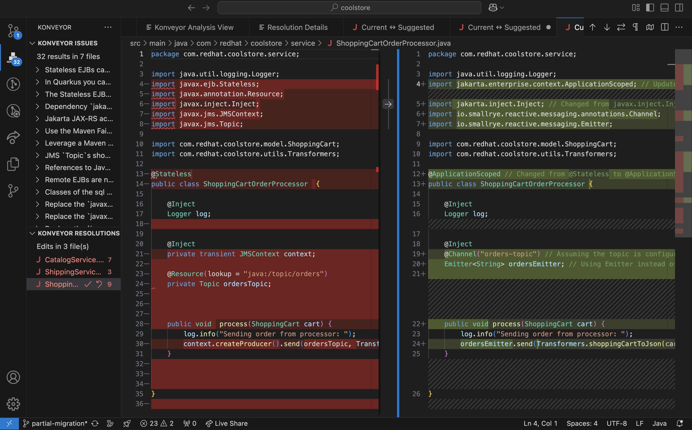

# Kai Demo (August 2024)

Konveyor AI (kai) is Konveyor's approach to easing modernization of application
source code to a new target by leveraging LLMs with guidance from static code
analysis augmented with data in Konveyor that helps to learn how an Organization
solved a similar problem in the past.

- [Kai Demo](#kai-demo-august-2024)
  - [Overview](#overview)
  - [Prerequisites](#prerequisites)
  - [Step 1: Setup](#step-1-setup)
    - [Install Kai](#installation)
    - [Clone Coolstore app](#get-a-demo-app)
    - [Configure Konveyor](#configure-konveyor)
  - [Step 2: Run Analysis](#step-2-run-analysis)
    - [2.1 Change import namespaces](#21-change-import-namespaces)
    - [2.2 Modify Scope from CDI bean requirements](#22-modify-scope-from-cdi-bean-requirements)
    - [2.3 EJB Remote and Message Driven Bean(MDB) changes](#23-ejb-remote-and-message-driven-beanmdb-changes)
      - [EJB Remote](#ejb-remote)
      - [Message Driven Bean (MDB)](#message-driven-bean-mdb)
  - [Step 3: Deploy app to Kubernetes](#step-3-deploy-app-to-kubernetes)
  - [Step 4: Debug and File Incidents](#debug-and-file-incidents)
  - [Conclusion](#conclusion)

## Overview

In this demo, we will showcase the capabilities of Konveyor AI (Kai) in
facilitating the modernization of application source code to a new target. We
will illustrate how Kai can handle various levels of migration complexity,
ranging from simple import swaps to more involved changes such as modifying
scope from CDI bean requirements. Additionally, we will look into migration
scenarios that involves EJB Remote and Message Driven Bean(MBD) changes

We will focus on migrating a partially migrated [JavaEE Coolstore
application](https://github.com/konveyor-ecosystem/coolstore.git) to Quarkus, a
task that involves not only technical translation but also considerations for
deployment to Kubernetes. By the end of this demo, you will understand how
Konveyor AI (Kai) can assist and expedite the modernization process.

## Prerequisites

- [VSCode](https://code.visualstudio.com/download)
- [Git](https://git-scm.com/downloads)
- [Kubernetes cluster (minikube)](https://minikube.sigs.k8s.io/docs/start/)
- [GenAI credentials](../llm_selection.md#ibm-bam-service)
- [Maven](https://maven.apache.org/install.html)
- Quarkus 3.10
- Java 17

Additionally, you will need to have the Kai IDE plugin installed in VSCode.
Download the latest from
[here](https://github.com/konveyor/editor-extensions/releases).

## Step 1: Setup

### Installation

Follow the steps in the [installation guide](../installation.md) to install Kai. It will help you find the latest build and complete the setup.

### Get a Demo App

1. Clone the Cool-store application:

   ```bash
   git clone https://github.com/konveyor-ecosystem/coolstore.git
   ```

   Next, switch to the branch of the Coolstore app that's been partially migrated:

   ```sh
   git checkout partial-migration
   ```

2. Navigate to File > Open in VSCode and locate the folder we just cloned.
   Make sure you have GenAI credentials before you start configuring Kai.

### Configure Konveyor

1.  When you launch the extension, you will land on the Welcome Page, as shown below. If the Welcome Page does not appear, proceed to the step 2.
    
    If "Set up Konveyor" is not available in the list, click the More button for additional options.
    
2.  If the welcome page does not appear, open the command palette by pressing Command + Shift + P. This will bring up a list of commands.
    
    From the command palette, locate and select the "Set up Konveyor" option. This will guide you through the configuration process.
    
3.  Configure Konveyor for your project.

    - User has an option to override binaries and custom rules, however it comes with the default packaged binaries and custom rules.
      
    - The Konveyor extension allows you to add custom rules to the analyzer. This is useful when you want to apply your own rules during analysis.
    - Configuring analysis arguments is necessary to determine which rules apply to the project during analysis. Set up analysis arguments specific to your project by selecting the appropriate options and pressing "OK" to save the changes.
      

    We will analyze the Coolstore application using the following migration targets to identify potential areas for improvement:

       <!-- - containerization -->

    - cloud-readiness
    - jakarta-ee
    - jakarta-ee8
    - jakarta-ee9
    - quarkus

    - To verify your arguments, go to your project directory and open `/.vscode/settings.json`. This serves as a reference for how `settings.json` should look.

      ```json
      {
        "konveyor.analysis.labelSelector": "(konveyor.io/target=cloud-readiness || konveyor.io/target=jakarta-ee || konveyor.io/target=jakarta-ee8 || konveyor.io/target=jakarta-ee9 || konveyor.io/target=quarkus) || (discovery)"
      }
      ```

    - Next, set up the Generative AI key for your project. This step will open the `provider-settings.yaml` file. By default, it is configured to use OpenAI. To change the model, update the anchor `&active` to the desired block. Modify this file with the required arguments, such as the model and API key, to complete the setup. Sample of the `provider-settings.yaml` can be found [here.](https://github.com/konveyor/editor-extensions/blob/main/vscode/resources/sample-provider-settings.yaml)

4.  Once the configuration is done, click on start server button. Logs are collected at output channel named konveyor-analyzer.
    

## Step 2: Run Analysis

Let's perform our initial analysis:

1. Once you have RPC server initialized, navigate to "Konveyor Analysis View" and click `Run Analysis`. Open the command palette by pressing Command + Shift + P to find it.
   

2. The Konveyor Analysis View lists issues, allowing you to filter them by file issues. On the left side, the Konveyor Issue Panel groups files based on similar issues for easier navigation.
   

If you lose the "Konveyor Analysis View" window, press Command + Shift + P to open the Command Palette, then search for and select the Analysis View window. Alternatively, click the editor icon under the Konveyor Issue panel to reopen it.


Once the analysis is complete, you will see many incidents. However, let's focus on fixing only the 5 files necessary to migrate the Coolstore application.

- `src/main/java/com/redhat/coolstore/model/ShoppingCart.java`
- `src/main/java/com/redhat/coolstore/model/InventoryEntity.java`
- `src/main/java/com/redhat/coolstore/service/CatalogService.java`
- `src/main/java/com/redhat/coolstore/service/ShippingService.java`
- `src/main/java/com/redhat/coolstore/service/ShoppingCartOrderProcessor.java`

> [!NOTE]
>
> While the file `src/main/java/com/redhat/coolstore/rest/RestApplication.java`
> is flagged, for the purpose of this demo it is okay to skip that file and
> proceed.

The incidents in the above files will provide insights into potential issues or
areas that require attention during the migration process.

### 2.1 Change import namespaces

Open “Konveyor Analysis View” and search for `InventoryEntity.java` file. Click on `Resolve 6 incidents` to resolve all incidents or individual incidents as shown below.


The “Resolution Details” window will display the requested fix information as shown below.


Click on the eye symbol to view the differences.


Accept the changes by clicking on the symbol shown above on the screenshot. This will trigger analysis and reduce the number of incidents.

The above steps show how Kai simplifies the translation of import namespaces, ensuring seamless automated migration of javax libraries to jakarta persistence
libraries.

Just like we fixed `InventoryEntity.java`, repeat the same steps for `ShoppingCart.java`.

### 2.2 Modify Scope from CDI bean requirements

In this step, we will use Kai to update the scope definitions in `CatalogService.java`, `ShippingService.java`, and `ShoppingCartOrderProcessor.java` to align with Quarkus CDI bean requirements. Kai will automate this process, ensuring a smooth migration.

As you can see, the files are grouped by common incidents. Request a fix for all three files shown below.


Verify each solution one by one and ensure the requested changes are applied. In this case, Kai understands the problem and proactively fixes future issues as well.


In `CatalogService.java` Stateless EJB is converted to a CDI bean by replacing the @Stateless annotation with a scope @ApplicationScoped.


### 2.3 EJB Remote and Message Driven Bean(MDB) changes

From the previous request, Kai not only modified the scope definitions but also addressed EJB Remote and MDB functionalities in `ShippingService.java` and `ShoppingCartOrderProcessor.java`, respectively. Kai replaced EJBs with REST functionality and updated related imports and annotations.

#### EJB Remote



Due to the absence of support for Remote EJBs in Quarkus, you will notice that these functionalities are removed and replaced with REST functionality.

#### Message Driven Bean (MDB)



- Note the changes made to `ordersEmitter` channel:

  ```java
  @Inject
  @Channel("orders")
  Emitter<String> ordersEmitter;
  ```

  Although this change is valid, it's important to note that the LLM is unaware
  of the number of consumers for `orders` channel. It assumed that there is a
  single consumer for `orders`, but, this app has multiple consumers of
  `orders`. Assuming there's only a single consumer can lead to
  `io.smallrye.reactive.messaging.providers.wiring.TooManyDownstreamCandidatesException`.
  To avoid this, add the `@Broadcast` annotation:

  ```java
  import io.smallrye.reactive.messaging.annotations.Broadcast;

  @Inject
  @Channel("orders")
  @Broadcast
  Emitter<String> ordersEmitter;
  ```

- Since the LLM doesn't have access to the project's `pom.xml` file, it lacks
  information about available dependencies. Update the import statements to the
  following:

  ```java
  import org.eclipse.microprofile.reactive.messaging.Channel;
  import org.eclipse.microprofile.reactive.messaging.Emitter;
  ```


### Step 3: Deploy app to Kubernetes

Although the app is deployable to any [Kubernetes](https://kubernetes.io/)
distribution. For the sake of simplicity we choose
[minikube](https://minikube.sigs.k8s.io/docs/).

> [!NOTE]
>
> It is assumed that minikube is installed. If not you can follow
> the instructions [here](https://minikube.sigs.k8s.io/docs/start/).

First, start minikube with the docker driver:

```bash
minikube start --driver=docker
```

Next, point your shell to minikube's docker daemon. Kubernetes may not be able
to find the built images if they are not in the same docker daemon as minikube.

```bash
eval $(minikube docker-env)
```

The coolstore requires a PostgreSQL database. To install Postgres into minikube,
we have added deploy scripts. run the scripts in the following order

```bash
kubectl apply -f deploy/kubernetes/persistent-volume.yaml
kubectl apply -f deploy/kubernetes/persistent-volume-claim.yaml
kubectl apply -f deploy/kubernetes/postgresql-deployment.yaml
kubectl apply -f deploy/kubernetes/postgresql-service.yaml

# Wait until the postgres pod is running
watch kubectl get all
```

This should setup the database ready for connections from the coolstore app.

To deploy the app, simply run the following command, it will create a docker
image on the local drive and load the manifests into kubernetes to pull the
image.

```bash
mvn clean compile package -Dquarkus.kubernetes.deploy=true
```

Once deployed, access the app via browser hitting the localhost and port. Note
that it might take a minute when you open the website for the first time. To get
this URL, run the following command:

```bash
minikube service list
```


## Debug and File Incidents

Please review this [page](../debug.md) for information on Logs, Troubleshooting, and Filing Issues.

## Conclusion

In this demo, we showcased the capability of Kai in facilitating various types
of code migrations within the Coolstore application. By leveraging Kai's
capabilities, organizations can expedite the modernization process. If you are
interested to learn more about our ongoing efforts and future plans, please
reach out to us in the [slack
channel](https://kubernetes.slack.com/archives/CR85S82A2)
