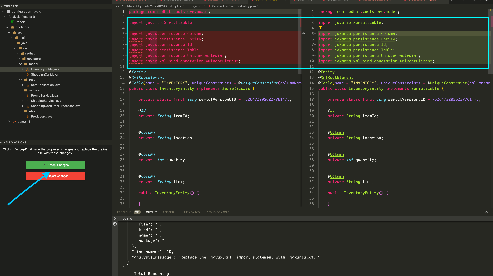

# Kai Demo (August 2024)

Konveyor AI (kai) is Konveyor's approach to easing modernization of application
source code to a new target by leveraging LLMs with guidance from static code
analysis augmented with data in Konveyor that helps to learn how an Organization
solved a similar problem in the past.

- [Kai Demo](#kai-demo)
  - [Overview](#overview)
  - [Prerequisites](#prerequisites)
  - [Step 1: Setup](#step-1-setup)
    - [Running Kai with IBM-served Llama 3](#running-kai-with-ibm-served-llama-3)
    - [Running Kai with Amazon Bedrock-served Llama 3](#running-kai-with-amazon-bedrock-served-llama-3)
    - [Running Kai with GPT-3.5-Turbo](#running-kai-with-gpt-35-turbo)
    - [Running Kai with Cached Responses Only (demo mode)](#running-kai-with-cached-responses-only-demo-mode)
  - [Step 2: Clone the coolstore app](#step-2-clone-the-coolstore-app)
  - [Step 3: Run Analysis](#step-3-run-analysis)
    - [3.1 Change import namespaces](#31-change-import-namespaces)
    - [3.2 Modify Scope from CDI bean requirements](#32-modify-scope-from-cdi-bean-requirements)
    - [3.3 EJB Remote and Message Driven Bean(MDB) changes](#33-ejb-remote-and-message-driven-beanmdb-changes)
      - [EJB Remote](#ejb-remote)
      - [Message Driven Bean (MDB)](#message-driven-bean-mdb)
    - [Step 4: Deploy app to Kubernetes](#step-4-deploy-app-to-kubernetes)
  - [Conclusion](#conclusion)

## Overview

In this demo, we will showcase the capabilities of Konveyor AI (Kai) in
facilitating the modernization of application source code to a new target. We
will illustrate how Kai can handle various levels of migration complexity,
ranging from simple import swaps to more involved changes such as modifying
scope from CDI bean requirements. Additionally, we will look into migration
scenarios that involves EJB Remote and Message Driven Bean(MBD) changes

We will focus on migrating a partially migrated [JavaEE Coolstore
application](https://github.com/konveyor-ecosystem/coolstore.git) to Quarkus, a
task that involves not only technical translation but also considerations for
deployment to Kubernetes. By the end of this demo, you will understand how
Konveyor AI (Kai) can assist and expedite the modernization process.

## Prerequisites

- [Docker](https://docs.docker.com/get-docker/) to deploy the coolstore app
- [VSCode](https://code.visualstudio.com/download)
- [Git](https://git-scm.com/downloads)
- [Kubernetes cluster (minikube)](https://minikube.sigs.k8s.io/docs/start/)
- [GenAI credentials](../llm_selection.md#ibm-bam-service)
- [Maven](https://maven.apache.org/install.html)
- Quarkus 3.10
- Java 17

Additionally, you will need to have the Kai IDE plugin installed in VSCode. As
of 2024-09-10, you should install **version 0.0.3**. You can follow the steps
listed
[here](https://github.com/konveyor-ecosystem/kai-vscode-plugin)

## Step 1: Setup

[You can configure Kai in multiple ways](../contrib/configuration.md). The best
way to configure Kai is with `config.toml` file. When running Kai using `podman
compose up`, if the file `build/config.toml` exists, Kai will use it. An example
config is present at `build/example_config.toml`.

Create a new file at `build/config.toml` to begin.

You will need to select an LLM model to use with Kai. Here are some examples of
how to configure Kai to use different models. For more options, see
[llm_selection.md](../llm_selection.md).

If you don't have access to an LLM, you also have the option to run Kai in demo
mode, which uses cached responses.

> [!IMPORTANT]
>
> The demo assumes you are using IBM-served Llama 3. If you are using a different
> model, the responses you get back may be different.

### Running Kai with IBM-served Llama 3

<!-- Begin copy from llm_selection.md#ibm-bam-service -->

> [!WARNING]  
> In order to use this service an individual needs to obtain a w3id
> from IBM. The kai development team is unable to help obtaining this access.

1. Login to https://bam.res.ibm.com/.
2. To access via an API you can look at ‘Documentation’ after logging into
   https://bam.res.ibm.com/. You will see a field embedded in the
   'Documentation' section where you can generate/obtain an API Key.
3. Ensure you have exported the key via `export
GENAI_KEY=my-secret-api-key-value`.

<!-- End copy from llm_selection.md#ibm-bam-service -->

Next, paste the following into your `build/config.toml` file:

```toml
[models]
provider = "ChatIBMGenAI"

  [models.args]
  model_id = "meta-llama/llama-3-70b-instruct"
  parameters.max_new_tokens = 2048
```

Finally, run the backend with `podman compose up`.

### Running Kai with Amazon Bedrock-served Llama 3

1. Obtain your AWS API key from Amazon Bedrock.
2. Export your `AWS_ACCESS_KEY_ID`, `AWS_SECRET_ACCESS_KEY`, and
   `AWS_DEFAULT_REGION` environment variables.

Next, paste the following into your `build/config.toml` file:

```toml
[models]
provider = "ChatBedrock"

  [models.args]
  model_id = "meta.llama3-70b-instruct-v1:0"
```

Finally, run the backend with `podman compose up`.

### Running Kai with GPT-3.5-Turbo

<!-- Begin copy from llm_selection.md#openai-service -->

1. Follow the directions from OpenAI
   [here](https://help.openai.com/en/articles/4936850-where-do-i-find-my-openai-api-key).
2. Ensure you have exported the key via `export
OPENAI_API_KEY=my-secret-api-key-value`

<!-- End copy from llm_selection.md#openai-service -->

Next, paste the following into your `build/config.toml` file:

```toml
[models]
provider = "ChatOpenAI"

  [models.args]
  model = "gpt-3.5-turbo"
```

Finally, run the backend with `podman compose up`.

### Running Kai with Cached Responses Only (demo mode)

If you don't have access to a `GEN_AI` key, you can run the server in demo mode
which will use cached responses

To run the Kai server in demo mode, `podman compose up`. `KAI__DEMO_MODE` is set
to `true` inside the `compose.yaml` file.

## Step 2: Clone the coolstore app

Let's clone the Coolstore application, which we will be used demo the migration
process to Quarkus.

First, clone the Coolstore demo from its repository:

```sh
git clone https://github.com/konveyor-ecosystem/coolstore.git
```

Next, switch to the branch of the Coolstore app that's been partially migrated:

```sh
git checkout partial-migration
```

## Step 3: Run Analysis

We will analyze the Coolstore application using the following migration targets
to identify potential areas for improvement:

<!-- - containerization -->

- jakarta-ee
- jakarta-ee8
- jakarta-ee9
- quarkus

Let's perform our initial analysis:

1. Open VSCode and load coolstore project if it is not already loaded.
2. Follow the steps to run the analysis listed
   [here](https://github.com/konveyor-ecosystem/kai-vscode-plugin/blob/main/docs/user-guide.md#running-kantra-analysis)
3. Once the analysis is complete you will see incidents listed on the following files

- `src/main/java/com/redhat/coolstore/model/ShoppingCart.java`
- `src/main/java/com/redhat/coolstore/model/InventoryEntity.java`
- `src/main/java/com/redhat/coolstore/service/CatalogService.java`
- `src/main/java/com/redhat/coolstore/service/ShippingService.java`
- `src/main/java/com/redhat/coolstore/service/ShoppingCartOrderProcessor.java`

> [!NOTE]
>
> While the file `src/main/java/com/redhat/coolstore/rest/RestApplication.java`
> is flagged, for the purpose of this demo it is okay to skip that file and
> proceed.

The incidents in the above files will provide insights into potential issues or
areas that require attention during the migration process.

### 3.1 Change import namespaces

- Right-click on the file
  `src/main/java/com/redhat/coolstore/model/ShoppingCart.java`.
- Select Kai Fix-All.
- Accept the proposed changes.
- Repeat the same process for the file -
  `src/main/java/com/redhat/coolstore/model/InventoryEntity.java`.



The above steps show how Kai simplifies the translation of import namespaces,
ensuring seamless automated migration of javax libraries to jakarta persistence
libraries.

### 3.2 Modify Scope from CDI bean requirements

In this step, we will use Kai to modify the scope in `CatalogService.java` to
adhere to Quarkus CDI bean requirements. Kai will handle this automatically,
ensuring seamless migration.

- Right-click on the file
  `src/main/java/com/redhat/coolstore/service/CatalogService.java`.
- Select Kai Fix-All.
- Accept the proposed changes.


### 3.3 EJB Remote and Message Driven Bean(MDB) changes

We will address EJB Remote and MDB functionalities in `ShippingService.java` and
`ShoppingCartOrderProcessor.java` respectively. Kai will guide us through
replacing EJBs with REST functionality and updating related imports and
annotations.

#### EJB Remote

- Right-click on the file
  `src/main/java/com/redhat/coolstore/service/ShippingService.java`.
- Select `Kai Fix-All`.
- Accept the proposed changes.


Due to the absence of support for Remote EJBs in Quarkus, you will notice that
these functionalities are removed and replaced with REST functionality.

#### Message Driven Bean (MDB)

- Right-click on the file `src/main/java/com/redhat/coolstore/service/ShoppingCartOrderProcessor.java`.

- Select `Kai Fix-All` and accept the changes.


- Note the changes made to `ordersEmitter` channel:

  ```java
  @Inject
  @Channel("orders")
  Emitter<String> ordersEmitter;
  ```

  Although this change is valid, it's important to note that the LLM is unaware
  of the number of consumers for `orders` channel. It assumed that there is a
  single consumer for `orders`, but, this app has multiple consumers of
  `orders`. Assuming there's only a single consumer can lead to
  `io.smallrye.reactive.messaging.providers.wiring.TooManyDownstreamCandidatesException`.
  To avoid this, add the `@Broadcast` annotation:

  ```java
  import io.smallrye.reactive.messaging.annotations.Broadcast;

  @Inject
  @Channel("orders")
  @Broadcast
  Emitter<String> ordersEmitter;
  ```

- Since the LLM doesn't have access to the project's `pom.xml` file, it lacks
  information about available dependencies. Update the import statements to the
  following:

  ```java
  import org.eclipse.microprofile.reactive.messaging.Channel;
  import org.eclipse.microprofile.reactive.messaging.Emitter;
  ```


### Step 4: Deploy app to Kubernetes

Although the app is deployable to any [Kubernetes](https://kubernetes.io/)
distribution. For the sake of simplicity we choose
[minikube](https://minikube.sigs.k8s.io/docs/).

> [!NOTE]
>
> It is assumed that minikube is installed. If not you can follow
> the instructions [here](https://minikube.sigs.k8s.io/docs/start/).

First, start minikube with the docker driver:

```bash
minikube start --driver=docker
```

Next, point your shell to minikube's docker daemon. Kubernetes may not be able
to find the built images if they are not in the same docker daemon as minikube.

```bash
eval $(minikube docker-env)
```

The coolstore requires a PostgreSQL database. To install Postgres into minikube,
we have added deploy scripts. run the scripts in the following order

```bash
kubectl apply -f deploy/kubernetes/persistent-volume.yaml
kubectl apply -f deploy/kubernetes/persistent-volume-claim.yaml
kubectl apply -f deploy/kubernetes/postgresql-deployment.yaml
kubectl apply -f deploy/kubernetes/postgresql-service.yaml

# Wait until the postgres pod is running
watch kubectl get all
```

This should setup the database ready for connections from the coolstore app.

To deploy the app, simply run the following command, it will create a docker
image on the local drive and load the manifests into kubernetes to pull the
image.

```bash
mvn clean compile package -Dquarkus.kubernetes.deploy=true
```

Once deployed, access the app via browser hitting the localhost and port. Note
that it might take a minute when you open the website for the first time. To get
this URL, run the following command:

```bash
minikube service list
```


## Conclusion

In this demo, we showcased the capability of Kai in facilitating various types
of code migrations within the Coolstore application. By leveraging Kai's
capabilities, organizations can expedite the modernization process. If you are
interested to learn more about our ongoing efforts and future plans, please
reach out to us in the [slack
channel](https://kubernetes.slack.com/archives/CR85S82A2)
