# Modernizing a JavaEE Application to Quarkus Using Konveyor AI

Konveyor AI (kai) is Konveyor's approach to easing modernization of application
source code to a new target by leveraging LLMs with guidance from static code
analysis augmented with data in Konveyor that helps to learn how an Organization
solved a similar problem in the past.

- [Modernizing a JavaEE Application to Quarkus Using Konveyor AI](#modernizing-a-javaee-application-to-quarkus-using-konveyor-ai)
  - [Overview](#overview)
  - [Prerequisites](#prerequisites)
  - [Step 1: Setup](#step-1-setup)
    - [Installation](#installation)
    - [Download the Demo Application](#download-the-demo-application)
    - [Get Ready to Analyze](#get-ready-to-analyze)
  - [Step 2: Run Analysis](#step-2-run-analysis)
    - [2.1 Change import namespaces](#21-change-import-namespaces)
    - [2.2 Modify Scope from CDI bean requirements](#22-modify-scope-from-cdi-bean-requirements)
    - [2.3 EJB Remote](#23-ejb-remote)
    - [Notice](#notice)
    - [2.4 JMS to SmallRye](#24-jms-to-smallrye)
  - [Step 3: Deploy app to Kubernetes](#step-3-deploy-app-to-kubernetes)
  - [Debug and File Incidents](#debug-and-file-incidents)
  - [Conclusion](#conclusion)

## Overview

In this demo, we will showcase the capabilities of Konveyor AI (Kai) in
facilitating the modernization of application source code to a new target. We
will illustrate how Kai can handle various levels of migration complexity,
ranging from simple import swaps to more involved changes such as modifying
scope from CDI bean requirements. Additionally, we will look into migration
scenarios that involves EJB Remote and JMS-based Message Driven Bean (MDB)
changes.

We will focus on migrating a partially migrated [JavaEE Coolstore
application][coolstore github] to Quarkus, a task that involves not only
technical translation but also considerations for deployment to Kubernetes. By
the end of this demo, you will understand how Konveyor AI (Kai) can assist and
expedite the modernization process.

[coolstore github]: https://github.com/konveyor-ecosystem/coolstore.git

## Prerequisites

- [VSCode](https://code.visualstudio.com/download)
- [Git](https://git-scm.com/downloads)
- [Kubernetes cluster (minikube)](https://minikube.sigs.k8s.io/docs/start/)
- AI credentials
- [Maven](https://maven.apache.org/install.html)
- Java 21

Additionally, you will need to have the Kai IDE plugin installed in VSCode.
Download the latest from [here][kai extension releases]

[kai extension releases]: https://github.com/konveyor/editor-extensions/releases

## Step 1: Setup

### Installation

Follow the steps in the [installation guide](../../getting_started.md) to
install Kai. It will help you find the latest build and complete the setup.

### Download the Demo Application

1. Clone the Cool-store application:

   ```bash
   git clone https://github.com/konveyor-ecosystem/coolstore.git
   ```

   Next, switch to the branch of the Coolstore app that's been partially migrated:

   ```sh
   git checkout partial-migration
   ```

2. Navigate to File > Open in VSCode and locate the folder we just cloned.

### Get Ready to Analyze

We will analyze the Coolstore application using the following migration targets
to identify potential areas for improvement:

- cloud-readiness
- jakarta-ee
- jakarta-ee8
- jakarta-ee9
- quarkus
- discovery

Upon a fresh install of the extension, you should see something like this:

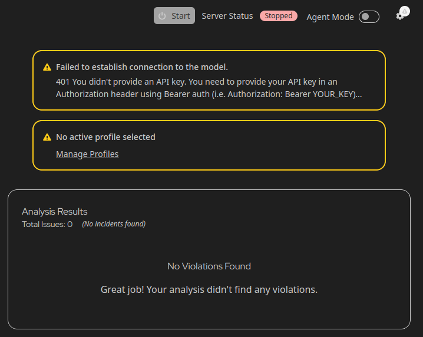

Click on "Manage Profiles".


Create a profile with the aforementioned following target technologies:

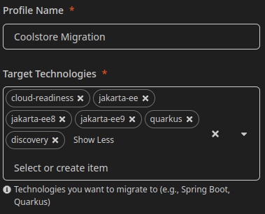

Return back to the main "Konveyor Analysis View" page and click the settings
icon in the top right.

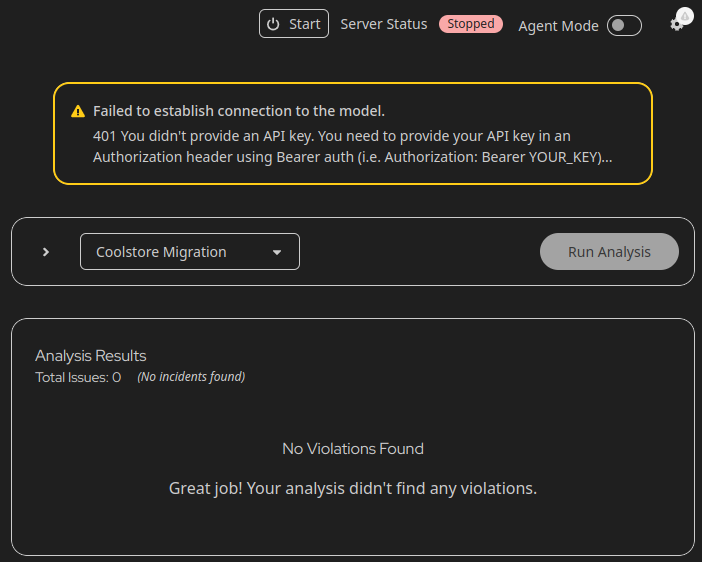

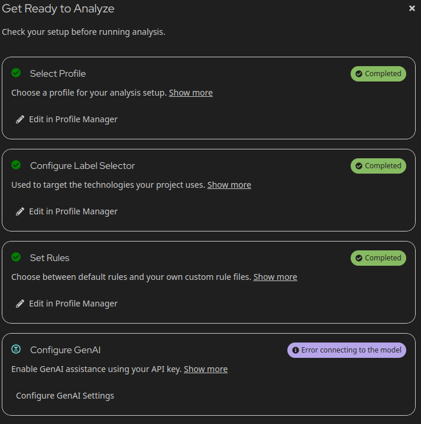

Then, click "Configure GenAI Settings". Input your GenAI Credentials, for
example, providing an `OPENAI_API_KEY` variable.

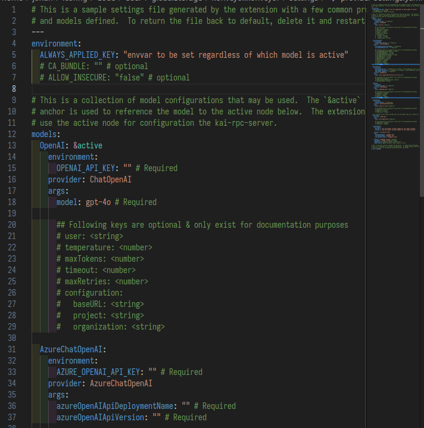

Return to the "Konveyor Analysis View" and click "Start".

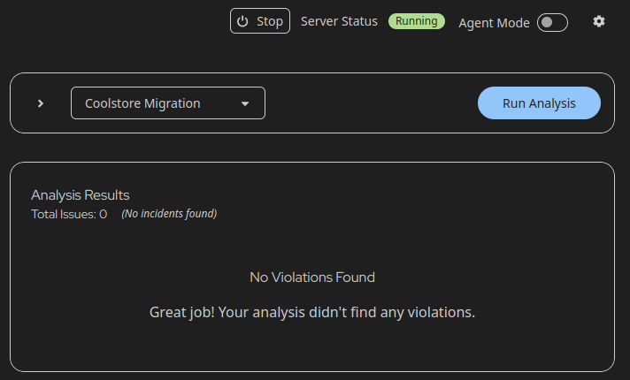

## Step 2: Run Analysis

Let's perform our initial analysis. Click "Run Analysis". Once the analysis is
complete, you will see many incidents.

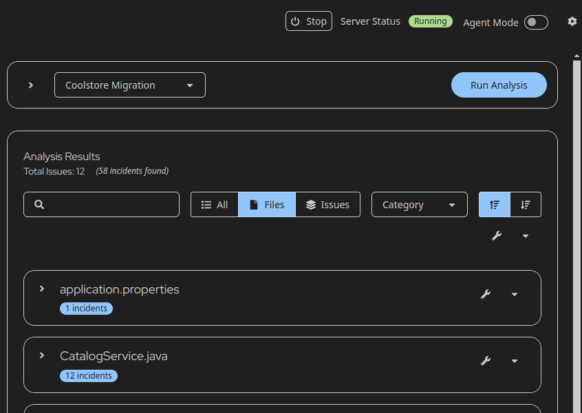

Let's focus on fixing only the 6 files necessary to migrate the Coolstore
application.

- `src/main/java/com/redhat/coolstore/model/ShoppingCart.java`
- `src/main/java/com/redhat/coolstore/model/InventoryEntity.java`
- `src/main/java/com/redhat/coolstore/service/CatalogService.java`
- `src/main/java/com/redhat/coolstore/service/ShippingService.java`
- `src/main/java/com/redhat/coolstore/service/InventoryNotificationMDB.java`
- `src/main/java/com/redhat/coolstore/service/OrderServiceMDB.java`

> [!NOTE]
>
> While the file `src/main/java/com/redhat/coolstore/rest/RestApplication.java`
> is flagged, for the purpose of this demo it is okay to skip that file and
> proceed.

The incidents in the above files will provide insights into potential issues or
areas that require attention during the migration process.

> [!NOTE]
>
> Before fixing the issues, keep in mind that results may vary depending on the
> AI model used. The accuracy and detail of migration suggestions depend on the
> model’s training data and capabilities. If a different model (e.g., GPT-4,
> LLaMA-3) is used, the refactoring recommendations may differ.
>
> In this case, incidents are being fixed using GPT-4o.

### 2.1 Change import namespaces

Search for the `InventoryEntity.java file`. Click on the top right button to resolve all incidents or individual incidents as shown below.

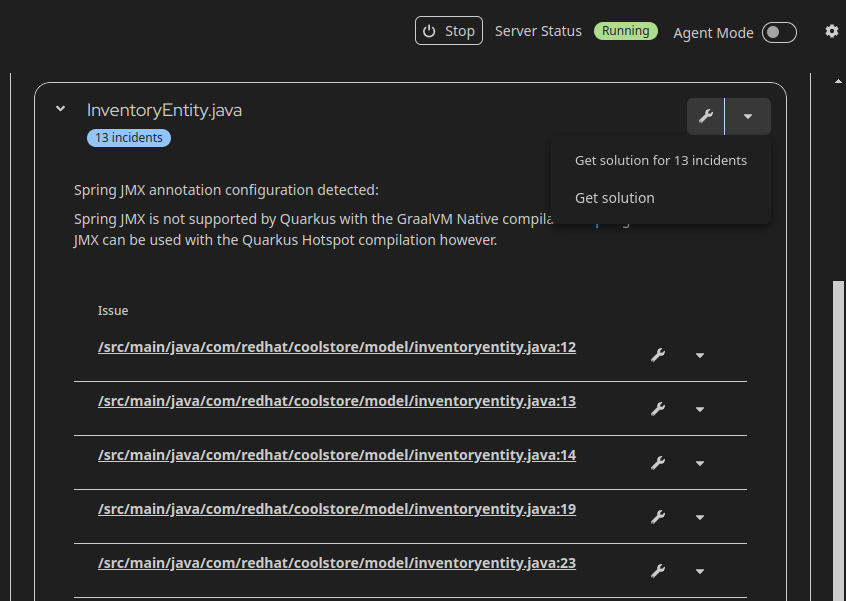

The "Resolution Details" window will display the requested fix information as
shown below.

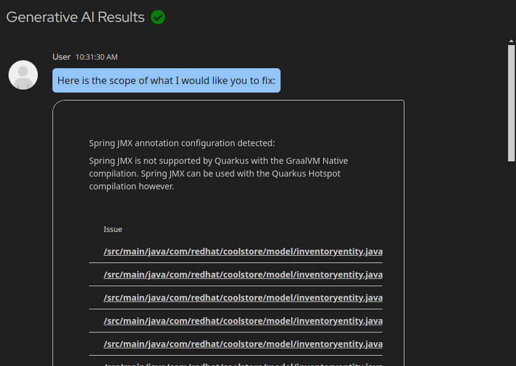

You can view the reasoning behind the suggested changes and additional
information provided by Kai.

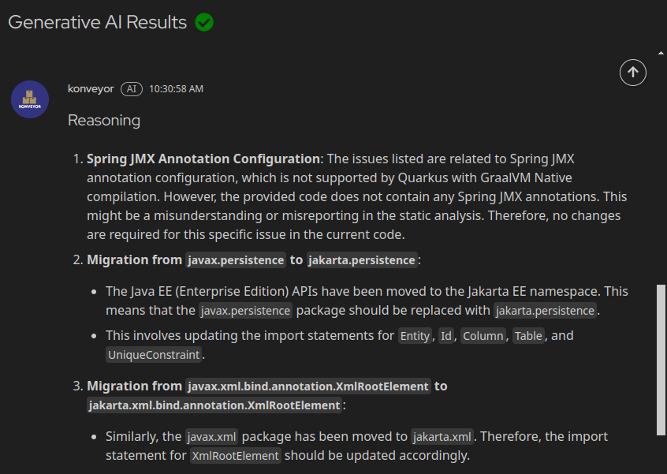

Moreover, you can see the additional number of errors that requires your
attention and number of modified files.

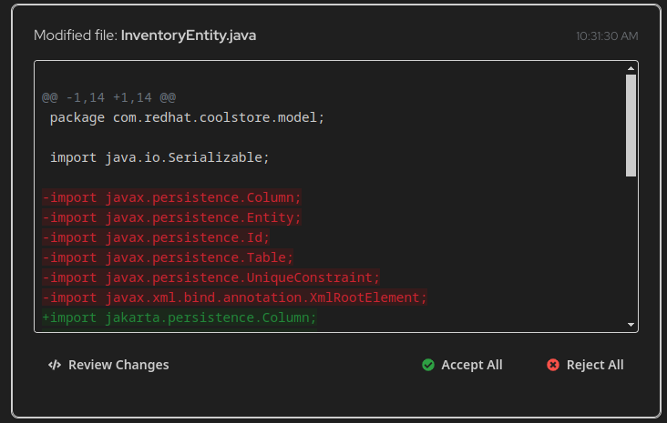

Click on "Review Changes" to view the differences.

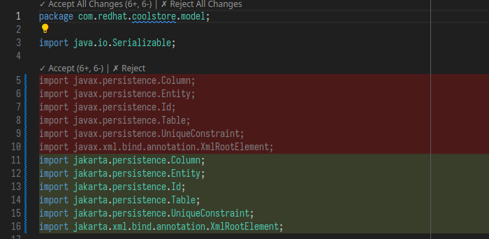

Accept the changes by accepting the hunks individually, or by returning to the
previous screen and clicking "Accept All".

The above steps show how Kai simplifies the translation of import namespaces,
ensuring seamless automated migration of javax libraries to jakarta persistence
libraries.

Just like we fixed `InventoryEntity.java`, repeat the same steps for
`ShoppingCart.java`.

### 2.2 Modify Scope from CDI bean requirements

In this step, we will use Kai to update the scope definitions in
`CatalogService.java`, and `ShippingService.java` to align with Quarkus CDI bean
requirements. Kai will automate this process, ensuring a smooth migration.

Let's review each file and fix all associated issues one by one. The effort
level will remain low. Just like in Step 2.1, we will search for the file and
request a resolution.

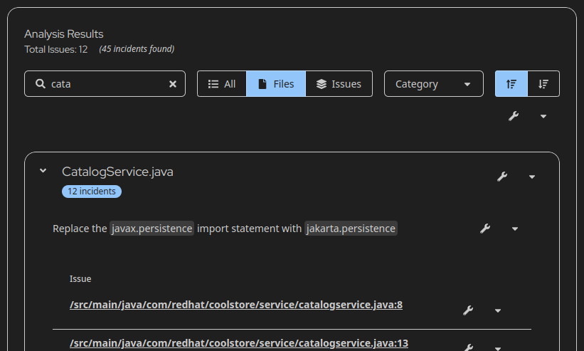

Verify each solution, review the reasoning and additional steps, and ensure the
requested changes are applied. In this case, Kai will rerun the analysis and
reduce the number of incidents if the changes are compatible.

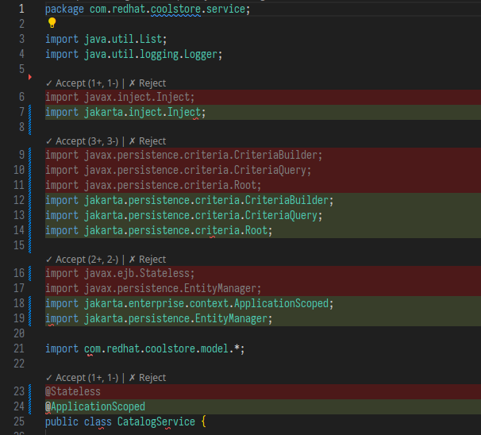

In `CatalogService.java` Stateless EJB is converted to a CDI bean by replacing
the @Stateless annotation with a scope @ApplicationScoped.

### 2.3 EJB Remote

Now lets request resolution for the `ShippingService.java` as we did in previous
steps. Kai replaced EJBs with REST functionality and updated related imports and
annotations.

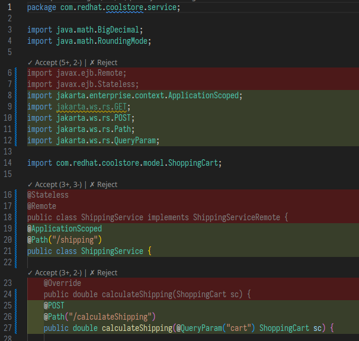

Due to the absence of support for Remote EJBs in Quarkus, you will notice that
these functionalities are removed and replaced with REST functionality.

### Notice

> [!WARNING]
>
> The rest of this guide has not been updated to the latest version of Kai.
> During our test day, we should figure out how things need to change. For me,
> the MDBs were not showing up during analysis results, so Kai couldn't fix them.

### 2.4 JMS to SmallRye

As you can see, there is an option to search for issues where files are grouped
by common incidents. Look for "JMS not supported in Quarkus".

The incident details indicate that JavaEE/JakartaEE JMS elements should be
removed and replaced with their Quarkus SmallRye/MicroProfile equivalents.
Additionally, the project's pom.xml file needs to be updated with the required
dependencies. If we introduce a new dependency, it should be properly configured
to ensure compatibility with the existing setup.

In such cases, let's leverage Kai's agentic workflow, which helps solve problems
in depth. Enable the mode by toggling the "Agent Mode" option in the main
analysis view.


Then fix the "JMS is not Supported in Quarkus" issue. This may take longer as
Kai is working to resolve a complex problem. Continue accepting changes until
the application is migrated.

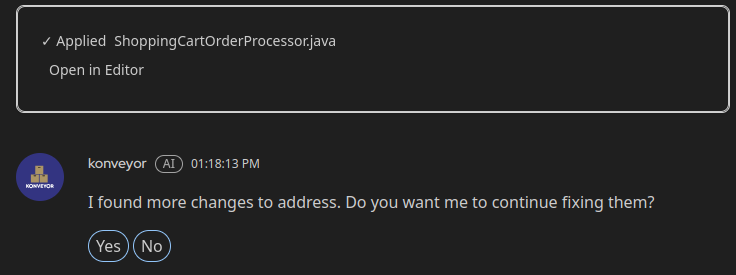

Let's review all the changes one by one.


The migration replaces the JMS-based Message Driven Bean (MDB) with Quarkus
SmallRye Reactive Messaging. It removes JMS dependencies, manual connection
management, and session handling, replacing them with `@Incoming("orders")` for
message processing.


Let's review `pom.xml` file.

> [!NOTE]
>
> If Kai updates its dependencies and includes SmallRye Reactive Messaging
> 4.27.0 as an independent dependency, it may not be found in Maven. Since
> Quarkus already includes SmallRye internally, it is recommended to use
> `io.quarkus:quarkus-smallrye-reactive-messaging` instead of
> `io.smallrye.reactive` to ensure compatibility and avoid missing artifacts.
>
> The required approach may vary based on the LLM model used. Verify and resolve
> accordingly. The screenshot below shows the expected state.


At the end of this step, the application should be able to compile successfully.
Any additional incidents can be ignored. To update dependencies from the
repository and compile the project, run the following command

```bash
mvn clean install -U && mvn compile
```

## Step 3: Deploy app to Kubernetes

Although the app is deployable to any [Kubernetes](https://kubernetes.io/)
distribution. For the sake of simplicity we choose
[minikube](https://minikube.sigs.k8s.io/docs/).

> [!NOTE]
>
> It is assumed that minikube is installed. If not you can follow the
> instructions [here](https://minikube.sigs.k8s.io/docs/start/).

First, start minikube with the docker driver:

```bash
minikube start --driver=docker
```

Next, point your shell to minikube's docker daemon. Kubernetes may not be able
to find the built images if they are not in the same docker daemon as minikube.

```bash
eval $(minikube docker-env)
```

The coolstore requires a PostgreSQL database. To install Postgres into minikube,
we have added deploy scripts. run the scripts in the following order

```bash
kubectl apply -f deploy/kubernetes/persistent-volume.yaml
kubectl apply -f deploy/kubernetes/persistent-volume-claim.yaml
kubectl apply -f deploy/kubernetes/postgresql-deployment.yaml
kubectl apply -f deploy/kubernetes/postgresql-service.yaml

# Wait until the postgres pod is running
watch kubectl get all
```

This should setup the database ready for connections from the coolstore app.

To deploy the app, simply run the following command, it will create a docker
image on the local drive and load the manifests into kubernetes to pull the
image.

```bash
mvn clean compile package -Dquarkus.kubernetes.deploy=true
```

Once deployed, access the app via browser hitting the localhost and port. Note
that it might take a minute when you open the website for the first time. To get
this URL, run the following command:

```bash
minikube service list
```


## Debug and File Incidents

Please review this [page](/docs/debug.md) for information on Logs,
Troubleshooting, and Filing Issues.

## Conclusion

In this demo, we showcased the capability of Kai in facilitating various types
of code migrations within the Coolstore application. By leveraging Kai's
capabilities, organizations can expedite the modernization process. If you are
interested to learn more about our ongoing efforts and future plans, please
reach out to us in the [slack channel][konveyor slack channel].

[konveyor slack channel]: https://kubernetes.slack.com/archives/CR85S82A2
