# Modernizing a Java 8 Application to Java 17 Using Konveyor AI

## Goal

This scenario demonstrates how **Konveyor AI** can assist in modernizing a **Java 8** application to **Java 17** by identifying outdated APIs, suggesting migration changes, and ensuring best security practices (e.g., replacing MD5 hashing). We will use a custom rule and default rules with **Konveyor AI** to analyze a legacy Java application and generate refactoring recommendations.

## Prerequisites

Ensure you have the following set up:

- [VSCode](https://code.visualstudio.com/download)
- [Git](https://git-scm.com/downloads)
- [GenAI credentials](https://github.com/konveyor/kai/blob/main/docs/llm_selection.md#ibm-bam-service)
- Java 8 & Java 17 installed
- Maven 3.9+
- [Java sample app](https://github.com/konveyor-ecosystem/migrationex.git)
- [Kai VSCode IDE extension 0.0.13+](https://github.com/konveyor/editor-extensions/releases)

## Application Overview

The [`migration example`](<(https://github.com/konveyor-ecosystem/migrationex.git)>) repository consists of two main components:

1.  Java 8 Application – The sample Java 8 application (`migration example`) is a simple **Book management system** that manages a collection of books.
2.  Rules Folder – Contains custom migration rules used by Kai for this app.

### Files to modernize

- `Library.java`
- `LibraryService.java`
- `pom.xml`

## Step 1: Setup the environment

### 1.1 Clone the Sample Java 8 Application

Clone the migration example repository:

```sh

git clone https://github.com/konveyor-ecosystem/migrationex.git
cd migrationex/migrationex
```

Navigate to File > Open in VSCode and locate the folder we just cloned and select the sub-folder `migrationex`.

### 1.2 Install the Konveyor AI VS Code Extension

Follow this [installation guide](https://github.com/konveyor/kai/blob/main/docs/scenarios/demo.md#configure-konveyor) to install the latest Konveyor AI IDE plugin.

_Note: At the time of writing this guide, we used version 0.0.13._

### 1.3 Configure Kai in VS Code

1.3.1. When you launch the extension, you will land on the Welcome Page, as shown below. If the Welcome Page does not appear, proceed to the step 1.3.2.

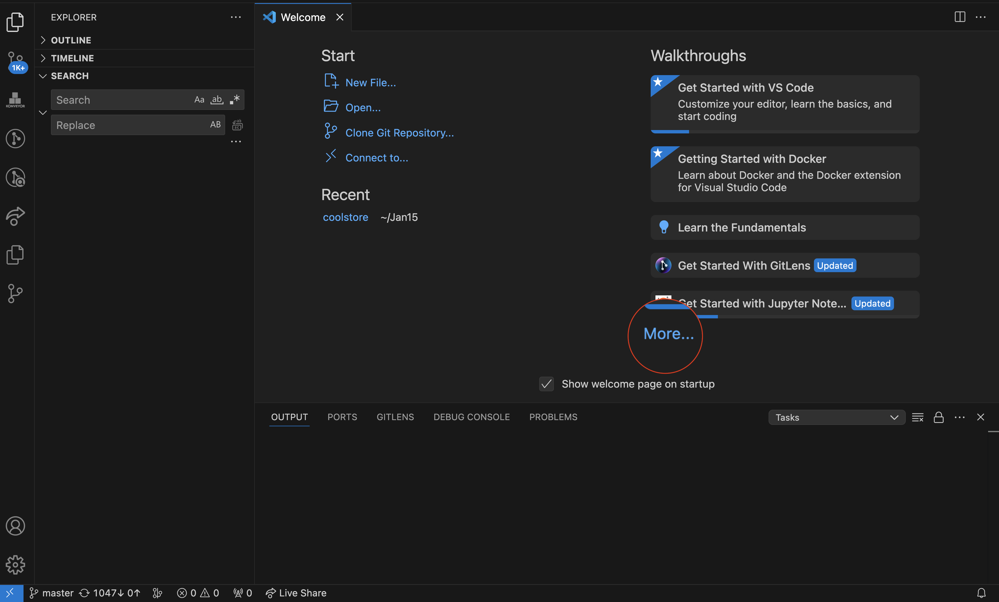

1.3.2. If "Set up Konveyor" is not available in the list, click the More button for additional options.
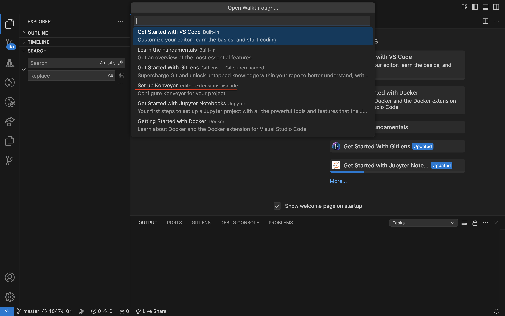

1.3.3 If the welcome page does not appear, open the command palette by pressing Command + Shift + P. This will bring up a list of commands.
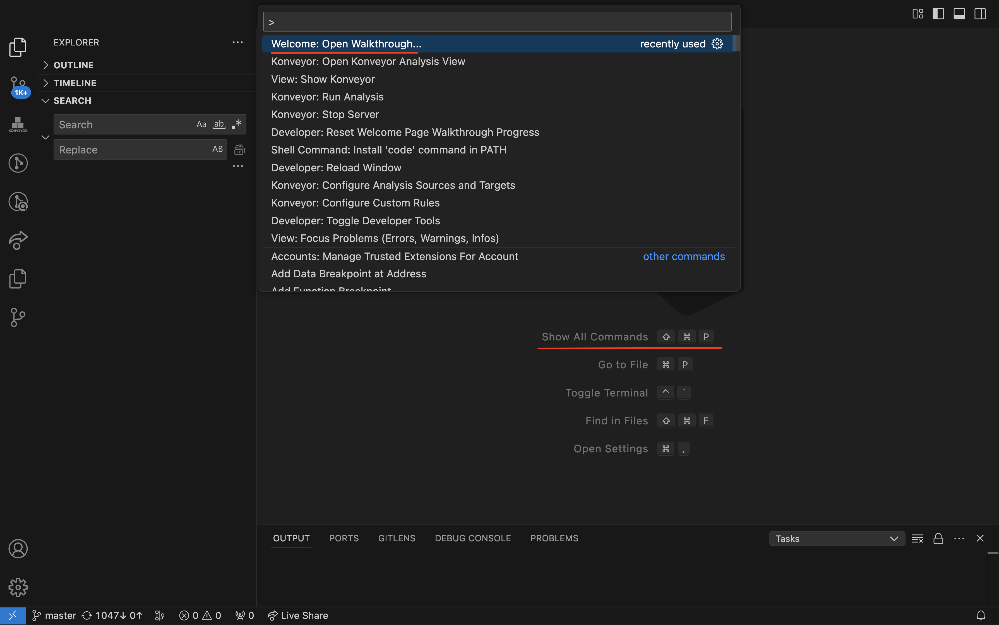

From the command palette, locate and select the "Set up Konveyor" option. This will guide you through the configuration process.
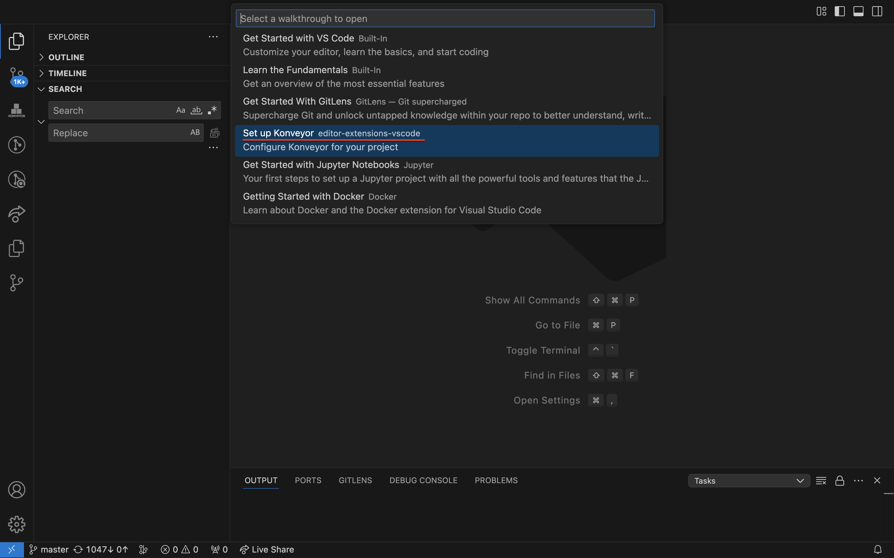

#### Configure Kai for your project.

User has an option to override binaries and custom rules, however it comes with the default packaged binaries and custom rules.

1. Let's select the custom rule we have
   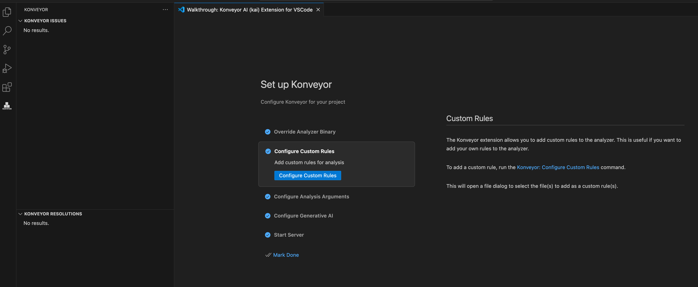
   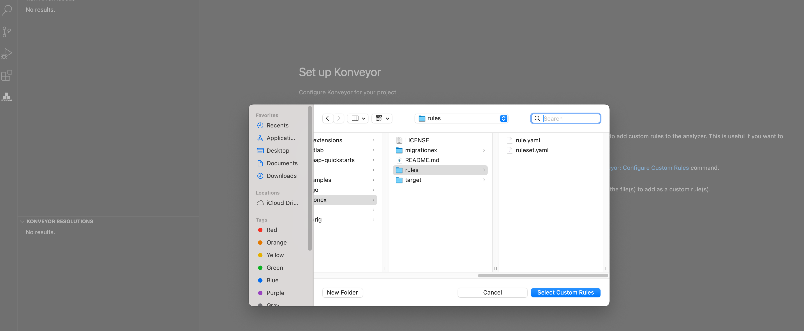
   Make sure to select `Yes` to use the default rulesets
   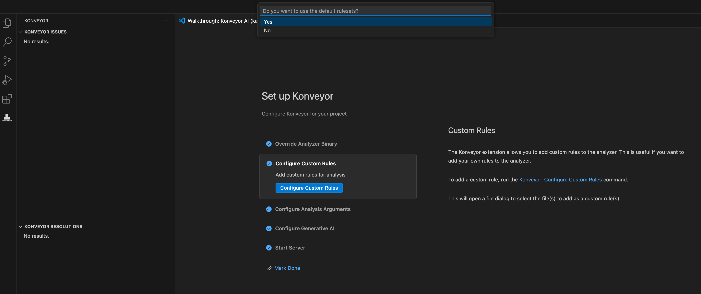
   You will see a notification that custom rules updated
   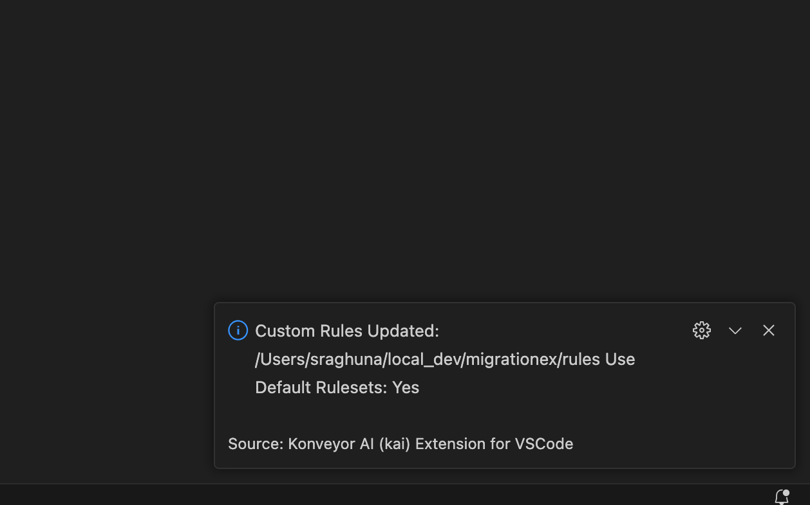

2. Configuring analysis arguments is necessary to determine which rules apply to the project during analysis. Set up analysis arguments specific to your project by selecting the appropriate options and pressing "OK" to save the changes.

We will analyze the application using the following migration targets to identify potential areas for improvement:

- Openjdk11
- Openjdk 17
- Jakarta-ee

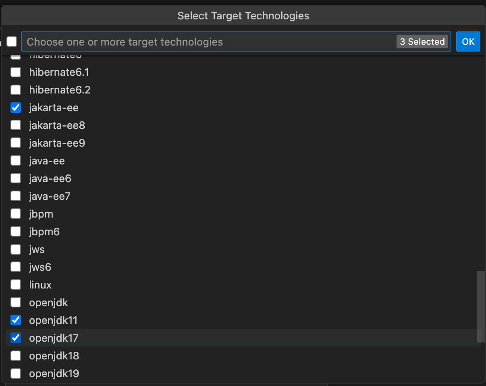

3. Next, set up the Generative AI key for your project. This step will open the `provider-settings.yaml` file. By default, it is configured to use OpenAI. To change the model, update the anchor `&active` to the desired block. Modify this file with the required arguments, such as the model and API key, to complete the setup. Sample of the provider-settings.yaml can be found [here](https://github.com/konveyor/editor-extensions/blob/main/vscode/resources/sample-provider-settings.yaml).

4. Click on `Start Analyzer` to initialize the RPC server

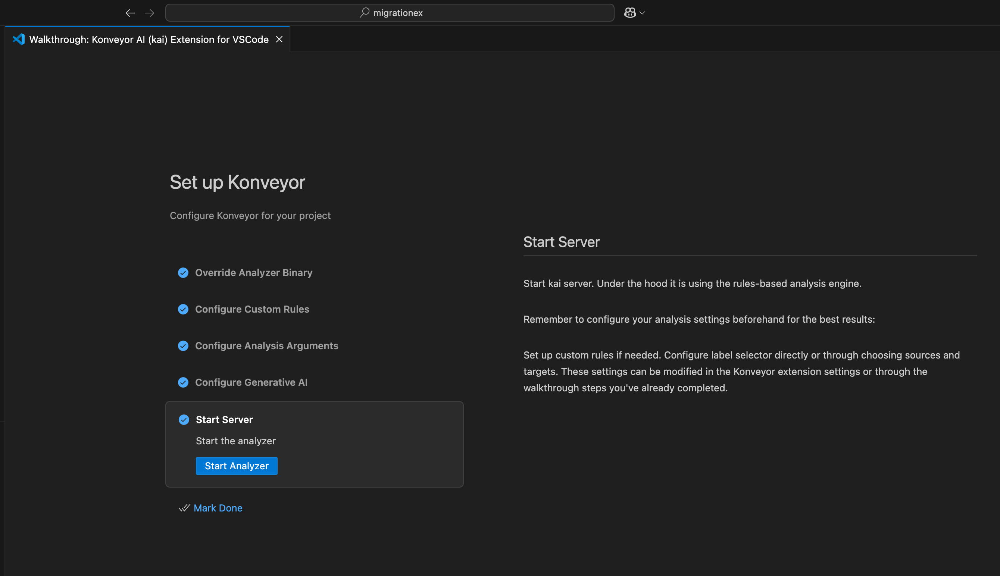

## Step 2: Understanding the Custom Rule

Before we run the analysis, lets understand the custom rule we are going to use.

#### 1. Custom Rule for MD5 Hashing

The `Library.java` class is responsible for managing books in the system. However, it uses MD5 hashing to generate unique identifiers:

Library.java (Before Migration)

```java
    ...
    ...
    private String generateHash(String input) {
        try {
            MessageDigest md5Digest = MessageDigest.getInstance("MD5");
            byte[] hash = md5Digest.digest(input.getBytes());
            BASE64Encoder encoder = new BASE64Encoder();
            return encoder.encode(hash);
        } catch (NoSuchAlgorithmException e) {
            e.printStackTrace();
            return null;
        }
    }
```

##### Problem:

MD5 is outdated and vulnerable to collisions.

##### Solution:

We need to detect MD5 usage and replace it with SHA-256.

Since MD5 hashing is insecure, we add a custom rule to detect and recommend secure alternatives.

````yaml
- ruleID: java-custom-security-00001
  category: mandatory
  effort: 2
  labels:
    - konveyor.io/source=java8
    - konveyor.io/source=openjdk
    - konveyor.io/target=openjdk17
  when:
    and:
      - java.referenced:
          pattern: java.security.MessageDigest.getInstance
          location: METHOD_CALL
      - builtin.filecontent:
          pattern: 'MessageDigest.getInstance\("MD5"\)'
  description: Do not use MD5 for hashing due to security vulnerabilities.
  message: |
    The MD5 algorithm is **outdated** and should not be used for secure hashing.
    Instead, use **SHA-256** or **SHA-512**.

    **Fix:**
    ```java
    // Deprecated MD5 usage
    MessageDigest md = MessageDigest.getInstance("MD5");

    // Recommended SHA-256 usage
    MessageDigest md = MessageDigest.getInstance("SHA-256");
    ```
  links:
    - title: "java ref"
      url: https://docs.oracle.com/en/java/javase/17/docs/api/java.base/java/security/MessageDigest.html
    - title: "MD5"
      url: https://csrc.nist.gov/projects/hash-functions
````

You can learn more about writing your own custom rules [here](https://github.com/konveyor/kai/blob/main/docs/custom_ruleset.md)

## Step 3: Run Analysis

Let's run our initial analysis:

1. Once you have RPC server initialized, navigate to "Konveyor Analysis View" and click Run Analysis. Open the command palette by pressing `Command + Shift + P` to find it.
   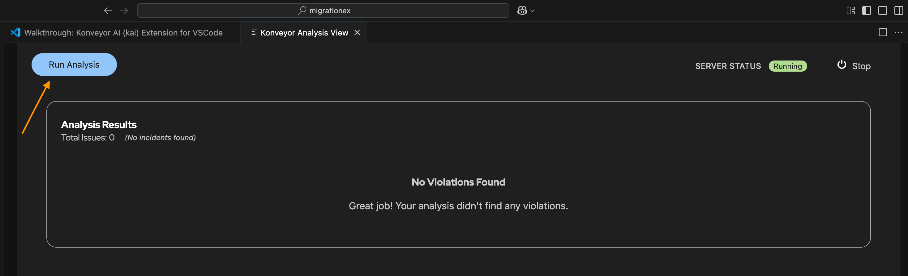

2. The Konveyor Analysis View lists issues, allowing you to filter them by file issues. On the left side, the Konveyor Issue Panel groups files based on similar issues for easier navigation.

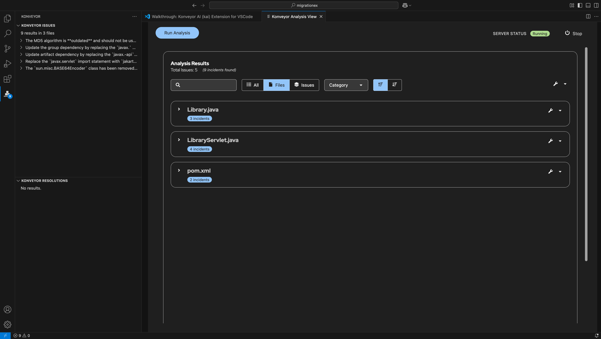

### 3.1 Incidents in Library.java

Expand the incidents for `Library.java` and you will see three incidents

#### Summary

| **Issue**                               | **Location** | **Fix**                    |
| --------------------------------------- | ------------ | -------------------------- |
| **MD5 is outdated** _(Custom Rule)_     | Line 42      | Use `SHA-256` or `SHA-512` |
| **`javax.servlet` → `jakarta.servlet`** | Line 8       | Update import              |
| **Deprecated `BASE64Encoder`**          | Line 7       | Use `Base64.getEncoder()`  |

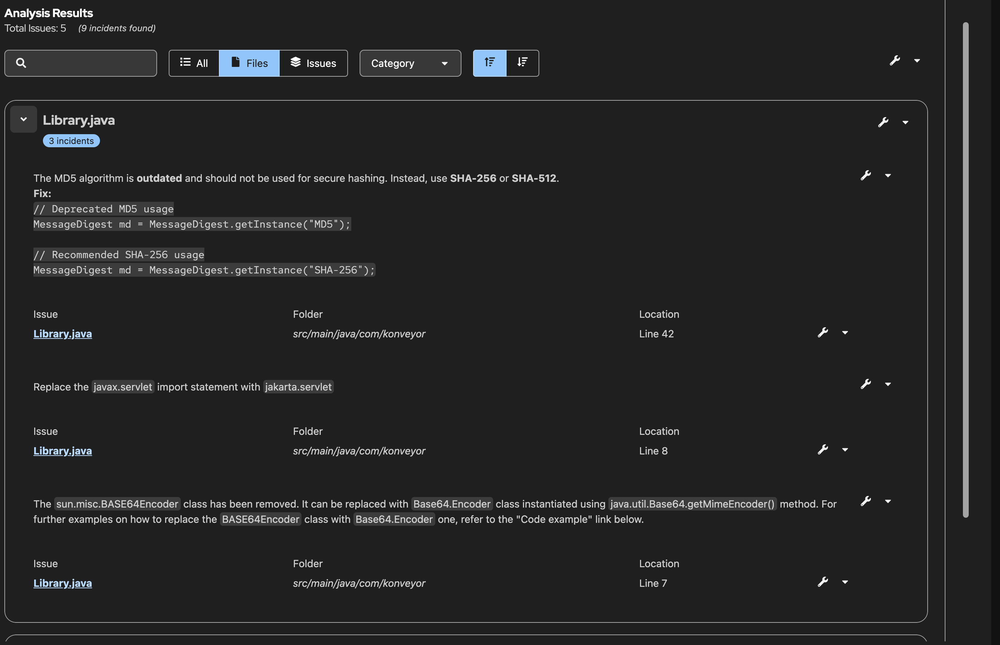

#### MD5 is outdated

#### Initiating the Resolution

- Click on the **tool icon** next to the first issue (MD5 hashing).

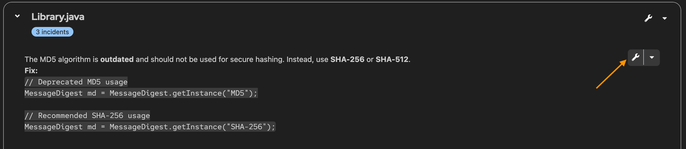

- This opens the resolution details panel
  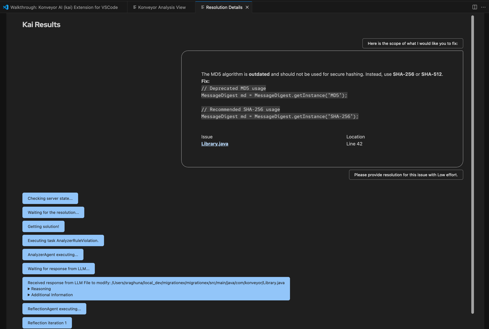

#### Requesting a Fix

- The **resolution process starts**, where Kai interacts with the **LLM**.
- Once Kai completes processing, it suggests modifications for **Library.java**.
  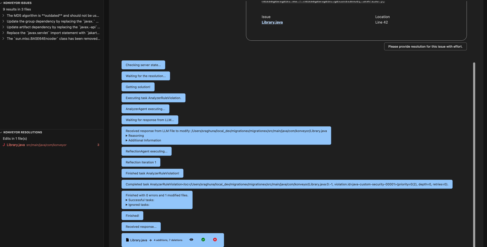
  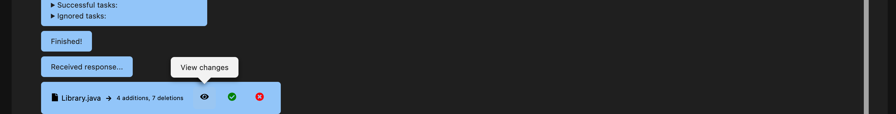

#### Reviewing Suggested Changes

- The IDE highlights differences between the **current** and **suggested** versions.
- The **right panel** displays:
  - **MD5 is replaced with SHA-256** for secure hashing.
  - **`BASE64Encoder` is replaced with `Base64.getEncoder()`** from `java.util.Base64`, which is the standard modern API.
    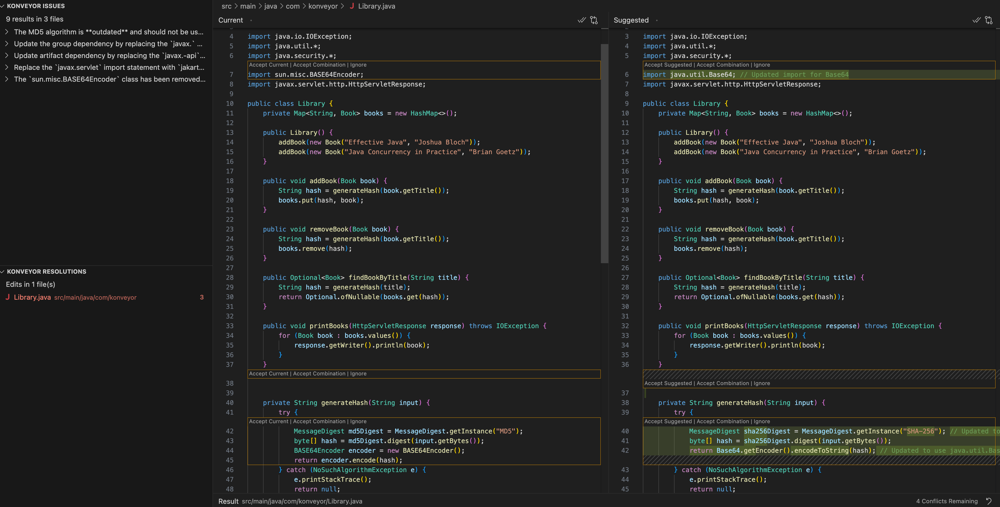

#### Applying Fixes

Click the `check icon` on the file in the left pane to apply the updates.
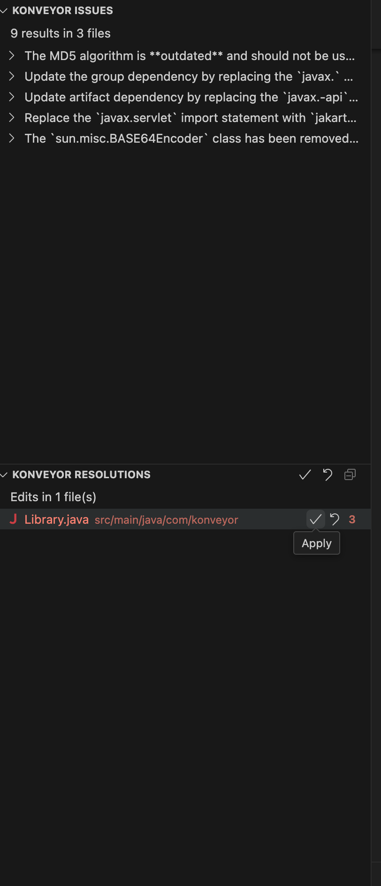

Kai correctly identified and resolved the issue:

final output:

```java
import java.util.Base64; // Updated import for Base64
MessageDigest sha256Digest = MessageDigest.getInstance("SHA-256"); // Updated to SHA-256
return Base64.getEncoder().encodeToString(hash); // Updated to use Base64 from java.util
```

From the logs we notice,

```
 **Identify the Issue**: The code currently uses the MD5 hashing algorithm, which is considered outdated and insecure for cryptographic purposes. The recommendation is to switch to a more secure hashing algorithm, such as SHA-256.\n+\n+2. **Update the Hashing Algorithm**: We will replace the `MessageDigest.getInstance(\"MD5\")` call with `MessageDigest.getInstance(\"SHA-256\")`. This change will enhance the security of the hashing mechanism used in the application.\n+\n+3. **Remove Deprecated Classes**: The code uses `sun.misc.BASE64Encoder`, which is not part of the standard Java API and is not recommended for use. Instead, we can use `java.util.Base64` which is available in Java 8 and later. This will also ensure compatibility with OpenJDK 17.
```

The LLM was smart to identify that `sun.misc.BASE64Encoder` is deprecated and decided to update that as well.

### 3.2 pom.xml

#### Identifying Issues

Konveyor analysis detected two dependency-related issues in `pom.xml`:

- Line 23: Replace the `javax.` groupId with `jakarta.`.
- Line 24: Replace `javax.-api` artifactId with `jakarta.-api`.

#### Requesting a Fix

We will solve both the issues together this time. Clicking on the **tool icon** next to the file name initiates the resolution process for both the issues.
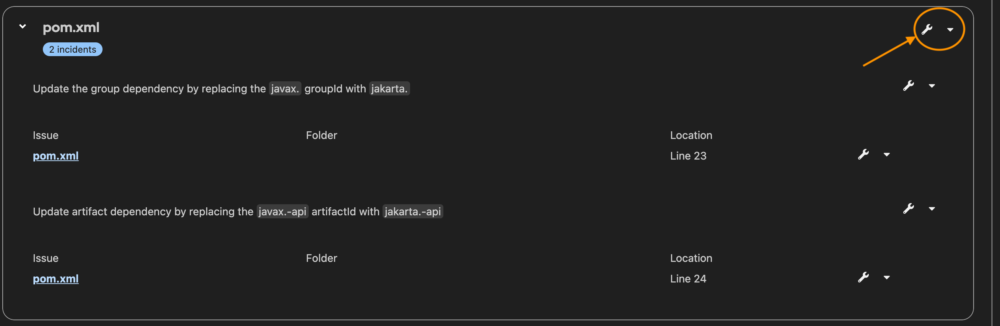
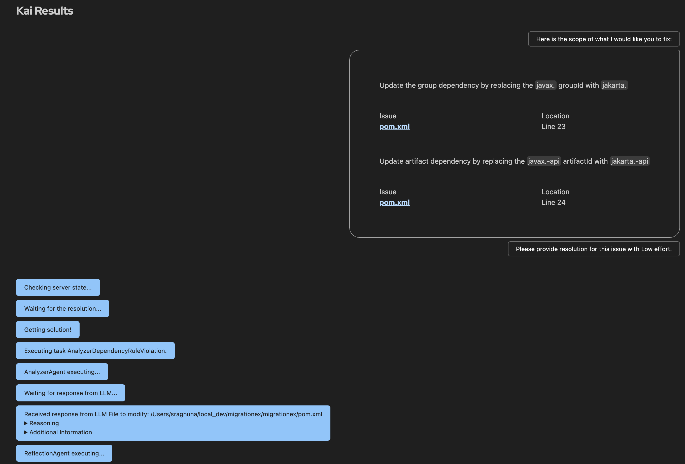

- Once complete, click on the `pom.xml` on the left pane to view the changes.

#### Reviewing Suggested Changes

- The **left panel** shows the current `pom.xml` file.
- The **right panel** displays the suggested changes:
  - **Updated `groupId` from `javax.servlet` → `jakarta.servlet`**.
  - **Updated `artifactId` from `javax.servlet-api` → `jakarta.servlet-api`**.
  - **Updated compiler target from `1.8` → `17`** to align with the Java 17 migration.

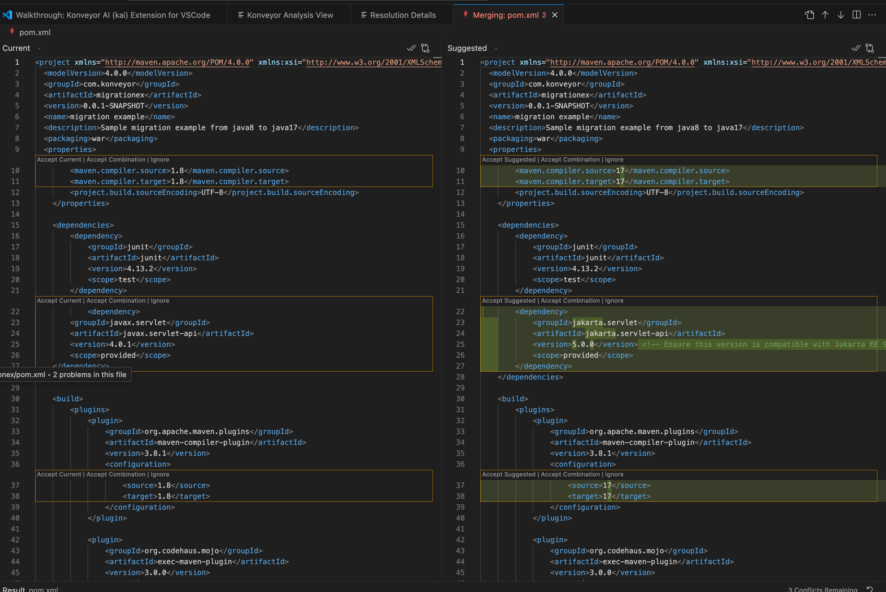

#### Applying Fixes

Click the `check icon` on the file in the left pane to apply the changes.

#### Final Output

```xml
<dependency>
    <groupId>jakarta.servlet</groupId>
    <artifactId>jakarta.servlet-api</artifactId>
    <version>5.0.0</version> <!-- Ensure this version is compatible with Jakarta EE 9+ -->
    <scope>provided</scope>
</dependency>

<properties>
    <maven.compiler.source>17</maven.compiler.source>
    <maven.compiler.target>17</maven.compiler.target>
    <project.build.sourceEncoding>UTF-8</project.build.sourceEncoding>
</properties>
```

### 3.3 Issue - The package 'javax' has been replaced by 'jakarta'

Once the changes to pom.xml are applied, Kai automatically retriggers analysis and updates the analysis view

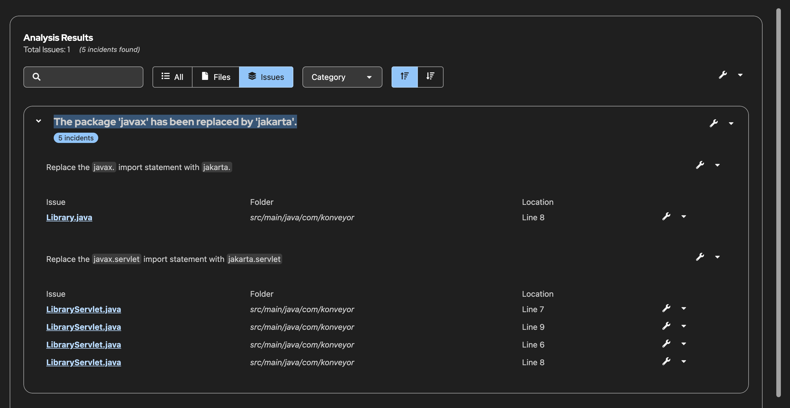

#### Identifying Issues

Konveyor analysis detected multiple import statements that require updates from **javax** to **jakarta**:

- **Library.java**
  - Line **8**: Replace `javax.servlet.http.HttpServletResponse` with `jakarta.servlet.http.HttpServletResponse`
- **LibraryServlet.java**
  - Line **6**: Replace `javax.servlet.ServletException` with `jakarta.servlet.ServletException`
  - Line **7**: Replace `javax.servlet.http.HttpServlet` with `jakarta.servlet.http.HttpServlet`
  - Line **8**: Replace `javax.servlet.http.HttpServletRequest` with `jakarta.servlet.http.HttpServletRequest`
  - Line **9**: Replace `javax.servlet.http.HttpServletResponse` with `jakarta.servlet.http.HttpServletResponse`

#### Requesting a Fix

Clicking on the **tool icon** next to the issue name initiates the resolution process.
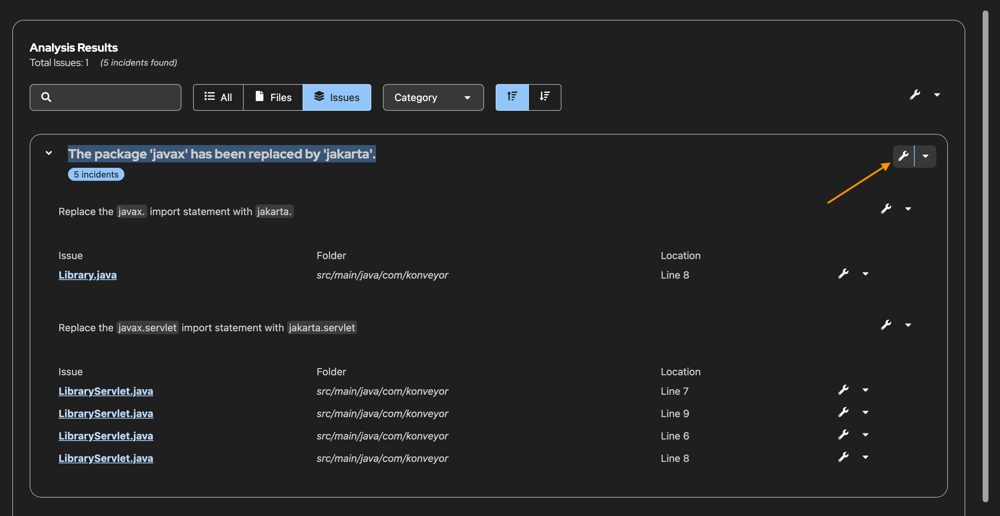

Kai processes the request in **Library.java** and **LibraryServlet.java**.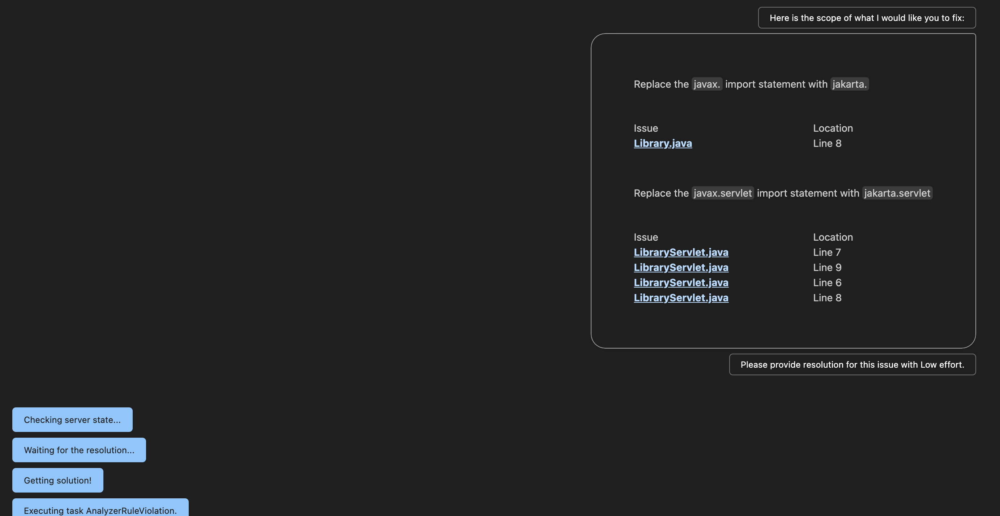

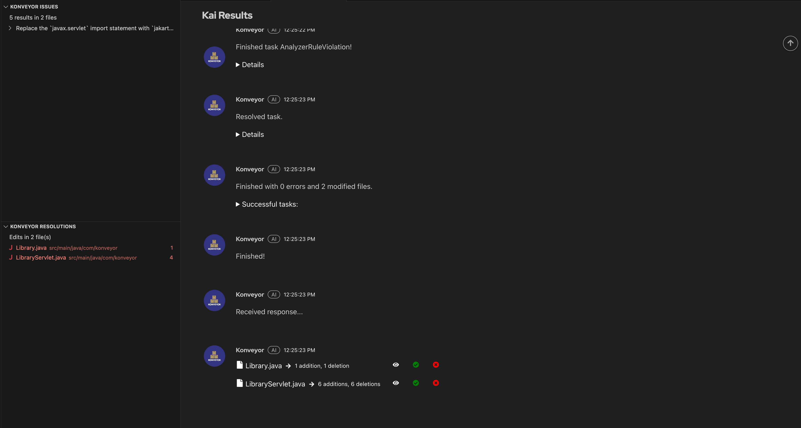

#### Reviewing Suggested Changes

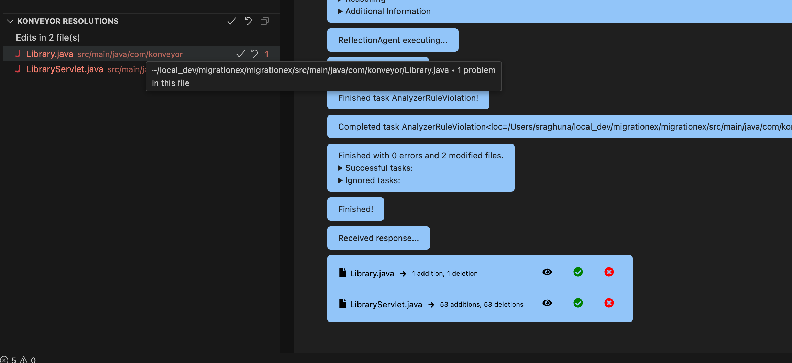

- **Library.java**

  The **left panel** contains the `javax.servlet.http.HttpServletResponse` import.
  The **right panel** updates it to `jakarta.servlet.http.HttpServletResponse`.
  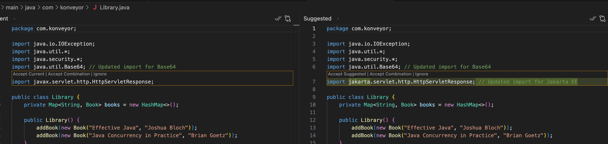

- **LibraryServlet.java**
  The **left panel** shows the current code with `javax.servlet` imports.
  The **right panel** displays the suggested **jakarta.servlet** imports.
  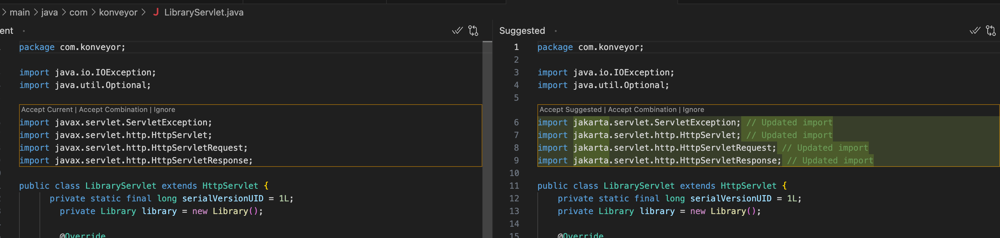

#### Applying Fixes

Click the `check icon` next to the filenames in tje left pane to finalize the updates.

After applying all the changes, Kai retriggers analysis, and no further incidents were found, confirming a successful migration.

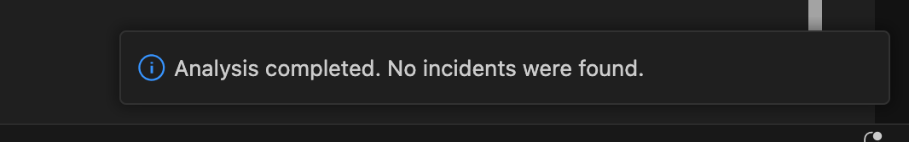

## Step 4: Build the app

With all migration changes applied, we can now build, package, and deploy the updated application.

### 4.1 Building the Application

To compile the migrated code and generate the deployment artifact, run the following command:
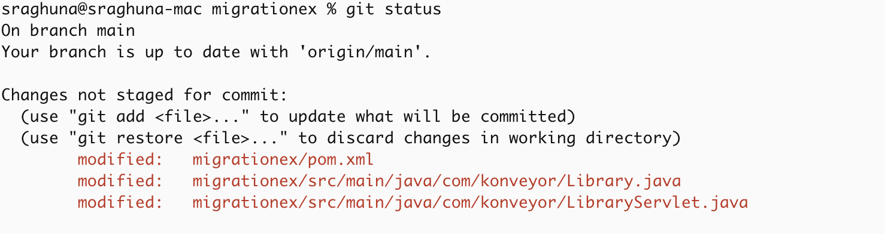

1. cd into project directory

```sh
mvn clean compile
mvn package
```

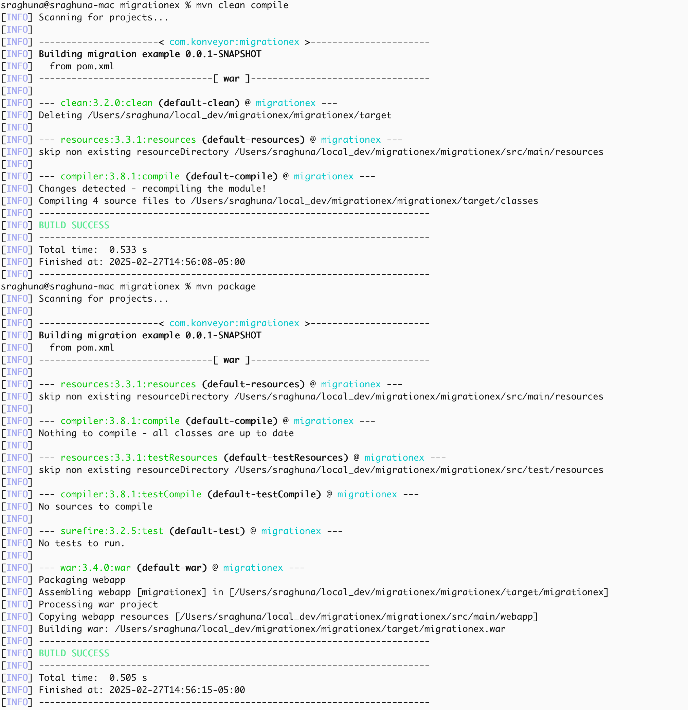

- The `mvn clean compile` command ensures a clean slate by removing old compiled files and recompiling the updated source code.
- The `mvn package` step creates a .war file, that is used for deployment.

The generated ``.war` file can be found in the `target/` directory

### 4.2 Deploying the app to Apache Tomcat

After successfully building the .war file, the next step is to deploy it to an Apache Tomcat server.

1. Start Tomcat by navigating to the Tomcat bin/ directory and run:

```

./startup.sh
```

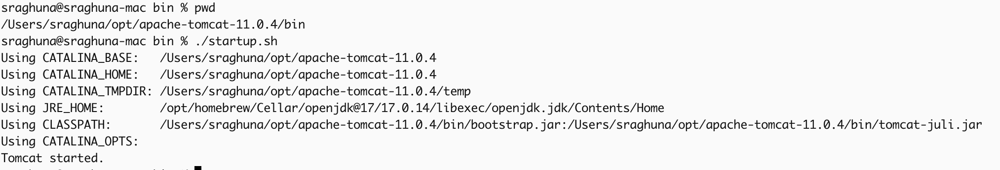

2. Access the Tomcat Manager
   Open a browser and navigate to `http://localhost:8080/manager/html` 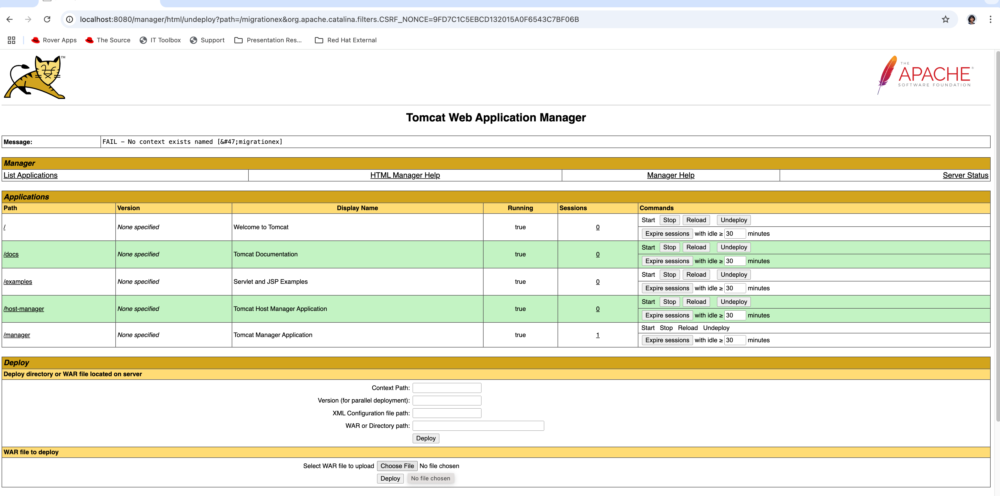

3. Upload the .war File
   Click "Choose File" under the "WAR file to deploy" section. Select `migrationex.war` from the target/ directory. Click "Deploy".
   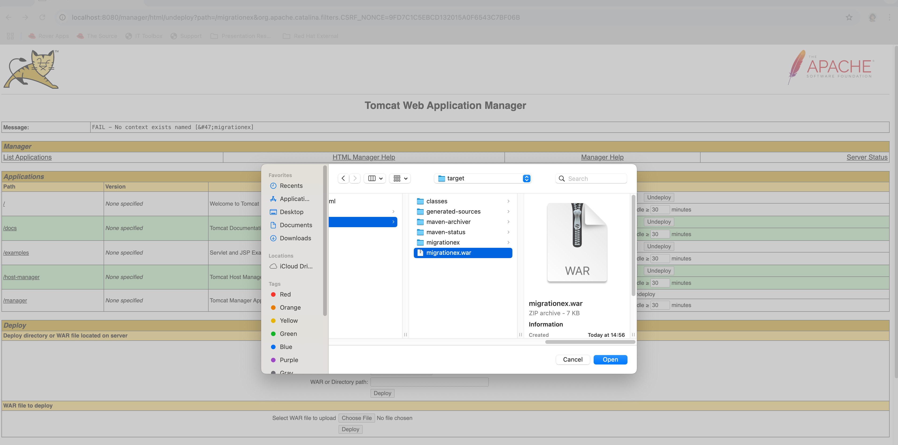

If the deployment is successful, `migrationex` should appear in the list of running applications.

### 4.3 Running the Application

Now that the application is deployed, access it in a browser via the url - http://localhost:8080/migrationex/

It displays a simple book management UI.

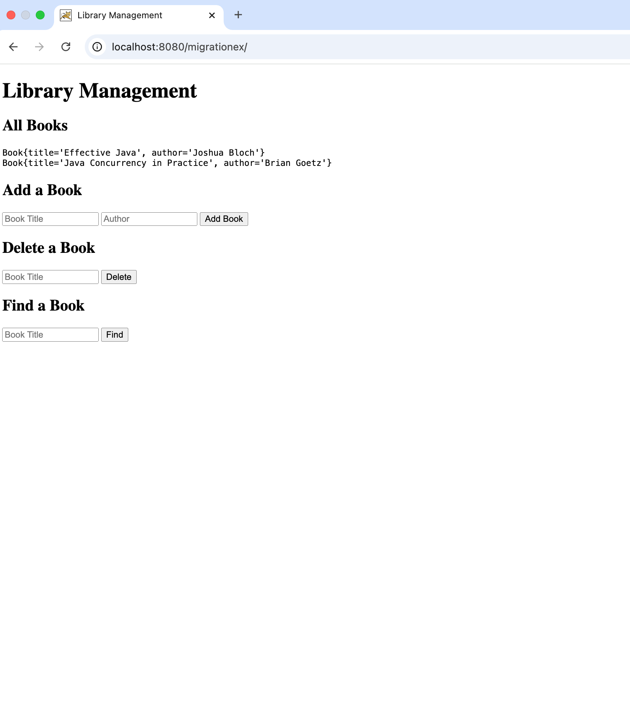

## Conclusion

We have successfully migrated a Java 8 application to Java 17 using Konveyor AI. Through an automated analysis and refactoring process, we identified deprecated dependencies, outdated cryptographic practices, and API changes required for compatibility with Java17.
