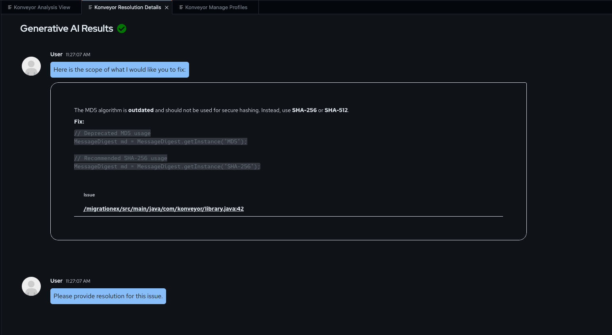
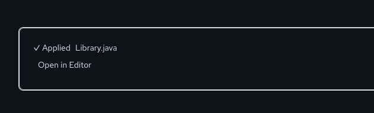
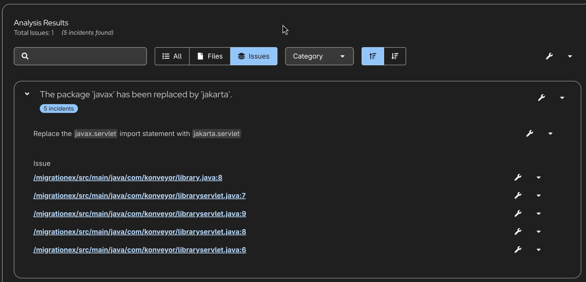
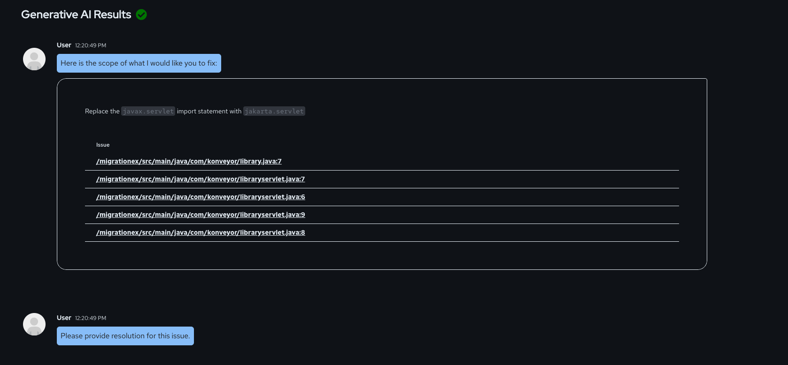
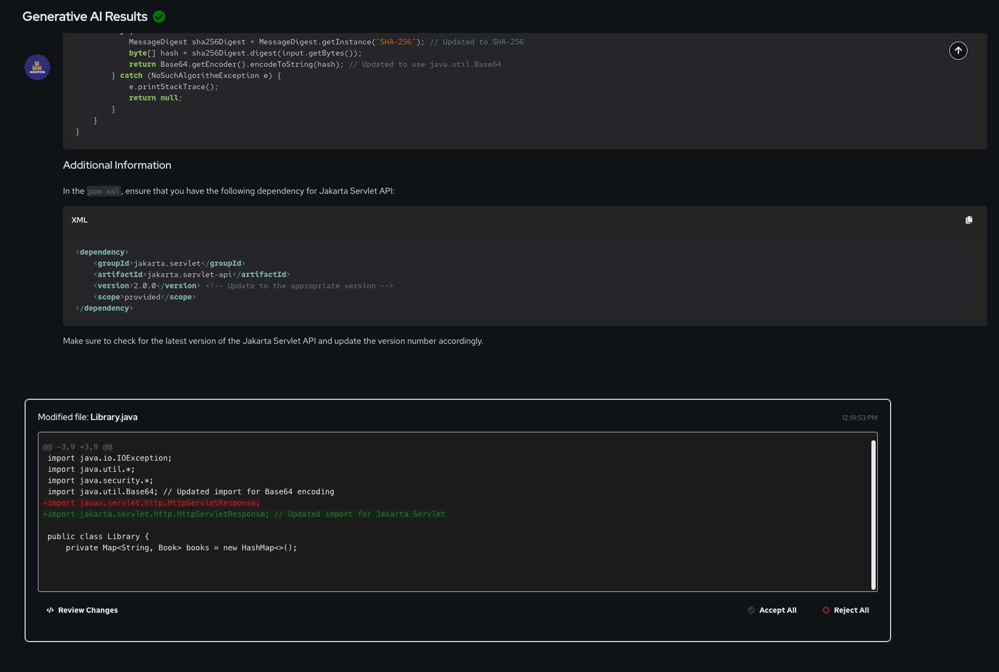
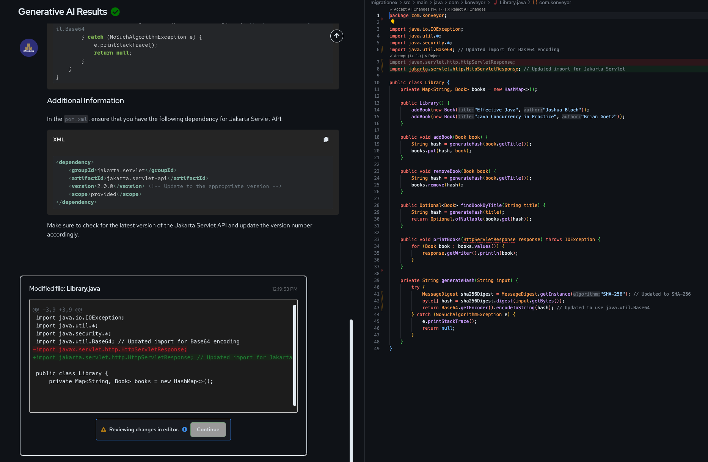
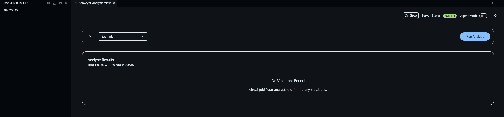

# Modernizing a Java 8 Application to Java 17 Using Konveyor AI

## Goal

This scenario demonstrates how **Konveyor AI (Kai)** can assist in modernizing a **Java 8** application to **Java 17** by identifying outdated APIs, suggesting migration changes, and ensuring best security practices (e.g., replacing MD5 hashing). We will use a custom rule and default rules with Kai to analyze a Java8 application and generate refactoring recommendations.

## Background

Migrating applications from Java 8 to Java 17 helps in leveraging modern Java features, improved performance, and long-term support. However, the upgrade process is not just a simple JDK version switch. Developers and end-users often encounter compilation failures, deprecated classes, and security vulnerabilities that require manual intervention.

A common challenge in this process is dealing with removed or deprecated classes and APIs. In the following guide, we will explore few issues (like below) that arise when compiling the sample Java 8 application with Java 17,

```sh
% mvn --version
Apache Maven 3.9.9 (8e8579a9e76f7d015ee5ec7bfcdc97d260186937)
Maven home: /Users/sraghuna/Downloads/apache-maven-3.9.9
Java version: 17.0.14, vendor: Homebrew, runtime: /opt/homebrew/Cellar/openjdk@17/17.0.14/libexec/openjdk.jdk/Contents/Home
Default locale: en_US, platform encoding: UTF-8
OS name: "mac os x", version: "14.7.4", arch: "aarch64", family: "mac"

% mvn clean compile
[INFO] Scanning for projects...
[INFO]
[INFO] ----------------------< com.konveyor:migrationex >----------------------
[INFO] Building migration example 0.0.1-SNAPSHOT
[INFO]   from pom.xml
...
...

[INFO] -------------------------------------------------------------
[ERROR] COMPILATION ERROR :
[INFO] -------------------------------------------------------------
[ERROR] /Users/sraghuna/local_dev/migrationex/migrationex/src/main/java/com/konveyor/Library.java:[7,16] cannot find symbol
  symbol:   class BASE64Encoder
  location: package sun.misc
...
...
[INFO] 3 errors
[INFO] -------------------------------------------------------------
[INFO] ------------------------------------------------------------------------
[INFO] BUILD FAILURE
[INFO] ------------------------------------------------------------------------
[INFO] Total time:  0.503 s
[INFO] Finished at: 2025-03-05T13:06:58-05:00
...
```

This issue occurs because the `sun.misc.BASE64Encoder` class, deprecated in Java8, was completely removed in Java9. Additionally, the application uses `MD5` hashing, which is considered insecure by modern cryptographic standards. We will use a custom rule and Kai to identify and refactor these issues efficiently.

The following problems highlight the effort and expertise required to perform Java 8 to Java 17 migration:

- Compatibility Issues – Classes from javax packages need to be updated to jakarta, removed APIs (such as `sun.misc.BASE64Encoder`) need alternatives, and project dependencies require updates.
- Security Concerns – Legacy code may include insecure cryptographic implementations, such as `MD5` hashing, which should be replaced with more secure alternatives like `SHA-256`.

By using Kai, developers and end-users can streamline Java 8 to Java 17 migrations with minimal manual effort. Kai comes with over 2,400 community-contributed rules, covering JDK upgrades like Java 8 -> Java 17+

- Built-in rules - Konveyor ships with rules that automatically detect removed or deprecated Java APIs and suggest replacements. In this guide, we use one such [rule](https://github.com/konveyor/rulesets/blob/main/default/generated/openjdk11/191-java-removals.windup.yaml#L293) that identifies the removal of `sun.misc.BASE64Encoder` and recommends using `java.util.Base64` instead. You can explore the rulesets repo [here](https://github.com/konveyor/rulesets)

- Custom Rules for advanced use cases - Beyond community rules, Kai also supports custom rules, allowing users to tailor migration rules to their specific needs. In this guide, we create a [custom security rule](https://github.com/konveyor-ecosystem/migrationex/blob/main/rules/rule.yaml) that detects insecure `MD5` hashing and replaces it with `SHA-256`, ensuring compliance with modern cryptographic standards.

We will demonstrate how Kai can address the above problems and simplify the whole migration process by:

- Running an automated analysis to detect issues like removed APIs and outdated dependencies using default rulesets.
- Applying a custom rule to detect a security risk and obtaining refactored code adhering to security best practices.

## Prerequisites

Ensure you have the following set up:

- [VSCode](https://code.visualstudio.com/download)
- [Git](https://git-scm.com/downloads)
- [GenAI credentials](https://github.com/konveyor/kai/blob/main/docs/llm_selection.md#openai-service)
- Java 17 installed
- Maven 3.9+
- [Java sample app](https://github.com/konveyor-ecosystem/migrationex.git)
- [Kai VSCode IDE extension "0.1.0" or later](https://github.com/konveyor/editor-extensions/releases)
- [Apache Tomcat 11](https://tomcat.apache.org/download-11.cgi)

## Tutorial Dev Environment

This tutorial was built and tested using the following setup:

- Java Version: `OpenJDK 17`
- Maven: `3.9.9`
- Konveyor AI VSCode Extension Version: `0.1.0`
- LLM Model Used: `gpt-o1-mini`

_Results may vary if a different LLM model is used._ The AI model’s ability to detect and refactor code depends on the specific model's training data and capabilities. If using a different model (e.g., `gpt-4`, `llama-3`), the migration suggestions may differ in accuracy, or level of detail.

For best results, we recommend using the **gpt-o1-mini** model as tested in this guide. OpenShift AI and `Llama 3 70B` have been tested and produce good results, making them a good alternative.

## Application Overview

The [`migration example`](https://github.com/konveyor-ecosystem/migrationex.git) repository consists of two main components:

1.  Java 8 Application – The sample Java 8 application (`migration example`) is a simple **Book management system** that manages a collection of books.
2.  Rules Folder – Contains custom migration rules used by Kai for this app.

### Files to modernize

- `Library.java`
- `LibraryService.java`
- `pom.xml`

## Step 1: Setup the environment

### 1.1 Clone the Sample Java 8 Application

Clone the migration example repository:

```sh

git clone https://github.com/konveyor-ecosystem/migrationex.git
cd migrationex/migrationex
```

Navigate to File > Open in VSCode and locate the folder we just cloned and select the sub-folder `migrationex`.

### 1.2 Install and Configure the Konveyor AI VS Code Extension

Follow this [getting started guide](https://github.com/konveyor/kai/blob/main/docs/getting_started.md) to install and configure the latest Konveyor AI IDE plugin.

**_Note: At the time of writing this guide, we used version 0.1.0_**

In the [configure settings for analysis](https://github.com/konveyor/kai/blob/main/docs/getting_started.md#configure-settings-for-analysis) section, 
you will choose label selectors (target and/or source technologies).

In this scenario, we will analyze the application using the following migration targets to identify potential areas for improvement:

- Openjdk11
- Openjdk17
- Jakarta-ee

_We need OpenJDK 11 as a target when migrating from Java 8 to 17 because some deprecations and migration rules from Java 9 and 11 are not present in OpenJDK 17. OpenJDK 11 captures changes deprecated in earlier versions, while OpenJDK 17 focuses on 11+ deprecations. Using both ensures we catch all necessary migration warnings and avoid missing intermediate changes._


Skip selecting source platform. 

Let's select our custom rule
  
  You will see a notification that custom rules updated
  

## Step 2: Understanding the Custom Rule

Before we run the analysis, lets understand the custom rule we are going to use.

### 1. Custom Rule for MD5 Hashing

The `Library.java` class is responsible for managing books in the system. However, it uses MD5 hashing to generate unique identifiers:

`Library.java` (Before Migration)

```java
    ...
    ...
    private String generateHash(String input) {
        try {
            MessageDigest md5Digest = MessageDigest.getInstance("MD5");
            byte[] hash = md5Digest.digest(input.getBytes());
            BASE64Encoder encoder = new BASE64Encoder();
            return encoder.encode(hash);
        } catch (NoSuchAlgorithmException e) {
            e.printStackTrace();
            return null;
        }
    }
```

#### Problem

MD5 is outdated and vulnerable to collisions.

#### Solution

We need to detect MD5 usage and replace it with SHA-256.

Since MD5 hashing is insecure, we add a custom rule to detect and recommend secure alternatives.

````yaml
- ruleID: java-custom-security-00001
  category: mandatory
  effort: 2
  labels:
    - konveyor.io/source=java8
    - konveyor.io/source=openjdk
    - konveyor.io/target=openjdk17
  when:
    and:
      - java.referenced:
          pattern: java.security.MessageDigest.getInstance
          location: METHOD_CALL
      - builtin.filecontent:
          pattern: 'MessageDigest.getInstance\(\"MD5\"\)'
  description: Do not use MD5 for hashing due to security vulnerabilities.
  message: |
    The MD5 algorithm is **outdated** and should not be used for secure hashing.
    Instead, use **SHA-256** or **SHA-512**.

    **Fix:**
    ```java
    // Deprecated MD5 usage
    MessageDigest md = MessageDigest.getInstance("MD5");

    // Recommended SHA-256 usage
    MessageDigest md = MessageDigest.getInstance("SHA-256");
    ```
  links:
    - title: "java ref"
      url: https://docs.oracle.com/en/java/javase/17/docs/api/java.base/java/security/MessageDigest.html
    - title: "MD5"
      url: https://csrc.nist.gov/projects/hash-functions
````

You can learn more about writing your own custom rules [here](https://github.com/konveyor/kai/blob/main/docs/custom_ruleset.md)

## Step 3: Understanding the Targets From Default Rules

Now, lets understand one of the targets we selected: `jakarta-ee`.

This target will select any [builtin rule](https://github.com/konveyor/rulesets/tree/main/default/generated) that has the label-selector `konveyor.io/target=jakarta-ee`.

### 1. Built-in Rule for updating `javax` dependency

`pom.xml` dependency (before migration):

```xml
        </dependency>
            <dependency>
        <groupId>javax.servlet</groupId>
        <artifactId>javax.servlet-api</artifactId>
        <version>4.0.1</version>
        <scope>provided</scope>
    </dependency>
```

#### Problem

The `pom.xml` file contains dependency `javax.servlet` that will need to be updated to perform this migration.

#### Solution

Update this dependency group ID `javax.servlet` to `jakarta.servlet`.

The built-in rule `javax-to-jakarta-dependencies-00001` coming from target `jakarta-ee` will help us resolve this problem:

```yaml
- category: mandatory
  customVariables: []
  description: The 'javax' groupId has been replaced by 'jakarta' group id in dependencies.
  effort: 1
  labels:
  - konveyor.io/target=jakarta-ee9+
  - konveyor.io/target=jakarta-ee
  - konveyor.io/target=eap8
  - konveyor.io/target=eap
  - konveyor.io/target=jws6+
  - konveyor.io/target=jws
  - konveyor.io/source=spring5
  - konveyor.io/target=spring6+
  - konveyor.io/source
  links:
  - title: Jakarta EE
    url: https://jakarta.ee/
  message: Update the group dependency by replacing the `javax.{{renamedG}}` groupId
    with `jakarta.{{renamedG}}`
  ruleID: javax-to-jakarta-dependencies-00001
  when:
    builtin.filecontent:
      filePattern: pom\.xml
      pattern: groupId>javax.(annotation|batch|ejb|el|enterprise.concurrent|enterprise.deploy|faces|interceptor|jms|jws|mail|management.j2ee|resource|security.auth.message|security.jacc|servlet|servlet.jsp|servlet.jsp.jstl|transaction|websocket|ws.rs|xml.bind|xml.registry|xml.rpc|xml.soap|xml.ws)<
```

Now that we have a better understanding of the custom rule and targets for this scenario, we can begin analysis.

## Step 4: Run Analysis

Let's run our initial analysis:

1. Once you have RPC server initialized, navigate to "Konveyor Analysis View" and click Run Analysis. Open the command palette by pressing `Command + Shift + P` to find it.
   

2. The Konveyor Analysis View lists the found analysis issues.  We can filter them by `Files`. On the left side, the Konveyor Issue Panel groups files based on similar issues for easier navigation.


### 3.1 Incidents in Library.java

Expand the incidents for `Library.java` and you will see three incidents

#### Summary

| **Issue**                               | **Location** | **Fix**                    |
| --------------------------------------- | ------------ | -------------------------- |
| **MD5 is outdated** _(Custom Rule)_     | Line 42      | Use `SHA-256` or `SHA-512` |
| **`javax.servlet` → `jakarta.servlet`** | Line 8       | Update import              |
| **Deprecated `BASE64Encoder`**          | Line 7       | Use `Base64.getEncoder()`  |


#### MD5 is outdated

#### Initiating the Resolution

- Click on the **tool icon** next to the first issue (MD5 hashing).


- This opens the resolution details panel
  
  

#### Requesting a Fix

- The **resolution process starts**, where Kai interacts with the **LLM**.
- Once Kai completes processing, it suggests modifications for **Library.java**.
  
  

#### Reviewing Suggested Changes

- The `view changes` option will highlight differences between the **current** and **suggested** versions.
- The **right panel** displays:
  - **MD5 is replaced with SHA-256** for secure hashing.
  - **`BASE64Encoder` is replaced with `Base64.getEncoder()`** from `java.util.Base64`, which is the standard modern API.
    

#### Applying Fixes

Click the `check icon` on the file in the left pane to apply the updates.



Kai correctly identified and resolved the issue:

final output:

```java
import java.util.Base64; // Updated import for Base64
MessageDigest sha256Digest = MessageDigest.getInstance("SHA-256"); // Updated to SHA-256
return Base64.getEncoder().encodeToString(hash); // Updated to use Base64 from java.util
```

From the logs in `./vscode/konveyor-logs` we notice,

```text
reasoning='\nTo migrate the provided Java 8 code to OpenJDK 17, we need to address the identified issue regarding the use of the MD5 hashing algorithm, which is considered outdated and insecure. The recommendation is to replace MD5 with a more secure hashing algorithm, such as SHA-256.\n\n### Steps to Address the Issue:\n1. **Change the Hashing Algorithm**: \n   - Replace the `MessageDigest.getInstance("MD5")` call with `MessageDigest.getInstance("SHA-256")`.\n   - This change will enhance the security of the hashing mechanism used in the application.\n\n2. **Remove Deprecated Classes**:\n   - The `sun.misc.BASE64Encoder` class is part of the internal API and is not recommended for use. Instead, we can use `java.util.Base64` which is available in Java 8 and later versions.\n   - This change will ensure that the code adheres to best practices and avoids reliance on internal APIs.\n
```

The LLM was smart to identify that `sun.misc.BASE64Encoder` is deprecated and decided to update that as well.

### 3.2 pom.xml

#### Identifying Issues

Konveyor analysis detected two dependency-related issues in `pom.xml`:

- Line 23: Replace the `javax.` groupId with `jakarta.`.
- Line 24: Replace `javax.-api` artifactId with `jakarta.-api`.

#### Requesting a Fix

We will solve both the issues together this time. Clicking on the **tool icon** next to the file name initiates the resolution process for both the issues.


- Once complete, click on the `pom.xml` on the left pane to view the changes.

#### Reviewing Suggested Changes

- The **left panel** shows the current `pom.xml` file.
- The **right panel** displays the suggested changes:
  - **Updated `groupId` from `javax.servlet` → `jakarta.servlet`**.
  - **Updated `artifactId` from `javax.servlet-api` → `jakarta.servlet-api`**.
  - **Updated compiler target from `1.8` → `17`** to align with the Java 17 migration.


#### Applying Fixes

Click the `check icon` on the file in the left pane to apply the changes.

#### Final Output

```xml
<dependency>
    <groupId>jakarta.servlet</groupId>
    <artifactId>jakarta.servlet-api</artifactId>
    <version>5.0.0</version> <!-- Ensure this version is compatible with Jakarta EE 9+ -->
    <scope>provided</scope>
</dependency>

<properties>
    <maven.compiler.source>17</maven.compiler.source>
    <maven.compiler.target>17</maven.compiler.target>
    <project.build.sourceEncoding>UTF-8</project.build.sourceEncoding>
</properties>
```

### 3.3 Issue - The package 'javax' has been replaced by 'jakarta'

Once the changes to pom.xml are applied, Kai automatically retriggers analysis and updates the analysis view



#### Identifying Issues

Konveyor analysis detected multiple import statements that require updates from **javax** to **jakarta**:
- **Library.java**
  - Line **8**: Replace `javax.servlet.http.HttpServletResponse` with `jakarta.servlet.http.HttpServletResponse`
- **LibraryServlet.java**
  - Line **6**: Replace `javax.servlet.ServletException` with `jakarta.servlet.ServletException`
  - Line **7**: Replace `javax.servlet.http.HttpServlet` with `jakarta.servlet.http.HttpServlet`
  - Line **8**: Replace `javax.servlet.http.HttpServletRequest` with `jakarta.servlet.http.HttpServletRequest`
  - Line **9**: Replace `javax.servlet.http.HttpServletResponse` with `jakarta.servlet.http.HttpServletResponse`

#### Requesting a Fix

Clicking on the **tool icon** next to the issue name initiates the resolution process.


Kai processes the request in **Library.java** and **LibraryServlet.java**.



#### Reviewing Suggested Changes



- **Library.java**
  The **left panel** contains the `javax.servlet.http.HttpServletResponse` import. The **right panel** updates it to `jakarta.servlet.http.HttpServletResponse`
  

- **LibraryServlet.java**
  The **left panel** shows the current code with `javax.servlet` imports.
  The **right panel** displays the suggested **jakarta.servlet** imports.
  

#### Applying Fixes

Click the `check icon` next to the filenames in the left pane to finalize the updates.

After applying all the changes, Kai retriggers analysis, and no further incidents were found, confirming a successful migration.



## Step 5: Build the app

With all migration changes applied, we can now build, package, and deploy the updated application.

### 4.1 Building the Application

To compile the migrated code and generate the deployment artifact, run the following command:


1. cd into project directory

```sh
mvn clean compile
mvn package
```


- The `mvn clean compile` command ensures a clean slate by removing old compiled files and recompiling the updated source code.
- The `mvn package` step creates a .war file, that is used for deployment.

The generated `.war` file can be found in the `target/` directory

### 4.2 Deploying the app to Apache Tomcat

To install and configure Tomcat, please follow these [instructions](./install_apache_tomcat.md).

After successfully building the .war file, the next step is to deploy it to an Apache Tomcat server.

- Start Tomcat by navigating to the Tomcat bin/ directory and run:

```sh
./startup.sh
```


- Access the Tomcat Manager

  Open a browser and navigate to `http://localhost:8080/manager/html` 

- Upload the .war File

  Click "Choose File" under the "WAR file to deploy" section. Select `migrationex.war` from the target/ directory. Click "Deploy".
  

If the deployment is successful, `migrationex` should appear in the list of running applications.

### 4.3 Running the Application

Now that the application is deployed, access it in a browser via the url - http://localhost:8080/migrationex/

It displays a simple book management UI.


## Conclusion

We have successfully migrated a Java 8 application to Java 17 using Konveyor AI. Through an automated analysis and refactoring process, we identified deprecated dependencies, outdated cryptographic practices, and API changes required for compatibility with Java17.
