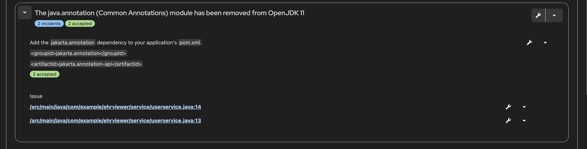

# Part 2: Migrating EHR Application with Solution Server Hints

## Overview

In Part 1, we successfully migrated Inventory Management app using custom enterprise audit library v1 to v2, using Konveyor AI. The Solution Server learned from this migration and stored the patterns, solutions, and success metrics. Now, we'll demonstrate how theKai's solution server accelerates the migration of the EHR application by providing contextual hints and confidence levels based on the learned patterns.

## Prerequisites

- Completed Part 1: Migrating Inventory Management System
- [EHR Application](https://github.com/hhpatel14/ehr_viewer/tree/java8)
- Same development environment as Part 1

## Step 1: Setup EHR Application

### 1.1 Clone EHR Application

```bash
# Clone the Electronic Health Record Application
git clone https://github.com/hhpatel14/ehr_viewer.git
cd ehr_viewer

# Switch to the java8 branch
git checkout java8
```

### 1.2 Verify Solution Server Knowledge

The Solution Server has learned from the inventory management migration and can now provide contextual hints for similar patterns. It provides success metrics for the violations, based on previously migrated incidents and their accepted solutions.

## Step 2: Run Analysis with Solution Server Hints

### 2.1 Use Existing Analysis Profile

Use the same analysis profile from Part 1 (`openjdk_custom_library`) for the EHR app migration. The profile already contains the custom audit library migration rules and is configured for the v1 to v2 migration patterns.


_Using the existing `openjdk_custom_library` analysis profile for the EHR app with the same audit library migration rules from Part 1._

### 2.2 Start Analysis

Run the analysis on the EHR application. Notice how the Solution Server now provides contextual hints based on the successful patterns from the inventory management migration.


The analysis results show the number of solved incidents next to each violation, indicating how many times this type of issue has been successfully resolved in previous migrations. The Solution Server provides confidence levels based on the number of successful migrations for each pattern, helping developers understand the reliability of the suggested solutions.

## Step 3: Fixing incidents

The analysis identified several migration incidents in the EHR application that need to be addressed. Each incident shows the number of previously solved cases, providing confidence in the migration approach.

### 3.1 List of Migration Incidents

| Category              | Issue                  | Rule ID                        | Description                                                             |
| --------------------- | ---------------------- | ------------------------------ | ----------------------------------------------------------------------- |
| Dependency            | Outdated Audit Library | `audit-logging-0001`           | Update audit-logging-library from v1.0.0 to v2.0.0                      |
| Event Creation        | AuditEvent.builder()   | `audit-logging-0002`           | Replace deprecated builder pattern with direct record instantiation     |
| Logger Implementation | FileSystemAuditLogger  | `audit-logging-0003`           | Replace with StreamableAuditLogger for TCP streaming                    |
| Logging Methods       | Synchronous Logging    | `audit-logging-0004`           | Convert logEvent() calls to logEventAsync() for non-blocking operations |
| Convenience Methods   | logSuccess/logFailure  | `audit-logging-0005`           | Replace legacy convenience methods with full AuditEvent construction    |
| Jakarta Annotations   | javax to jakarta       | `removed-javaee-modules-00020` | Update Java annotations for Java 21 compatibility                       |

### 3.2 Applying migration fixed

Now let's apply the fixes one by one, using the solution server

#### Fix 1: Update Dependencies (`audit-logging-0001`)

**Step 1: Analysis**


The analysis shows that version 1.0.0 needs to be upgraded to 2.0.0.

Click on the 'tool' icon to request a fix.

##### Step 2: Get Solution with Hints


Kai uses Solution Server hints to provide specific guidance on updating the dependency version, including the exact version number and configuration requirements.

##### Step 3: Review and Apply Changes


Review the applied changes to ensure the dependency has been correctly updated to version 2.0.0.


Apply the changes to update the Maven dependency in pom.xml.

#### Fix 2: Update Logger Implementation (`audit-logging-0003`)

**Step 1: Analysis**


The analysis identifies FileSystemAuditLogger usage that needs to be replaced with StreamableAuditLogger for TCP streaming.

Click on the 'tool' icon to request a fix.

**Step 2: Get Solution with Hints**


Kai uses Solution Server hints to provide the exact code changes needed to replace FileSystemAuditLogger with StreamableAuditLogger.

**Step 3: Review and Apply Changes**


Kai used the Solution Server's knowledge from the inventory management migration to learn the specific configuration requirements for StreamableAuditLogger. The Solution Server provided the exact configuration pattern that was successfully applied in Part 1 and automatically applied the same configuration to the EHR application.

```java

AuditConfiguration config = new AuditConfiguration();
config.setStreamHost(System.getenv().getOrDefault("AUDIT_STREAM_HOST", "localhost"));
config.setStreamPort(Integer.parseInt(System.getenv().getOrDefault("AUDIT_STREAM_PORT", "5000")));
config.setStreamProtocol(System.getenv().getOrDefault("AUDIT_STREAM_PROTOCOL", "tcp"));
auditLogger = new StreamableAuditLogger(config);
```

This configuration includes:

- **Environment-based configuration** for flexibility across different deployment environments
- **Default values** for local development (localhost:5000)
- **TCP streaming protocol** for centralized audit logging
- **Proper instantiation** of StreamableAuditLogger with the learned configuration

The Solution Server's hintensured that the same successful configuration for the auidt library was learnt from the from the inventory management system and applied applied to the EHR application, eliminating the need for manual configuration discovery.

Review the proposed changes to replace FileSystemAuditLogger with StreamableAuditLogger for TCP streaming capabilities.

Apply the changes to update the logger implementation in the service classes.

#### Fix 3: Update Audit Event Creation (`audit-logging-0002`)

**Step 1: Analysis**


The analysis identifies deprecated AuditEvent.builder() usage that needs to be replaced with direct record instantiation.

Click on the 'tool' icon to request a fix.

**Step 2: Get RAG Solution**
Kai uses Solution Server hints to provide the exact code changes needed to replace the builder pattern with direct record instantiation.
click on view chnages to see the code suggestion from Kai


**Step 3: Review and Apply Changes**


The LLM demonstrates its reasoning process, showing how it learned from the hints provided by Kai's Solution Server based on the inventory management migration to provide accurate builder pattern replacement.


Kai used the Solution Server's success metrics from the inventory management migration to learn the exact pattern for replacing AuditEvent.builder() with direct record instantiation. The Solution Server provided confidence based on successful migrations of this pattern.

Review the proposed changes to replace AuditEvent.builder() with direct record construction for Java 21 compatibility.

Apply the changes to update audit event creation patterns in the service classes.

#### Fix 4: Convert Synchronous to Asynchronous Logging (`audit-logging-0004`)

**Step 1: Analysis**


The analysis identifies synchronous logEvent() calls in the EHR application that need to be converted to asynchronous logEventAsync() for non-blocking operations.

Click on the 'tool' icon to request a fix.

**Step 2: Get Solution with Hints**


Kai uses Solution Server hints to provide the exact code changes needed to convert synchronous logging to asynchronous.

**Step 3: Review and Apply Changes**


Review the proposed changes to replace `logEvent()` with `logEventAsync()` for improved performance.

Apply the changes to convert synchronous logging calls to asynchronous in the EHR service classes.

#### Fix 5: Update Jakarta Annotations (`removed-javaee-modules-00020`)

**Step 1: Analysis**


The analysis identifies javax annotations in the app that need to be updated to jakarta for Java 21 compatibility.

Click on the 'tool' icon to request a fix.

**Step 2: Get Solution with Hints**


Kai provides the exact import and annotation changes needed for Jakarta EE compatibility.

**Step 3: Review and Apply Changes**


Review the proposed changes to update javax imports to jakarta.


Apply the changes to update Java annotations for Java 21 compatibility in the EHR application.

#### Fix 6: Replace Legacy Convenience Methods (`audit-logging-0005`)

**Step 1: Analysis**


The analysis identifies legacy logSuccess() and logFailure() convenience methods in the EHR application that need to be replaced with full AuditEvent construction.

Click on the 'tool' icon to request a fix.

**Step 2: IDE Reaches Out to Solution Server**


The IDE reaches out to the Solution Server to fetch contextual hints based on successful patterns from the inventory management migration.

**Step 3: Solution Server Provides Hints**


The Solution Server provides detailed hints showing how convenience methods were successfully replaced in previous migrations.


The IDE displays the hints to the user, showing the specific patterns and code examples from successful migrations.

**Step 4: LLM Reasoning Process**


The LLM demonstrates its reasoning process, showing how it learned from the hints provided by Kai's Solution Server to provide accurate convenience method replacement.

**Step 5: Get Solution with Hints**


Kai uses Solution Server hints to provide the exact code changes needed to replace convenience methods with full AuditEvent construction.


Review the detailed solution showing the complete replacement of logSuccess() and logFailure() with full AuditEvent objects.

Apply the changes to update legacy convenience method calls.

### 3.3 Migration completed

After applying all the fixes, the analysis runs again to verify that all migration issues have been resolved.


The analysis results show that all migration incidents have been successfully resolved. The EHR app has been successfully migrated from audit library v1 to v2 using the Kai's solution Server's hints and success metrics.

## Step 4: Building and Running the Migrated Application

### 4.1 Updated pom.xml Configuration

Update the pom.xml file with the necessary dependencies:

```xml
<?xml version="1.0" encoding="UTF-8"?>
<project xmlns="http://maven.apache.org/POM/4.0.0"
         xmlns:xsi="http://www.w3.org/2001/XMLSchema-instance"
         xsi:schemaLocation="http://maven.apache.org/POM/4.0.0
         http://maven.apache.org/xsd/maven-4.0.0.xsd">
    <modelVersion>4.0.0</modelVersion>

    <parent>
        <groupId>org.springframework.boot</groupId>
        <artifactId>spring-boot-starter-parent</artifactId>
        <version>3.2.0</version>
        <relativePath/>
    </parent>

    <groupId>com.example</groupId>
    <artifactId>ehr-viewer</artifactId>
    <version>2.0.0</version>
    <packaging>jar</packaging>

    <name>Electronic Health Record Viewer</name>
    <description>Spring Boot 3 application for EHR management with enhanced audit logging</description>


```

### 4.2 Updated UI Controller

Update jakarta deps in the UI controller

```java
import jakarta.servlet.http.HttpSession;
```


### 4.3 Configure Logstash

Set up Logstash for centralized audit logging to demonstrate the new TCP streaming capabilities of the v2 audit library.

#### Step 1: Download Configuration Files

Copy these two configuration files to your project root:

- [logstash.conf](https://github.com/savitharaghunathan/inventory_management/blob/java21/logstash.conf) - configuration for processing audit events
- [logstash.yml](https://github.com/savitharaghunathan/inventory_management/blob/java21/logstash.yml) - Logstash server configuration

#### Step 2: Run Logstash Container

Execute this command from your project directory to start Logstash in a Podman container:

```bash
podman run -d --name logstash -p 5000:5000 \
  -v $(pwd)/logstash.conf:/usr/share/logstash/pipeline/logstash.conf \
  -v $(pwd)/logstash.yml:/usr/share/logstash/config/logstash.yml \
  docker.elastic.co/logstash/logstash:8.11.0
```

### 4.4 Run and Verify the Migrated Application

#### Step 1: Build the Application


Build the application using Maven to ensure all dependencies are resolved and the code compiles successfully with Java 21.
switch to `Java21` and run `mvn run compile`

#### Step 2: Start the Application


Start the Spring Boot application. The application should start successfully with the new audit logging configuration and connect to the Logstash server.
run `mvn spring-boot:run`

#### Step 3: Test the Application


Test the application functionality to ensure it works correctly with the new audit logging patterns. Follow the steps here - https://github.com/hhpatel14/ehr_viewer/tree/java21?tab=readme-ov-file#1-login

Verify that audit events are being generated and sent to Logstash.

#### Step 4: Verify Audit Logs


Check the audit logs to verify that the new v2 format is working correctly. The logs should show asynchronous logging with enhanced event details and proper TCP streaming to Logstash.
Run `podman logs logstash |grep UserService` to check thw logs.

## Conclusion

The EHR app migration demonstrates the power of Kai's Solution Server in accelerating enterprise migrations by leveraging learned patterns and success metrics from previous migrations. Kai creates a powerful tool for enterprise application modernization, making complex migrations faster, more reliable, and more consistent.
