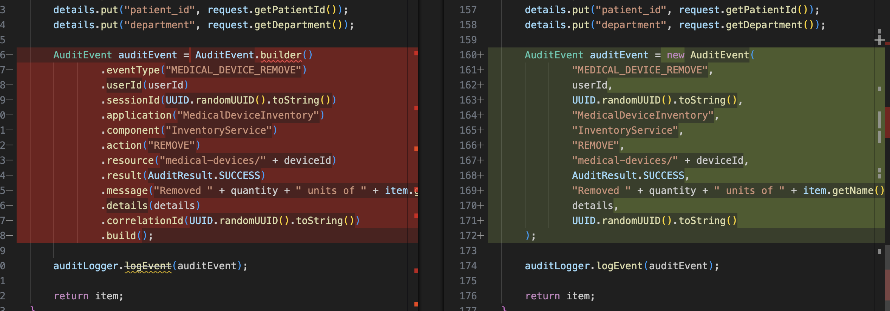

# Modernizing Healthcare Applications: Audit Library Migration Using Konveyor AI and Solution Server

## Goal

This scenario demonstrates how **Konveyor AI (Kai)** can assist in modernizing **two healthcare applications** by migrating from an outdated audit logging library (v1) to a modern streaming-based audit library (v2). We will use custom rules with Kai to analyze both applications and generate refactoring recommendations, then leverage the **Solution Server** to demonstrate how migration patterns learned from the first application can be automatically applied to the second application.

## Applications to Modernize

1. **[Medical Device Inventory Management System](https://github.com/savitharaghunathan/inventory_management)** - Manages medical device inventory with comprehensive audit logging. Built with Spring Boot 2 (Java 8) and features REST API endpoints for medical device operations, in-memory storage with sample inventory data, and audit logging using the v1 audit library.

2. **[Electronic Health Record (EHR) System](https://github.com/hhpatel14/ehr_viewer/tree/java8)** - Patient data management system that also uses the same audit logging library for compliance tracking. Built with Spring Boot 2 (Java 8), featuring audit logging for all user actions including login, logout, and patient record access.

This approach showcases the power of Kai's Solution Server in learning from one migration and applying those patterns to similar applications, significantly reducing migration effort and ensuring consistency across healthcare systems. The Solution Server delivers two primary benefits: **Contextual Hints** that surface examples of past migration solutions—including successful user modifications and accepted fixes—enabling Kai to offer actionable hints for difficult or previously unsolved migration problems; and **Migration Success Metrics** that expose detailed success metrics for each migration rule, derived from real-world usage data, enabling IDEs and automation tools to present users with confidence levels for successful migration of given code segments.

## Background

Medical device inventory management systems require robust audit logging for compliance with healthcare regulations (HIPAA, FDA, etc.). The audit trail must capture all device movements, user actions, and patient interactions for regulatory compliance and patient safety.

### The Audit Library Migration Challenge

The current applications use an outdated audit logging library (v1) with the following limitations:

| **v1 (Java 8)**                                 | **v2 (Java 21+)**                |
| ----------------------------------------------- | -------------------------------- |
| Synchronous file-based logging                  | Asynchronous TCP streaming       |
| Builder pattern for `AuditEvent`                | Record-based `AuditEvent`        |
| Convenience methods (`logSuccess`/`logFailure`) | Full `AuditEvent` construction   |
| Local file storage                              | Centralized logging via Logstash |
| Hard-coded configuration                        | Environment-based configuration  |

**Key Migration Drivers:**

- **Performance**: Eliminate blocking audit calls with asynchronous operations
- **Scalability**: Replace file I/O bottlenecks with TCP streaming
- **Compliance**: Enable real-time monitoring for healthcare regulations
- **Security**: Address Java 8 end-of-life concerns
- **Centralization**: Integrate with Logstash for enterprise-wide audit management

### Migration Complexity

The migration from v1 to v2 involves five primary areas of change:

#### Core Migration Areas

1. **Dependency Management**: Upgrade audit library version from 1.0.0 to 2.0.0
2. **Event Creation**: Replace builder pattern with record instantiation
3. **Logger Implementation**: Switch from filesystem to streaming logger
4. **Logging Methods**: Convert synchronous to asynchronous logging
5. **Convenience Methods**: Replace simplified methods with full audit events

#### Impact Assessment

| Migration Area            | Files Affected  | Complexity | Risk Level |
| ------------------------- | --------------- | ---------- | ---------- |
| **Dependencies**          | pom.xml         | Low        | Low        |
| **Event Creation**        | Service classes | Medium     | Medium     |
| **Logger Implementation** | Service classes | High       | High       |
| **Logging Methods**       | Service classes | Medium     | Medium     |
| **Convenience Methods**   | Service classes | High       | Medium     |

## Prerequisites

Ensure you have the following set up:

- [VSCode](https://code.visualstudio.com/download)
- [Git](https://git-scm.com/downloads)
- [GenAI credentials](https://github.com/konveyor/kai/blob/main/docs/llm_selection.md#openai-service)
- Java 21 installed
- Maven 3.9+
- [Medical Device Inventory Management System](https://github.com/savitharaghunathan/inventory_management)
- [Kai VSCode IDE extension "0.2.0" or later](https://github.com/konveyor/editor-extensions/releases)
- [Logstash](https://www.elastic.co/downloads/logstash) for audit event processing

## Tutorial Dev Environment

This tutorial was built and tested using the following setup:

- Java Version: OpenJDK 8 & 21
- Maven: 3.9.9
- Spring Boot 2 & 3
- Konveyor AI VSCode Extension Version: 0.2.0
- LLM Model Used: `gpt-o1-mini`

## Step 1: Setup the environment

### 1.1 Clone Inventory Application

```bash
# Clone the Medical Device Inventory Application
git clone https://github.com/savitharaghunathan/inventory_management.git
cd inventory_management

# Switch to the java8 branch
git checkout java8
```

### 1.2 Install and Configure Kai

Follow the [Kai installation guide](https://github.com/konveyor/kai/blob/main/docs/scenarios/demo.md#configure-konveyor) and configure with:

- **Custom Rules**: The audit library migration rules are defined in the `rules/` directory of the inventory application. These rules detect v1 patterns and suggest v2 equivalents. You can select these rules in Kai's configuration
- **Migration Targets**: `openjdk21`

## Step 2: Understanding the Custom Rules

### 2.1 Audit Library Migration Rules

The custom rules detect v1 audit library patterns and suggest v2 equivalents:

#### Rule 1: Dependency Version Upgrade

```yaml
ruleID: audit-logging-0001
description: Detects Maven dependency on v1.x of audit-logging-library and suggests upgrading to 2.x.x (Java 21+)
category: mandatory
effort: 1
when:
  java.dependency:
    name: com.enterprise.audit-logging-library
    lowerbound: "1.0.0"
    upperbound: "1.9.0"
message: The `audit-logging-library` version {{dependency.version}} is outdated. Please upgrade to 2.0.0.
labels:
  - konveyor.io/source=openjdk8
  - konveyor.io/target=openjdk21
```

**Migration Point:**

- **File**: `pom.xml`
- **Change**: Update dependency version from 1.0.0 to 2.0.0
- **Impact**: Enables Java 21 features and new API capabilities

#### Rule 2: Audit Event Builder Pattern

```yaml
ruleID: audit-logging-0002
description: Replace deprecated `AuditEvent.builder()` with direct Java 21 record instantiation
category: mandatory
effort: 3
when:
  java.referenced:
    pattern: com.enterprise.audit.logging.model.AuditEvent.builder
    location: IMPORT
message: The `AuditEvent.builder()` pattern is deprecated. Instantiate the `AuditEvent` record directly (e.g. `new AuditEvent(...)`).
labels:
  - konveyor.io/source=openjdk8
  - konveyor.io/target=openjdk21
```

**Migration Point:**

- **Pattern**: Replace builder pattern with direct record instantiation
- **Before**: `AuditEvent.builder().eventType("TYPE").build()`
- **After**: `new AuditEvent(timestamp, "TYPE", userId, ...)`
- **Impact**: Leverages Java 21 records for type safety and performance

#### Rule 3: Logger Implementation

```yaml
ruleID: audit-logging-0003
description: Replace `FileSystemAuditLogger` instantiation with `StreamableAuditLogger` over TCP
category: mandatory
effort: 3
when:
  java.referenced:
    pattern: com.enterprise.audit.logging.service.FileSystemAuditLogger
    location: IMPORT
message: Direct instantiation of `FileSystemAuditLogger` is deprecated. Use `StreamableAuditLogger` configured for TCP streaming.
labels:
  - konveyor.io/source=openjdk8
  - konveyor.io/target=openjdk21
```

**Migration Point:**

- **Pattern**: Replace FileSystemAuditLogger with StreamableAuditLogger
- **Before**: `new FileSystemAuditLogger(config)`
- **After**: `new StreamableAuditLogger(config)`
- **Impact**: Enables TCP streaming to centralized logging infrastructure

#### Rule 4: Synchronous to Asynchronous Logging

```yaml
ruleID: audit-logging-0004
description: Use non-blocking `logEventAsync(event)` instead of synchronous `logEvent(event)`
category: mandatory
effort: 3
when:
  java.referenced:
    pattern: com.enterprise.audit.logging.service.FileSystemAuditLogger.logEvent
    location: METHOD_CALL
message: The synchronous `logEvent(event)` method should be replaced. Use the non-blocking `logEventAsync(event)` for better performance.
labels:
  - konveyor.io/source=openjdk8
  - konveyor.io/target=openjdk21
```

**Migration Point:**

- **Pattern**: Replace synchronous logging with asynchronous
- **Before**: `auditLogger.logEvent(auditEvent)`
- **After**: `auditLogger.logEventAsync(auditEvent)`
- **Impact**: Improves application performance by eliminating blocking operations

#### Rule 5: Convenience Methods

```yaml
ruleID: audit-logging-0005
description: Replace legacy `logSuccess` or `logFailure` methods with a full `AuditEvent` record
category: mandatory
effort: 3
when:
  or:
    - java.referenced:
        pattern: com.enterprise.audit.logging.service.FileSystemAuditLogger.logSuccess
        location: METHOD_CALL
    - java.referenced:
        pattern: com.enterprise.audit.logging.service.FileSystemAuditLogger.logFailure
        location: METHOD_CALL
message: Legacy convenience methods (logSuccess, logFailure) are removed. Construct a full `AuditEvent` record and use logEventAsync instead.
labels:
  - konveyor.io/source=openjdk8
  - konveyor.io/target=openjdk21
```

**Migration Point:**

- **Pattern**: Replace convenience methods with full audit event construction
- **Before**: `auditLogger.logSuccess("TYPE", "ACTION", "RESOURCE", "MESSAGE")`
- **After**: Full `AuditEvent` construction with all required fields

## Step 3: Run Analysis

### 3.1 Setup Analysis Profile

Configure Kai analysis with the custom audit library migration rules. This step involves creating a new analysis profile specifically for the audit library migration.

#### Step 1: Create New Profile

Click on "Edit in Profile Manager" to start configuring a custom analysis profile for the audit library migration. This allows us to specify the exact rules and targets for our migration.


#### Step 2: Configure Profile Settings

Set the profile name to `openjdk_custom_library` and configure the source and target environments. specify `openjdk21` as the target

#### Step 3: Select Custom Rules

Navigate to the rules directory in your app path (inventory management) and select the rules folder. These rules are specifically designed to detect v1 patterns and suggest v2 equivalents of the audit library.


#### Step 4: Finalize Configuration

Review the final configuration showing the selected rules, source/target environments, and analysis scope. This profile is auto saved and will be marked as 'active' by default.


### 3.2 Start Analysis

Run the analysis to detect migration issues. This step initiates the automated analysis of the codebase using the configured profile.

Select the profile we just created from the dropdown menu. This ensures Kai uses our custom rules to analyze the codebase for v1 to v2 migration patterns.


#### Step 1: Select Analysis Profile

Start the Analyzer by clicking on start button


click `ctrl+shift+p` or `cmd+shift+p` and enter and select 'Restart solution server` to restart the solution server


#### Step 2: Execute Analysis

Click "Start Analysis". Kai will analyze the entire codebase, looking for patterns that match our custom rules for audit library migration issues.


### 3.3 Analysis Results

Kai identifies multiple migration issues in the inventory application. The analysis provides a comprehensive view of all the changes needed for the v1 to v2 migration.


The analysis results panel shows all detected migration issues organized by category. We can see 14 total incidents across 6 different migration areas, with detailed information about each issue including file locations, line numbers, and suggested fixes.

**Key Findings:**

- **Dependency Issues**: Outdated audit library v1.0.0 needs upgrade to v2.0.0
- **Logger Implementation**: FileSystemAuditLogger needs replacement with StreamableAuditLogger and update the old builder() calls
- **Synchronous Logging**: logEvent() calls need conversion to logEventAsync()
- **Legacy Methods**: logSuccess/logFailure methods need full AuditEvent construction
- **Jakarta updates**: Java 8 -> 21 annotation updates

### 3.4 Applying Migration Fixes

#### Fix 1: Update Maven Dependencies

Kai detects the outdated audit library dependency and suggests the solution.

##### Step 1: Identify Dependency Issue


Kai highlights the outdated audit library dependency in the pom.xml file. The analysis shows that version 1.0.0 needs to be upgraded to 2.0.0, and the Java version needs to be updated from 8 to 21.

Click on the 'tool' icon to request a fix.

Kai provides specific guidance on updating the dependency version, including the exact version number and the updated java versions.


##### Step 2: Review and Apply Changes


Review the applied changes to ensure the dependency has been correctly updated to version 2.0.0 and Java version has been set to 21.


The diff view shows the before and after state of the pom.xml file, highlighting the specific changes needed for the dependency version and Java compiler settings.


Detailed comparison view showing the exact line changes, including the dependency version update and the Java compiler source/target version changes.

##### Step 3: Apply the Changes


Click "Apply Changes" to automatically update the pom.xml file with the new dependency version and Java settings.

The analysis will re run and update the analysis results.

#### Fix 2: Replace FileSystemAuditLogger


Kai identifies the FileSystemAuditLogger usage and suggests replacement. This step involves updating the logger implementation from file-based to TCP streaming.

##### Step 1: Identify Logger Usage

Click on the tool button next to the incident to request a solution for `Replace FileSystemAuditLogger instantiation with StreamableAuditLogger over TCP` issue

##### Step 2: LLM Provides Generic Suggestion

The LLM suggests a basic replacement but lacks specific knowledge of the audit library's v2 API patterns and configuration requirements. The suggestion is generic and doesn't include the proper configuration setup


> **Note:** The LLM suggests a basic replacement but lacks specific knowledge of the audit library's v2 API patterns and configuration requirements.

Update the config manaully with the following details

```java
            AuditConfiguration config = new AuditConfiguration();
            config.setStreamHost(System.getenv().getOrDefault("AUDIT_STREAM_HOST", "localhost"));
            config.setStreamPort(Integer.parseInt(System.getenv().getOrDefault("AUDIT_STREAM_PORT", "5000")));
            config.setStreamProtocol(System.getenv().getOrDefault("AUDIT_STREAM_PROTOCOL", "tcp"));
            auditLogger = new StreamableAuditLogger(config);

```


Save the changes and accept the file in the resolutions panel.

#### Fix 3: Update Audit Event Creation

Convert builder pattern to record instantiation. This step involves updating the way audit events are created, moving from the deprecated builder pattern to the new record-based constructor.

##### Step 1: Identify Builder Pattern Usage


Click on the tool button next to the incident to request a solution for `Replace deprecated AuditEvent.builder() with direct Java 21 record instantiation` issue

##### Step 2: LLM Suggestion vs Accepted Solution

**LLM Suggestion (Incomplete):**
The LLM attempts to suggest a fix but provides an incomplete constructor call. It lacks knowledge of the exact parameter order and required fields for the v2 AuditEvent record.


**Manual changes:**
Add the following changes manually in the diff view

```java

String sessionId = UUID.randomUUID().toString();
String correlationId = UUID.randomUUID().toString();

AuditEvent auditEvent = new AuditEvent(
    Instant.now(), // timestamp
    "MEDICAL_DEVICE_VIEW", // event_type
    userId, // user_id
    sessionId, // session_id
    "MedicalDeviceInventory", // application
    "InventoryService", // component
    "VIEW", // action
    "medical-devices/" + deviceId, // resource
    AuditResult.SUCCESS, // result
    "User " + userId + " viewed medical device: " + item.getName(), // message
    details, // details
    correlationId, // correlation_id
    null, // source_ip
    null // user_agent
);
```


This provides the complete AuditEvent constructor with all required parameters in the correct order.

Scroll down to the next incident and repeat the above steps with the manual chnages below


** Manual changes**

```java

String sessionId = UUID.randomUUID().toString();
String correlationId = UUID.randomUUID().toString();
AuditEvent auditEvent = new AuditEvent(
    Instant.now(), // timestamp: Instant
    "MEDICAL_DEVICE_ADD", // event_type: String
    userId, // user_id: String
    sessionId, // session_id: String
    "MedicalDeviceInventory", // application: String
    "InventoryService", // component: String
    "ADD", // action: String
    "medical-devices/" + deviceId, // resource: String
    AuditResult.SUCCESS, // result: AuditResult
    "Added " + quantity + " units of " + item.getName(), // message: String
    details, // details: Map<String, Object>
    correlationId, // correlation_id: String
    null, // source_ip: String
    null // user_agent: String
);

```

refer to the screenshots below for the updates


Add the import `import java.time.Instant;` to the file

```java
import java.time.Instant;
```

Save the changes and accept the file in the resolutions panel. This solution will be saved to the Solution Server for future reference.

#### Fix 4: Convert Synchronous to Asynchronous Logging

Replace synchronous logEvent() calls with asynchronous logEventAsync(). This step improves application performance by eliminating blocking audit operations.

##### Step 1: Identify Synchronous Logging Calls


Click on the tool button next to the incident to request a solution for `Use non-blocking logEventAsync(event) instead of synchronous logEvent(event)` issue

View the solution by clicking on the `eye` icon


The LLM suggests the right replacement for this issue


Save the changes and accept the file in the resolutions panel. This solution will be saved to the Solution Server for future reference.

#### Fix 5: Replace Legacy Convenience Methods

Convert logSuccess/logFailure methods to full AuditEvent construction. This is the most complex migration step, requiring complete reconstruction of audit events.

##### Step 1: Identify Legacy Method Usage


Click on the tool button next to the incident to request a solution for `Replace legacy logSuccess or logFailure methods with a full AuditEvent record` issue

View the solution by clicking on the `eye` icon


##### Step 2: LLM Suggestion vs Accepted Solution

**LLM Suggestions:**
The LLM provides the output learned from solving issue 2, but removes the comments from the parameters. This is important for the solution server to generatlize solutions but understand the structyre of the method. So, we will be readding the comments to the following 6 issues.

update with the following manual fix

```java
    // Device doesn't exist - log failure
    AuditEvent failureEvent = new AuditEvent(
        Instant.now(), // timestamp: Instant
        "MEDICAL_DEVICE_ADD", // event_type: String
        userId, // user_id: String
        sessionId, // session_id: String
        "MedicalDeviceInventory", // application: String
        "InventoryService", // component: String
        "ADD", // action: String
        "medical-devices/" + deviceId, // resource: String
        AuditResult.FAILURE, // result: AuditResult
        "Medical device not found: " + deviceId, // message: String
        null, // details: Map<String, Object>
        correlationId, // correlation_id: String
        null, // source_ip: String
        null // user_agent: String
    );
    auditLogger.logEventAsync(failureEvent);
```


scroll down to the next incident and update with the following changes,


```java
AuditEvent failureEvent = new AuditEvent(
    Instant.now(), // timestamp: Instant
    "MEDICAL_DEVICE_REMOVE", // event_type: String
    userId, // user_id: String
    sessionId, // session_id: String
    "MedicalDeviceInventory", // application: String
    "InventoryService", // component: String
    "REMOVE", // action: String
    "medical-devices/" + deviceId, // resource: String
    AuditResult.FAILURE, // result: AuditResult
    "Medical device not found: " + deviceId, // message: String
    null, // details: Map<String, Object>
    correlationId, // correlation_id: String
    null, // source_ip: String
    null // user_agent: String
);
auditLogger.logEventAsync(failureEvent);
```


scroll down to the next incident and update with the following changes,


```java
            AuditEvent failureEvent = new AuditEvent(
                Instant.now(), // timestamp: Instant
                "MEDICAL_DEVICE_REMOVE", // event_type: String
                userId, // user_id: String
                sessionId, // session_id: String
                "MedicalDeviceInventory", // application: String
                "InventoryService", // component: String
                "REMOVE", // action: String
                "medical-devices/" + deviceId, // resource: String
                AuditResult.FAILURE, // result: AuditResult
                "Insufficient quantity. Available: " + item.getQuantity() + ", Requested: " + quantity, // message: String
                null, // details: Map<String, Object>
                correlationId, // correlation_id: String
                null, // source_ip: String
                null // user_agent: String
            );
            auditLogger.logEventAsync(failureEvent);
```


scroll down to the next incident and update with the following changes,


```java
   AuditEvent failureEvent = new AuditEvent(
                Instant.now(), // timestamp: Instant
                "MEDICAL_DEVICE_VIEW", // event_type: String
                userId, // user_id: String
                sessionId, // session_id: String
                "MedicalDeviceInventory", // application: String
                "InventoryService", // component: String
                "VIEW", // action: String
                "medical-devices/" + deviceId, // resource: String
                AuditResult.FAILURE, // result: AuditResult
                "Medical device not found: " + deviceId, // message: String
                null, // details: Map<String, Object>
                correlationId, // correlation_id: String
                null, // source_ip: String
                null // user_agent: String
            );
            auditLogger.logEventAsync(failureEvent);
```


scroll down to the next incident and update with the following changes,


```java
        AuditEvent successEvent = new AuditEvent(
            Instant.now(), // timestamp: Instant
            "MEDICAL_DEVICE_VIEW", // event_type: String
            userId, // user_id: String
            sessionId, // session_id: String
            "MedicalDeviceInventory", // application: String
            "InventoryService", // component: String
            "VIEW", // action: String
            "medical-devices/" + deviceId, // resource: String
            AuditResult.SUCCESS, // result: AuditResult
            "User " + userId + " viewed medical device: " + item.getName(), // message: String
            null, // details: Map<String, Object>
            correlationId, // correlation_id: String
            null, // source_ip: String
            null // user_agent: String
        );
        auditLogger.logEventAsync(successEvent);
```


scroll down to the next incident and update with the following changes,


```java
        String sessionId = UUID.randomUUID().toString();
        String correlationId = UUID.randomUUID().toString();

        // Log successful view of all inventory
        AuditEvent successEvent = new AuditEvent(
            Instant.now(), // timestamp: Instant
            "MEDICAL_DEVICE_VIEW_ALL", // event_type: String
            userId, // user_id: String
            sessionId, // session_id: String
            "MedicalDeviceInventory", // application: String
            "InventoryService", // component: String
            "VIEW_ALL", // action: String
            "medical-devices", // resource: String
            AuditResult.SUCCESS, // result: AuditResult
            "User " + userId + " viewed all medical device inventory items", // message: String
            null, // details: Map<String, Object>
            correlationId, // correlation_id: String
            null, // source_ip: String
            null // user_agent: String
        );
        auditLogger.logEventAsync(successEvent);
```

Save the changes and accept the file in the resolutions panel. This solution will be saved to the Solution Server for future reference.

#### Fix 6: Update Jakarta Annotations

Update Java annotations from javax to jakarta namespace. This step involves updating import statements and annotations to use the new Jakarta EE namespace.

##### Step 1: Identify Jakarta Annotation Issues


Click on the tool button next to the incident to request a solution for `java.annotation (Common Annotations) module removed in OpenJDK 11` issue

View the solution by clicking on the `eye` icon


Save the changes and accept the file in the resolutions panel. This solution will be saved to the Solution Server for future reference.


The analysis completion screen shows that all 12 migration incidents have been successfully resolved.

## Step 4: Build and Test

### 4.1 Update POM Configuration

Update the Maven configuration for Java 21. This step ensures the application builds correctly with the new Java version and dependencies.

**Update Build Configuration**

Update the Spring Boot dependencies and version updates in pom.xml to ensure compatibility with Java 21 and the new audit library:

```xml
<?xml version="1.0" encoding="UTF-8"?>
<project xmlns="http://maven.apache.org/POM/4.0.0"
         xmlns:xsi="http://www.w3.org/2001/XMLSchema-instance"
         xsi:schemaLocation="http://maven.apache.org/POM/4.0.0
         http://maven.apache.org/xsd/maven-4.0.0.xsd">
    <modelVersion>4.0.0</modelVersion>

    <parent>
        <groupId>org.springframework.boot</groupId>
        <artifactId>spring-boot-starter-parent</artifactId>
        <version>3.2.0</version>
        <relativePath/>
    </parent>

    <groupId>com.example</groupId>
    <artifactId>inventory-management</artifactId>
    <version>2.0.0</version>
    <packaging>jar</packaging>

    <name>Inventory Management</name>
    <description>Simple Spring Boot 3 inventory management with audit logging</description>

```


### 4.2 Configure Logstash

Set up Logstash for centralized audit logging to demonstrate the new TCP streaming capabilities of the v2 audit library.

#### Step 1: Download Configuration Files

Copy these two configuration files to your project root:

- [logstash.conf](https://github.com/savitharaghunathan/inventory_management/blob/java21/logstash.conf) - configuration for processing audit events
- [logstash.yml](https://github.com/savitharaghunathan/inventory_management/blob/java21/logstash.yml) - Logstash server configuration

#### Step 2: Run Logstash Container

Execute this command from your project directory to start Logstash in a Podman container:

```bash
podman run -d --name logstash -p 5000:5000 \
  -v $(pwd)/logstash.conf:/usr/share/logstash/pipeline/logstash.conf \
  -v $(pwd)/logstash.yml:/usr/share/logstash/config/logstash.yml \
  docker.elastic.co/logstash/logstash:8.11.0
```

#### Step 3: Verify Logstash Setup


The Logstash container is now running and listening on port 5000, ready to receive audit events from the v2 audit library via TCP streaming. This enables enterprise-wide audit log aggregation and centralized monitoring.

### 4.3 Build the Application

Switch to `Java21` in your terminal.

Compile the migrated application to ensure all changes are syntactically correct and the application builds successfully.

Run `mvn clean compile`


> The Maven build completes successfully, showing that all migration changes are syntactically correct and the application compiles without errors. The build output confirms that the Java 21 compilation and new dependencies are working properly.

### 4.4 Run the Application

Start the Spring Boot application to verify that the migration changes work correctly at runtime.

Run `mvn spring-boot:run` to start the application


> The Spring Boot application starts successfully, indicating that all migration changes are working correctly. The startup logs show the application is running on port 8080 with the new audit library configuration.

### 4.4 Test the Application

Test the migrated application with sample requests to verify that the audit logging is working correctly with the new v2 library.

**Test API Endpoint**
run

```bash
curl -X GET "http://localhost:8080/api/medical-devices?userId=user123"
```


> Testing the medical device inventory API endpoint shows that the application is responding correctly. The request retrieves the list of medical devices, demonstrating that the core functionality is working after the migration.

**Verify Audit Logging**
run

```bash
podman logs logstash | grep "audit-events.log"
```


> The audit log output shows that the new v2 audit library is working correctly, generating proper audit events with all required fields.

## Conclusion

We have successfully migrated the Medical Device Inventory Management System from audit library v1 to v2 using Konveyor AI. In the next part, we will explore how the Solution Server accelerates the migration of the Electronic Health Record (EHR) application that uses the same audit library. The Solution Server's learned patterns from this inventory management migration will provide contextual hints and proven solutions, demonstrating the power of knowledge transfer across similar applications within the enterprise organization.
