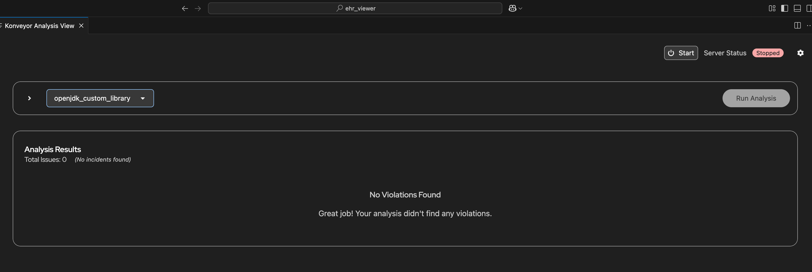
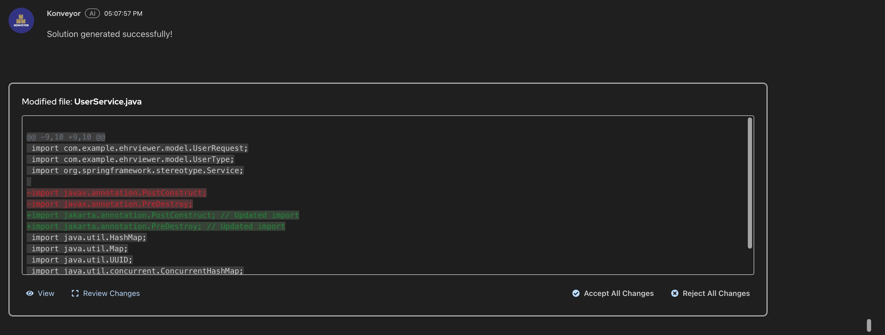

# Migrating healthcare apps using Kai solution server

- [Migrating healthcare apps using Kai solution server](#migrating-healthcare-apps-using-kai-solution-server)
  - [Goal](#goal)
  - [Overview](#overview)
  - [Prerequisites](#prerequisites)
  - [Step 1: Setup](#step-1-setup)
    - [Clone the Inventory Management System](#clone-the-inventory-management-system)
    - [Clone the EHR Viewer Application](#clone-the-ehr-viewer-application)
  - [Step 2: Migration using solution server](#step-2-migration-using-solution-server)
    - [2.1 Migrate Inventory Management](#21-migrate-inventory-management)
    - [2.2 Migrate EHR Viewer](#22-migrate-ehr-viewer)
  - [Step 3: Solution Server Benefits](#step-3-solution-server-benefits)
  - [Step 4: Deploy and Run the Applications](#step-4-deploy-and-run-the-applications)
  - [Conclusion](#conclusion)

## Goal

Migrate an outdated audit logging library (v1) to a modern streaming-based audit library (v2). We will use custom rules with Kai to analyze both applications and generate refactoring recommendations. Furthermore, we will use the **Solution Server**, through which we demonstrate how migration patterns learned from the first application can be automatically applied to the second application.

## Overview

In this scenario, we will showcase the capabilities of Kai's **Solution Server** in learning from one migration and applying those patterns to accelerate similar migrations. We will demonstrate how the Solution Server captures successful migration patterns and provides contextual hints and success metrics for future migrations.

We will focus on migrating two healthcare applications that use a custom audit logging library, showing how the Solution Server learns from the first migration and significantly accelerates the second one.

### Solution Server Capabilities

The Solution Server delivers two primary benefits to users of Kai:

- **Contextual Hints**: It surfaces examples of past migration solutions—including successful user modifications and accepted fixes—enabling Kai to offer actionable hints for difficult or previously unsolved migration problems.

- **Migration Success Metrics**: It exposes detailed success metrics for each migration rule, derived from past migrations. These metrics present users with a "confidence level" or likelihood of Kai successfully migrating a given code segment.

### Custom Rules for Audit Library Migration

This scenario uses custom migration rules specifically designed for the audit logging library migration:

#### Rule 3: Logger Implementation (`audit-logging-0003`)

```yaml
ruleID: audit-logging-0003
description: Replace `FileSystemAuditLogger` instantiation with `StreamableAuditLogger` over TCP
category: mandatory
effort: 3
when:
  java.referenced:
    pattern: com.enterprise.audit.logging.service.FileSystemAuditLogger
    location: IMPORT
message: Direct instantiation of `FileSystemAuditLogger` is deprecated. Use `StreamableAuditLogger` configured for TCP streaming.
```

**Migration Point:**

- **Pattern**: Replace `FileSystemAuditLogger` with `StreamableAuditLogger`
- **Before**: `new FileSystemAuditLogger(config)`
- **After**: `new StreamableAuditLogger(config)`
- **Impact**: Enables TCP streaming to centralized logging infrastructure

## Prerequisites

- [VSCode](https://code.visualstudio.com/download)
- [Git](https://git-scm.com/downloads)
- AI credentials
- [Maven](https://maven.apache.org/install.html)
- Kai with Solution Server enabled
- Java 21
- Maven 3.6+
- Logstash running on port 5000 (for audit streaming)

Additionally, you will need to have the Kai IDE plugin installed in VSCode with Solution Server enabled.
Download the latest from [here](https://github.com/konveyor/editor-extensions/releases).

## Step 1: Setup

TODO: setup Kai

### Clone the Inventory Management System

1. Clone the Medical Device Inventory Management application:

   ```bash
   git clone https://github.com/savitharaghunathan/inventory_management.git
   cd inventory_management
   git checkout partial
   ```

2. Navigate to File > Open in VSCode and locate the folder we just cloned.

### Clone the EHR Viewer Application

1. Clone the EHR Viewer application:

   ```bash
   git clone https://github.com/hhpatel14/ehr_viewer.git
   cd ehr_viewer
   git checkout partial
   ```

2. Open this folder in a separate VSCode window.

## Step 2: Migration using solution server

### 2.1 Migrate Inventory Management

1. **Run Analysis**: Start Kai analysis on the inventory management project

#### Configure Analysis Profile

Configure the analysis profile by selecting the settings icon as shown in the image:


In the configuration dialog, set up the profile with the following values:


**Configuration Values:**

- **Profile Name**: `openjdk-custom-library` (or any descriptive name)
- **Migration Targets**: Select `openjdk21` from the available targets

#### Select Custom Rules

Select the `rules` folder for the custom rules. Navigate to the rules directory and ensure the custom audit logging rules are included:


#### Start the Server and Run Analysis

Start the Kai server with the configured profile:


Run the analysis on the inventory management project:


#### The Analysis Results

Kai quickly identifies several migration issues in the codebase. The analysis shows violations related to the outdated audit library dependency and deprecated logger implementation patterns.

| #   | Issue Title (Rule)                                                                      | Incidents | Explanation shown                                                                                                                                                          | File & Line(s)                                                                                                                                                         |
| --- | --------------------------------------------------------------------------------------- | --------- | -------------------------------------------------------------------------------------------------------------------------------------------------------------------------- | ---------------------------------------------------------------------------------------------------------------------------------------------------------------------- |
| 1   | **Replace `FileSystemAuditLogger` instantiation with `StreamableAuditLogger` over TCP** | 1         | “Direct instantiation of `FileSystemAuditLogger` is deprecated. Use `StreamableAuditLogger` configured for TCP streaming.”                                                 | `/src/main/java/com/example/inventorymanagement/service/InventoryService.java:7`                                                                                       |
| 2   | **The `java.annotation` (Common Annotations) module has been removed from OpenJDK 11**  | 2         | “Add the `jakarta.annotation` dependency to your application’s `pom.xml`.”<br>`<groupId>jakarta.annotation</groupId>`<br>`<artifactId>jakarta.annotation-api</artifactId>` | `/src/main/java/com/example/inventorymanagement/service/InventoryService.java:12`<br>`/src/main/java/com/example/inventorymanagement/service/InventoryService.java:13` |

#### Fix 1: The Logger Implementation

The FileSystemAuditLogger violation requires replacement with StreamableAuditLogger. Let's work through this fix step by step.

##### Step 1: Request a Solution

Click on the tool icon to request a solution from Kai:


##### Step 2: Review Kai's Initial Solution

Kai provides an initial solution for the logger replacement:


The LLM suggests a basic replacement but lacks specific knowledge of the custom `AuditConfiguration` class. This enterprise-specific library isn't part of the LLM's public training data.

##### Step 3: View Kai's Reasoning

Kai shows its reasoning process for the suggested fix:


##### Step 4: Review the Complete Solution

View the detailed solution with the complete configuration:


##### Step 5: Manual Intervention Required

The LLM's initial suggestion is incomplete because it lacks knowledge of the custom `AuditConfiguration` class and its required parameters. This enterprise-specific audit library isn't part of the LLM's public training data, so it cannot generate the complete configuration pattern.

Update the migration suggestion with the following complete configuration:

```java
// Complete configuration required
AuditConfiguration config = new AuditConfiguration();
config.setStreamHost(System.getenv().getOrDefault("AUDIT_STREAM_HOST", "localhost"));
config.setStreamPort(Integer.parseInt(System.getenv().getOrDefault("AUDIT_STREAM_PORT", "5000")));
config.setStreamProtocol(System.getenv().getOrDefault("AUDIT_STREAM_PROTOCOL", "tcp"));
auditLogger = new StreamableAuditLogger(config);
```


**Solution Server Learning:** Once this manually-crafted solution is accepted, the Solution Server captures the complete configuration pattern, including the custom class usage, environment variable conventions, and TCP streaming setup. This knowledge becomes available for future similar migrations, eliminating the need for manual intervention in subsequent projects.

##### Step 6: Apply the Changes

Apply the changes to complete the fix:


#### Fix 2: Jakarta Annotations Migration

The second violation involves updating Java annotations from `javax` to `jakarta` for Java 21 compatibility.

##### Step 1: Analyze the Jakarta Annotation Issue

Review the analysis results for the Jakarta annotation violations:


##### Step 2: Review Kai's Solution

Kai provides a solution for updating the annotations:


##### Step 3: Review the Complete Solution

Review the detailed solution with all necessary changes:


##### Step 4: Apply the Jakarta Changes

Apply the changes to update the annotations:


#### Migration Complete - All Issues Resolved

Once all fixes are applied, the analysis shows zero remaining issues:


All violations have been successfully resolved, and the inventory management application is now fully migrated.

### 2.2 Migrate EHR Viewer

Open the EHR viewer project in a separate VSCode window and run the same Kai analysis with identical migration targets and custom rules.

#### Start EHR Analysis with Same Profile

Use the same analysis profile that was configured for the inventory management system:



Start the analysis on the EHR viewer project:


#### Analysis Results

**Total Issues:** 2 _(3 incidents found)_

| #   | Issue                                                                                                                                                                                                                     | Incidents | Files                                                                                                                                    |
| --- | ------------------------------------------------------------------------------------------------------------------------------------------------------------------------------------------------------------------------- | --------- | ---------------------------------------------------------------------------------------------------------------------------------------- |
| 1   | Replace **`FileSystemAuditLogger`** instantiation with **`StreamableAuditLogger`** over TCP<br>_Direct instantiation of `FileSystemAuditLogger` is deprecated. Use `StreamableAuditLogger` configured for TCP streaming._ | 1         | `/src/main/java/com/example/ehrviewer/service/UserService.java:7`                                                                        |
| 2   | **`java.annotation`** module removed in OpenJDK 11<br>_Add the `jakarta.annotation` dependency to `pom.xml`._                                                                                                             | 2         | `/src/main/java/com/example/ehrviewer/service/UserService.java:13`<br>`/src/main/java/com/example/ehrviewer/service/UserService.java:14` |


#### Fix 1: Logger Implementation

Here's where the Solution Server truly shines. The same `FileSystemAuditLogger` violation appears, but instead of the incomplete suggestion you saw before, Kai now provides the complete, working configuration.

##### Step 1: Review EHR Analysis Results

The analysis results show the same logger implementation violation:


##### Step 2: Request Fix with Solution Server Enhancement

Click on the tool icon to request a fix - notice how the Solution Server now provides enhanced suggestions:


##### Step 3: Review Enhanced Solution

Kai now provides the complete, working configuration based on the learned patterns from the inventory management migration:


```java
// Previously required manual work, now auto-generated by Solution Server
AuditConfiguration config = new AuditConfiguration();
config.setStreamHost(System.getenv().getOrDefault("AUDIT_STREAM_HOST", "localhost"));
config.setStreamPort(Integer.parseInt(System.getenv().getOrDefault("AUDIT_STREAM_PORT", "5000")));
config.setStreamProtocol(System.getenv().getOrDefault("AUDIT_STREAM_PROTOCOL", "tcp"));
auditLogger = new StreamableAuditLogger(config);
```

##### Step 4: View Solution Server Reasoning

The Solution Server shows its reasoning based on the previously learned patterns:


##### Step 5: Review Changes

Review the complete changes that will be applied:


##### Step 6: Accept the Solution

Accept the enhanced solution that was automatically generated:


What previously required manual research and implementation is now automatically suggested based on the Solution Server's learned knowledge.

#### Fix 2: Jakarta Annotations Migration

The second violation involves updating Java annotations from `javax` to `jakarta` for Java 21 compatibility.

##### Step 1: Analyze the Jakarta Annotation Issue

Review the analysis results for the Jakarta annotation violations in the EHR application:


Notice how the analysis now includes success metrics derived from the previous inventory management migration.

These confidence levels indicate the likelihood of successful migration based on learned patterns and real-world usage data from the Solution Server.

##### Step 2: Apply Jakarta Changes with Solution Server Enhancement

The Solution Server provides enhanced suggestions for the Jakarta annotation updates based on the patterns learned from the inventory management migration:



What makes this remarkable is that the Solution Server doesn't just copy patterns - it adapts them. The learned configuration patterns are applied to the EHR context while maintaining the technical correctness that was manually validated in the inventory management migration.

The migration that previously would have required the same manual research and domain expertise now flows smoothly, with high-confidence suggestions based on proven patterns.

## Step 3: Solution server benefits

### Compare migration experiences

| First migration (Inventory Management) | Second migration (EHR Viewer)             |
| -------------------------------------- | ----------------------------------------- |
| Manual pattern discovery               | Contextual hints from Solution Server     |
| Trial and error with configurations    | Pre-validated patterns and configurations |
| Time-intensive troubleshooting         | Significantly faster resolution           |

Throughout this migration process, you would have noticed:

- **Time to completion**: EHR migration is comparatively faster
- **Error rate**: Reduced failed attempts on similar violations
- **Consistency**: Both applications use identical audit patterns

### Solution Server Knowledge Base

After both migrations, the Solution Server contains:

- **Audit library migration patterns** for healthcare applications
- **Success metrics** showing high confidence for similar future migrations

## Step 4: Deploy and Run the Applications

### 4.1 Configure Logstash for Audit Streaming

Both applications now use the v2 audit library with TCP streaming capabilities. Set up Logstash to receive and process audit events.

#### Start Logstash Container

```bash
podman run -d --name logstash -p 5000:5000 \
  -v $(pwd)/logstash.conf:/usr/share/logstash/pipeline/logstash.conf \
  -v $(pwd)/logstash.yml:/usr/share/logstash/config/logstash.yml \
  docker.elastic.co/logstash/logstash:8.11.0
```

### 4.2 Build and Run Inventory Management

1. **Build the Application**

   ```bash
   cd inventory_management
   mvn clean compile
   ```

2. **Start the Application**

   ```bash
   mvn spring-boot:run
   ```

3. **Test the API**
   ```bash
   curl -X GET "http://localhost:8080/api/medical-devices?userId=user123"
   ```

### 4.3 Build and Run EHR Viewer

1. **Build the Application**

   ```bash
   cd ehr_viewer
   mvn clean compile
   ```

2. **Start the Application**

   ```bash
   mvn spring-boot:run
   ```

3. **Test the Web UI**
   - Navigate to: `http://localhost:8081/ui/login`
   - Use sample credentials: `johndoe` / `password1`
   - Follow the steps from the [EHR README](https://github.com/hhpatel14/ehr_viewer/tree/java21?tab=readme-ov-file#1-login)

### 4.4 Verify Audit Streaming

Check that both applications are sending audit events to Logstash:

```bash
# Check inventory management audit events
podman logs logstash | grep "InventoryService"

# Check EHR viewer audit events
podman logs logstash | grep "UserService"
```

Expected output shows structured JSON audit events with consistent patterns learned by the Solution Server:

```json
{"timestamp":"2024-01-15T10:30:45.123Z","event_type":"MEDICAL_DEVICE_VIEW","application":"MedicalDeviceInventory"...}
{"timestamp":"2024-01-15T10:31:12.456Z","event_type":"PATIENT_RECORD_VIEW","application":"EHRViewer"...}
```

## Conclusion

This scenario demonstrates how Kai's **Solution Server** transforms enterprise migrations by learning from successful patterns. What began as manual research and custom configuration for the inventory management system became automated, high-confidence solutions for the EHR viewer resulting in reduced migration time.

Key benefits demonstrated:

- **Contextual hints**: Domain-specific guidance based on past successes
- **Success metrics**: Confidence levels help prioritize migration efforts
- **Consistency**: Ensures uniform patterns across related applications

By continuously learning from completed migrations, the solution server makes each new similar migration incrementally more efficient.
