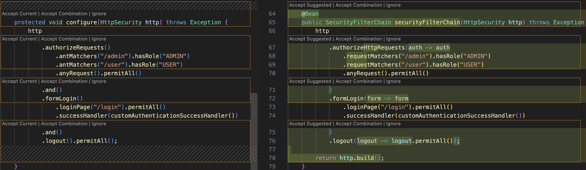
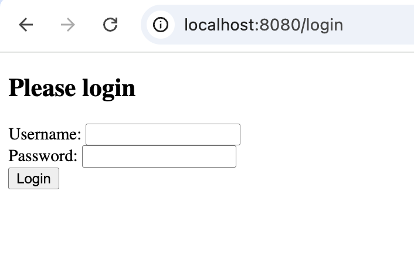

# Modernizing a Spring Boot 2 Application to Spring Boot 3 Using Konveyor AI

## Goal

This scenario demonstrates how **Konveyor AI (Kai)** can streamline the migration of a **Spring Boot 2** application to **Spring Boot 3**, **Java 17**, and **Jakarta EE**. We will use a combination of **default** and **custom rules** to:

- Detect deprecated APIs like `WebSecurityConfigurerAdapter`
- Update `javax.*` imports to `jakarta.*`
- Ensure compliance with Java 17

The sample application used is [`springboot_simplelogin`](https://github.com/savitharaghunathan/springboot_simplelogin), and the custom rules are located [here](https://github.com/savitharaghunathan/custom_rules/tree/main/springlogin).

## Background

Spring Boot 3 enforces significant changes including:

- Jakarta EE 9+ migration (`javax.*` -> `jakarta.*`)
- Java 17 as the baseline JDK
- Removal of legacy security configurations

These changes often break compilation and require manual refactoring. With Kai, developers can:

- Automatically identify and resolve breaking changes
- Get LLM-powered refactoring suggestions
- Apply consistent migration patterns across projects using custom rules

## Prerequisites

- [VSCode](https://code.visualstudio.com/download)
- [Git](https://git-scm.com/downloads)
- [GenAI credentials](https://github.com/konveyor/kai/blob/main/docs/llm_selection.md#openai-service)
- Java 17
- Maven 3.9+
- Sample App: [`springboot_simplelogin`](https://github.com/savitharaghunathan/springboot_simplelogin)
- Kai VSCode IDE Extension `v0.1.0`

## Step 1: Set Up Environment

### 1.1 Clone the Sample App and custom rules

```bash
git clone https://github.com/savitharaghunathan/springboot_simplelogin.git

git clone https://github.com/savitharaghunathan/custom_rules.git

```

### 1.2 Install Kai VSCode Extension

Follow the [official guide](https://github.com/konveyor/kai/blob/main/docs/installation.md) for installation instructions.

## Step 2: Understand the Custom Rules

Before we run the analysis, let’s understand the custom rules we are going to use for migrating from Spring Boot 2 to Spring Boot 3, focusing specifically on the removal of `WebSecurityConfigurerAdapter` and discouraged configuration overrides.

### 2.1. Custom Rule for Deprecated configure(AuthenticationManagerBuilder) Method

The `SecurityConfig.java` class configures users and roles using the now-discouraged configure `(AuthenticationManagerBuilder auth)` method:

#### Before Migration

```java

@Override
protected void configure(AuthenticationManagerBuilder auth) throws Exception {
    auth.inMemoryAuthentication()
        .withUser("user").password(passwordEncoder().encode("userpass")).roles("USER")
        .and()
        .withUser("admin").password(passwordEncoder().encode("adminpass")).roles("ADMIN");

    System.out.println("Encoded userpass: " + passwordEncoder().encode("userpass"));
}
```

##### Problem

Overriding `configure(AuthenticationManagerBuilder)` is discouraged in Spring Security 5.7 and won't work in Spring Boot 3/Spring 6, because `WebSecurityConfigurerAdapter` is removed.

##### Solution

Define a separate `UserDetailsService bean` to configure in-memory authentication. This approach aligns with the modular, bean-based style recommended in Spring Boot 3+

#### After Migration

```java
@Bean
public UserDetailsService userDetailsService(PasswordEncoder encoder) {
    InMemoryUserDetailsManager manager = new InMemoryUserDetailsManager();
    manager.createUser(User.withUsername("user")
        .password(encoder.encode("userpass"))
        .roles("USER").build());
    manager.createUser(User.withUsername("admin")
        .password(encoder.encode("adminpass"))
        .roles("ADMIN").build());
    return manager;
}
```

#### Corresponding custom rule

````yaml
- ruleID: spring-security-replace-authenticationmanagerbuilder-00001
  description: configure(AuthenticationManagerBuilder) override is discouraged since Spring Security 5.7.
  category: mandatory
  effort: 2
  labels:
    - konveyor.io/source=spring-boot2
    - konveyor.io/target=spring-boot3+
  when:
    java.referenced:
      location: METHOD
      pattern: configure(org.springframework.security.config.annotation.authentication.builders.AuthenticationManagerBuilder) *
  message: |
    Overriding `configure(AuthenticationManagerBuilder)` is **discouraged** in Spring Security 5.7.
    Instead, define a `UserDetailsService` and `PasswordEncoder` bean.

    **Fix:** Move user setup into a `UserDetailsService` bean like this:

    ```java
    @Bean
    public UserDetailsService userDetailsService(PasswordEncoder encoder) {
        InMemoryUserDetailsManager manager = new InMemoryUserDetailsManager();
        manager.createUser(User.withUsername("user")
            .password(encoder.encode("userpass"))
            .roles("USER").build());
        manager.createUser(User.withUsername("admin")
            .password(encoder.encode("adminpass"))
            .roles("ADMIN").build());
        return manager;
    }
    ```

  links:
    - title: "Spring Blog - Security without WebSecurityConfigurerAdapter"
      url: https://spring.io/blog/2022/02/21/spring-security-without-the-websecurityconfigureradapter
````

### 2.2. Custom Rule for Deprecated configure(HttpSecurity) Method

The class also overrides the configure(HttpSecurity http) method to define security rules,
login flow, and redirects

#### Before Migration

```java
@Override
protected void configure(HttpSecurity http) throws Exception {
    http
        .authorizeRequests()
            .antMatchers("/admin").hasRole("ADMIN")
            .antMatchers("/user").hasRole("USER")
            .anyRequest().permitAll()
        .and()
        .formLogin()
            .loginPage("/login").permitAll()
            .successHandler(customAuthenticationSuccessHandler())
        .and()
        .logout().permitAll();
}
```

##### Problem

Overriding `configure(HttpSecurity)` is discouraged in Spring Security 5.7. This approach is no longer recommended due to the deprecation of `WebSecurityConfigurerAdapter` in Spring Boot 3+.

##### Solution

Declare a `SecurityFilterChain` bean to define all your security logic. Additionally, update `antMatchers()` to `requestMatchers()` in Spring Security 6+.

#### Updated Code (After Migration)

```java
@Bean
public SecurityFilterChain securityFilterChain(HttpSecurity http) throws Exception {
    http
        .authorizeHttpRequests(auth -> auth
            .requestMatchers("/admin").hasRole("ADMIN")
            .requestMatchers("/user").hasRole("USER")
            .anyRequest().permitAll()
        )
        .formLogin(form -> form
            .loginPage("/login").permitAll()
            .successHandler(customAuthenticationSuccessHandler())
        )
        .logout(logout -> logout.permitAll());

    return http.build();
}
```

#### custom rule

````yaml
- ruleID: spring-security-replace-httpsecurity-configure-00002
  description: configure(HttpSecurity) override is discouraged since Spring Security 5.7
  category: mandatory
  effort: 2
  labels:
    - konveyor.io/source=spring-boot2
    - konveyor.io/target=spring-boot3+
  when:
    java.referenced:
      location: METHOD
      pattern: configure(org.springframework.security.config.annotation.web.builders.HttpSecurity) *
  message: |
    Overriding `configure(HttpSecurity)` is **discouraged** in Spring Security 5.7.
    Replace it by declaring a `SecurityFilterChain` bean.

    **Fix:**
    ```java
    @Bean
    public SecurityFilterChain securityFilterChain(HttpSecurity http) throws Exception {
        http
            .authorizeHttpRequests(auth -> auth
                .requestMatchers("/admin").hasRole("ADMIN")
                .requestMatchers("/user").hasRole("USER")
                .anyRequest().permitAll()
            )
            .formLogin(form -> form
                .loginPage("/login").permitAll()
                .successHandler(customAuthenticationSuccessHandler())
            )
            .logout(logout -> logout.permitAll());

        return http.build();
    }
    ```

    preferred import - `import org.springframework.security.web.SecurityFilterChain;`

  links:
    - title: "Spring Blog - Security without WebSecurityConfigurerAdapter"
      url: https://spring.io/blog/2022/02/21/spring-security-without-the-websecurityconfigureradapter
````

You can learn more about writing your own custom rules [here](https://github.com/konveyor/kai/blob/main/docs/custom_ruleset.md).

## Step 3: Configure and Run Analysis

Once you've installed the Konveyor AI VSCode extension and opened your project, follow these steps to configure and run an analysis using your custom rules.

### 3.1 Add Custom Rules

1. Open the `Welcome -> Setup Konveyor panel`.
2. Click on `Configure Custom Rules`.
3. From the dialog, select the folder containing your custom rules (e.g., `custom_rules/springlogin`) and click Select Custom Rules.


### 3.2 Enable Default Rulesets

When prompted, choose “Yes” to also include Konveyor's built-in default rulesets.


**Note:** This ensures both custom and default rules are applied during analysis.

### 3.3 Select the following targets

Click on `configure Sources and Targets` and select the following targets

- cloud-readiness
- jakarta-ee
- openjdk17

Since the custom rules contain a custom target for Springboot3 rules, we need to configure the label selector. Click on `Configure Analysis Label Selector` and add the target `(konveyor.io/target=spring-boot3+)` and press `Enter`.


Your `settings.json` file should look like this

```yaml
{
  "konveyor.analysis.labelSelector": "(konveyor.io/target=cloud-readiness || konveyor.io/target=jakarta-ee || konveyor.io/target=openjdk17) || (konveyor.io/target=spring-boot3+) || (discovery)",
  "konveyor.analysis.customRules":
    ["/Users/sraghuna/local_dev/custom_rules/springlogin"],
  "konveyor.analysis.useDefaultRulesets": true,
}
```

### 3.3 Open Analysis Panel

Click on `Open Analysis Panel` to view and manage your analysis tasks.


### 3.4 Start the Analyzer Server

In the top-right corner of the Analysis Panel, click `Start` to launch the analysis server.


### 3.5 Run Analysis

Once the server is running, click `Run Analysis` to scan the project and identify issues based on the configured rulesets.


## 4. Analysis and Kai Resolutions

### 4.1 Review Analysis Results

After running the analysis, the `Konveyor Analysis View` shows a list of detected issues:


Issues include:

- Deprecated usage of `configure(AuthenticationManagerBuilder)`
- Deprecated usage of `configure(HttpSecurity)`
- `javax.*` to `jakarta.*` namespace migration
- Incompatible Spring Boot and Spring version for Jakarta EE 9+

### 4.2 Fix Spring Boot Compatibility with Jakarta EE 9+

Click the tool icon next to the issue: **"Version of Spring Boot not compatible with Jakarta EE 9+"**


Once processed, the resolution is shown and a file diff appears for `pom.xml`:


Update includes:

- Spring Boot version: `2.7.4` -> `3.0.0`
- Java version: `8` -> `17`


Click on `check` icon to accept and apply the resolution.


The analysis will re-run and update the incidents.

### 4.3 Fix Deprecated Security Config (`AuthenticationManagerBuilder`)

Click the tool icon next to: **"configure(AuthenticationManagerBuilder) override is discouraged since Spring Security 5.7."**


Click the eye icon to view the diff


Kai provides a code suggestion to the recommended `UserDetailsService` bean:


After applying the resolution, you will see the analysis re-run and update the incidents.

### 4.4 Fix Deprecated Security Config (`HttpSecurity`)

Click the tool icon next to: **"configure(HttpSecurity) override is discouraged since Spring Security 5.7."**


Click the eye icon to review the diff.


Kai provides a recommended bean-based configuration:




The suggested code replaces the deprecated method:

```java
@Bean
public SecurityFilterChain securityFilterChain(HttpSecurity http) throws Exception {
    http
        .authorizeHttpRequests(auth -> auth
            .requestMatchers("/admin").hasRole("ADMIN")
            .requestMatchers("/user").hasRole("USER")
            .anyRequest().permitAll()
        )
        .formLogin(form -> form
            .loginPage("/login").permitAll()
            .successHandler(customAuthenticationSuccessHandler())
        )
        .logout(logout -> logout.permitAll());

    return http.build();
}
```

Once you have verified the changes, apply the resolution. Analysis will re-run once again and update the issues list.


### 4.5 Replace `javax.*` with `jakarta.*`

Click the tool icon next to the issue: **"The package 'javax' has been replaced by 'jakarta'."**


Click the eye icon to review the changes in the files,

- `SecurityConfig.java`
- `LoginController.java`


Kai suggests updating the import statement:

```diff
- import javax.servlet.http.HttpServletRequest;
+ import jakarta.servlet.http.HttpServletRequest;
```

After applying the changes to both the files, Kai will re-run analysis and update that no incidents found.


The table below summarizes the key changes when migrating Spring Security configurations from Spring Boot 2 to Spring Boot 3 using custom rules. These updates reflect the shift away from inheritance-based configuration (e.g., `WebSecurityConfigurerAdapter`) toward a fully component-based model using `@Bean` definitions.

| **Area**             | **Old Usage**                                                             | **New Recommended Pattern**                              |
| -------------------- | ------------------------------------------------------------------------- | -------------------------------------------------------- |
| Authentication setup | `configure(AuthenticationManagerBuilder)` with `inMemoryAuthentication()` | `@Bean UserDetailsService`                               |
| Security rules       | `configure(HttpSecurity)`                                                 | `@Bean SecurityFilterChain`                              |
| Endpoint matchers    | `antMatchers("/admin")`                                                   | `requestMatchers("/admin")`                              |
| Class structure      | `extends WebSecurityConfigurerAdapter`                                    | No inheritance. configuration is based on bean injection |

### Manual Fix Example

Kai may not automatically resolve all instances. For example, in `User.java`, update the persistence import manually.

Open the file `User.java` in the `model` package:


You will see this legacy import:

```java
import javax.persistence.*;
```

replace it with

```java
import jakarta.persistence.*;
```


## 5. Run the app

Once all issues have been resolved and changes applied, verify that the project builds and runs successfully.

First check the modified files with `git status`:


Then build the application using:

```bash
mvn clean install
```

```bash
sraghuna@sraghuna-mac springlogin % mvn clean install
[INFO] Scanning for projects...
[INFO]
[INFO] ----------------------< com.konveyor:springlogin >----------------------
[INFO] Building springlogin 0.0.1-SNAPSHOT
[INFO]   from pom.xml
[INFO] --------------------------------[ jar ]---------------------------------
[INFO]
[INFO] --- clean:3.2.0:clean (default-clean) @ springlogin ---
[INFO] Deleting /Users/sraghuna/eclipse-workspace/springlogin/target
[INFO]
[INFO] --- resources:3.3.0:resources (default-resources) @ springlogin ---
[INFO] Copying 1 resource
[INFO] Copying 1 resource
[INFO]
[INFO] --- compiler:3.10.1:compile (default-compile) @ springlogin ---
[INFO] Changes detected - recompiling the module!
[INFO] Compiling 6 source files to /Users/sraghuna/eclipse-workspace/springlogin/target/classes
[INFO]
[INFO] --- resources:3.3.0:testResources (default-testResources) @ springlogin ---
[INFO] skip non existing resourceDirectory /Users/sraghuna/eclipse-workspace/springlogin/src/test/resources
[INFO]
[INFO] --- compiler:3.10.1:testCompile (default-testCompile) @ springlogin ---
[INFO] Changes detected - recompiling the module!
[INFO] Compiling 1 source file to /Users/sraghuna/eclipse-workspace/springlogin/target/test-classes
[INFO]
[INFO] --- surefire:2.22.2:test (default-test) @ springlogin ---
[INFO]
[INFO] -------------------------------------------------------
[INFO]  T E S T S
[INFO] -------------------------------------------------------
[INFO] Running com.konveyor.springlogin.SpringLoginApplicationTests
13:46:23.706 [main] DEBUG org.springframework.boot.test.context.SpringBootTestContextBootstrapper - Neither @ContextConfiguration nor @ContextHierarchy found for test class [SpringLoginApplicationTests]: using SpringBootContextLoader
...
...


  .   ____          _            __ _ _
 /\\ / ___'_ __ _ _(_)_ __  __ _ \ \ \ \
( ( )\___ | '_ | '_| | '_ \/ _` | \ \ \ \
 \\/  ___)| |_)| | | | | || (_| |  ) ) ) )
  '  |____| .__|_| |_|_| |_\__, | / / / /
 =========|_|==============|___/=/_/_/_/
 :: Spring Boot ::                (v3.0.0)

2025-04-11T13:46:23.866-04:00  INFO 15190 --- [           main] c.k.s.SpringLoginApplicationTests        : Starting SpringLoginApplicationTests using Java 17.0.14 with PID 15190 (started by sraghuna in /Users/sraghuna/eclipse-workspace/springlogin)
...
...

[INFO]
[INFO] Results:
[INFO]
[INFO] Tests run: 4, Failures: 0, Errors: 0, Skipped: 0
[INFO]
[INFO]
[INFO] --- jar:3.3.0:jar (default-jar) @ springlogin ---
[INFO] Building jar: /Users/sraghuna/eclipse-workspace/springlogin/target/springlogin-0.0.1-SNAPSHOT.jar
[INFO]
[INFO] --- spring-boot:3.0.0:repackage (repackage) @ springlogin ---
[INFO] Replacing main artifact with repackaged archive
[INFO]
[INFO] --- install:3.0.1:install (default-install) @ springlogin ---
[INFO] Installing /Users/sraghuna/eclipse-workspace/springlogin/pom.xml to /Users/sraghuna/.m2/repository/com/konveyor/springlogin/0.0.1-SNAPSHOT/springlogin-0.0.1-SNAPSHOT.pom
[INFO] Installing /Users/sraghuna/eclipse-workspace/springlogin/target/springlogin-0.0.1-SNAPSHOT.jar to /Users/sraghuna/.m2/repository/com/konveyor/springlogin/0.0.1-SNAPSHOT/springlogin-0.0.1-SNAPSHOT.jar
[INFO] ------------------------------------------------------------------------
[INFO] BUILD SUCCESS
[INFO] ------------------------------------------------------------------------
[INFO] Total time:  3.679 s
[INFO] Finished at: 2025-04-11T13:46:26-04:00
[INFO] ------------------------------------------------------------------------
```

You should see Maven successfully compile the project, execute tests, and package the app into a JAR file:

Look for the `BUILD SUCCESS` message, confirming that the application is packaged correctly for deployment.

You are now ready to run or deploy the modernized Spring Boot application! You can run the app locally by

```bash
mvn spring-boot:run
```

```bash
[INFO] Scanning for projects...
[INFO]
[INFO] ----------------------< com.konveyor:springlogin >----------------------
[INFO] Building springlogin 0.0.1-SNAPSHOT
[INFO]   from pom.xml
[INFO] --------------------------------[ jar ]---------------------------------
...
...


  .   ____          _            __ _ _
 /\\ / ___'_ __ _ _(_)_ __  __ _ \ \ \ \
( ( )\___ | '_ | '_| | '_ \/ _` | \ \ \ \
 \\/  ___)| |_)| | | | | || (_| |  ) ) ) )
  '  |____| .__|_| |_|_| |_\__, | / / / /
 =========|_|==============|___/=/_/_/_/
 :: Spring Boot ::                (v3.0.0)

2025-04-11T13:49:34.498-04:00  INFO 15283 --- [           main] c.k.s.SpringBoot2LoginApplication        : Starting SpringBoot2LoginApplication using Java 17.0.14 with PID 15283 (/Users/sraghuna/eclipse-workspace/springlogin/target/classes started by sraghuna in /Users/sraghuna/eclipse-workspace/springlogin)
2025-04-11T13:49:34.499-04:00  INFO 15283 --- [           main] c.k.s.SpringBoot2LoginApplication        : No active profile set, falling back to 1 default profile: "default"
2025-04-11T13:49:34.660-04:00  INFO 15283 --- [           main] .s.d.r.c.RepositoryConfigurationDelegate : Bootstrapping Spring Data JPA repositories in DEFAULT mode.
2025-04-11T13:49:34.674-04:00  INFO 15283 --- [           main] .s.d.r.c.RepositoryConfigurationDelegate : Finished Spring Data repository scanning in 12 ms. Found 1 JPA repository interfaces.
2025-04-11T13:49:34.813-04:00  INFO 15283 --- [           main] o.s.b.w.embedded.tomcat.TomcatWebServer  : Tomcat initialized with port(s): 8080 (http)
2025-04-11T13:49:34.816-04:00  INFO 15283 --- [           main] o.apache.catalina.core.StandardService   : Starting service [Tomcat]
2025-04-11T13:49:34.816-04:00  INFO 15283 --- [           main] o.apache.catalina.core.StandardEngine    : Starting Servlet engine: [Apache Tomcat/10.1.1]
...
...

```

Navigate to `localhost:8080` and you will see a login screen


Enter `user` and `userpass` as the login credentials and you will see a `Welcome User!` message


## Conclusion

With Kai, we streamlined the migration of a Spring Boot 2 app to Spring Boot 3 in the above scenario. Kai automatically detected deprecated patterns, suggested modern replacements, and applied updates with minimal manual effort.
