# IDE Integration

This document captures information related to an IDE extension for VSCode the project is exploring.

The source code for the VSCode IDE plugin is here:

- https://github.com/konveyor-ecosystem/kai-vscode-plugin
  - This extension is forked from the [WindUp project](https://windup.github.io/blog/introduction/)

To make life a little easier we are carrying some builds of the plugin in the [kai/ide/vsix](/ide/vsix) directory

## Functionality Overview

The plugin will allow you to:

- Run [Kantra](https://github.com/konveyor/kantra), Konveyor's static code analysis CLI tool
- View the migration issues Kantra discovered
- Select a file and generate a code fix for the migration issues Kantra found
  - As of April 2024 the IDE will connect to a Kai instance running on localhost
  - Integration to have Kai run alongside a Konveyor instance is planned towards later portion of Summer 2024

## Installation

### Pre-requisite

#### Ensure you can run Kantra

- Please ensure you can run [Kantra](https://github.com/konveyor/kantra) from CLI of your machine. We have some example scripts to help show how to do this on MacOS via at [/samples/macos](/samples/macos)

  1. Ensure podman is running (for MacOS we need to run a podman VM): [samples/macos/restart_podman_machine.sh](/samples/macos/restart_podman_machine.sh)
  1. Fetch the Kantra binary, we will download it from a container image: [samples/macos/get_latest_kantra_cli.sh](/samples/macos/get_latest_kantra_cli.sh)

- You can run the below scripts to run an anlysis from the `example` directory:

  1. `cd example`
  1. Fetch source code to run analysis against via: [./fetch.sh](example/fetch.sh)
     - Will clone a git repo
  1. Will run Kantra to analyze the previously cloned source repo: [./analyze](example/analyze.sh)

- It is important that Kantra is able to run successfully on your machine before you proceed with the IDE extension. It will need to do a similar step of running Kantra from inside of the IDE.

#### Ensure you do NOT have an older version of MTA IDE Extension installed

- Please ensure you do NOT have a prior version of the MTA plugin installed
  

1. Click on IDE Extensions
1. Search for 'MTA'
1. If you have an MTA plugin installed, click 'Uninstall'
1. Restart your IDE

### Installation Steps

The below will guide you installing an engineering build of the VSCode Plugin which we have available as a `.vsix` file under [kai/ide/vsix](/ide/vsix) directory.

1. Download the latest `.vsix` we have available at [kai/ide/vsix](/ide/vsix)
1. Click on IDE Extensions tab on left side
1. Look at top of the IDE Extension window and click the `...` to get a drop down window
1. Click on `Install from VSIX`
   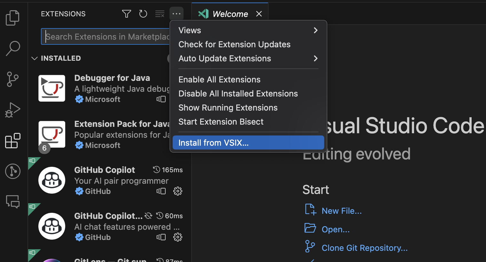
1. Select the `.vsix` file to install
1. Search the extensions and look for `MTA`.
   - As of April 2024 the extension will show as 'MTA' extension v7.0.2
1. Reload VSCode

## Using VSCode Extension

### Usage Summary

1. Open the IDE Extension panel.

   1. On the left panel you will see a list of icons below Explorer, Extensions, etc... one of those icons will say 'MTA' if you have the IDE Extension installed.
      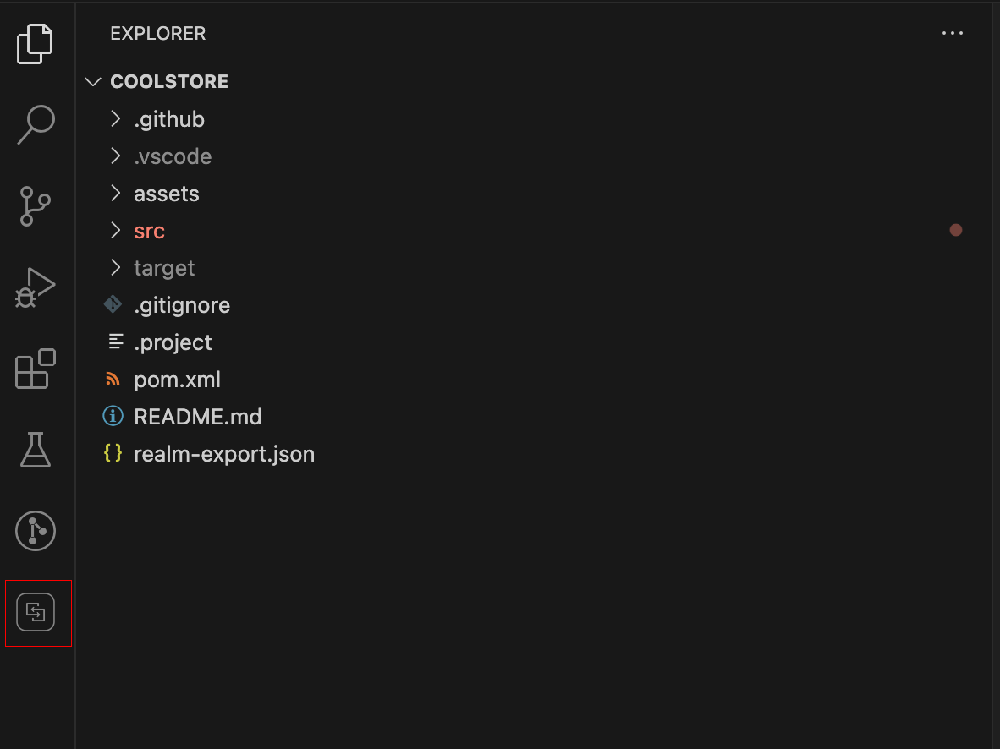
      - Click the MTA icon in the highlighted red square

1. Create a Configuration to Run Analysis (with Kantra)
   1. With the MTA panel open
      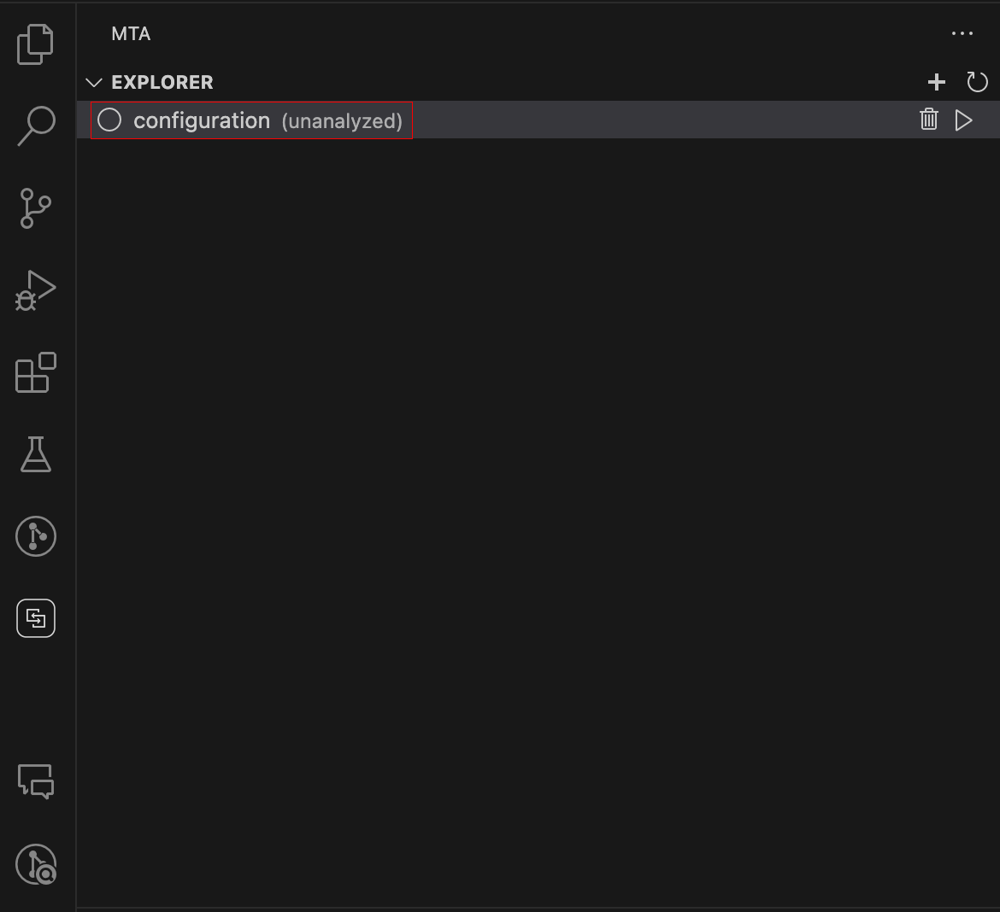
   1. If the configuration editor is not already open, click on the MTA configuration
      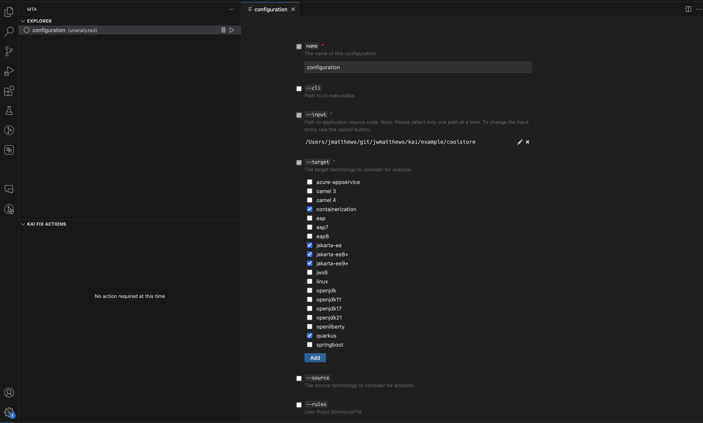 \* This is the area to configure how to run static code analysis with Kantra
1. Configure Kantra to run

   1. Specify the CLI for Kantra  
      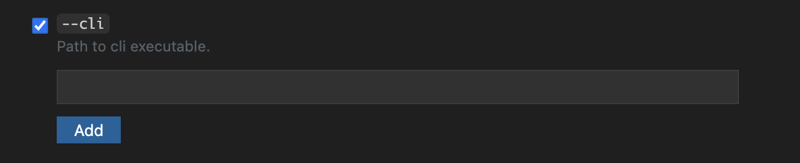

      - You can use the Kantra binary you used earlier in pre-requisite, for example our scripts will place this at [samples/bin](kai/samples/bin)

   1. Select the Targets
      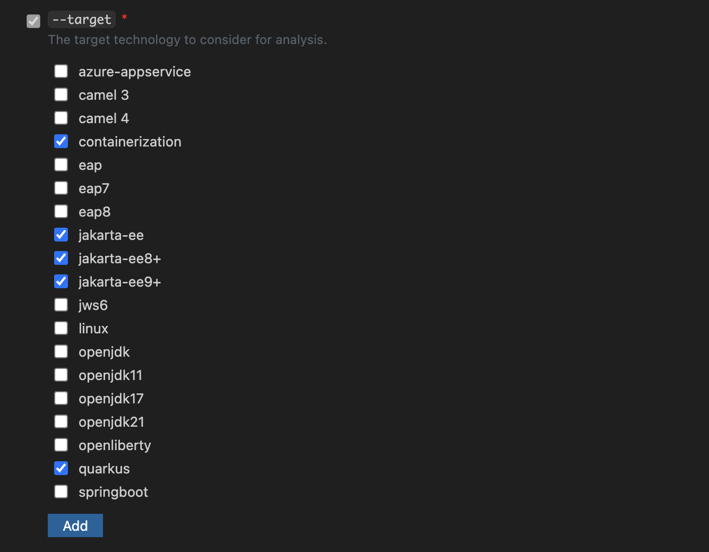
      - Select:
        - `containerizarion`
        - `jakarta-ee`
        - `jakarta-ee8+`
        - `jakarta-ee9+`
        - `quarkus`
   1. Add custom rules
      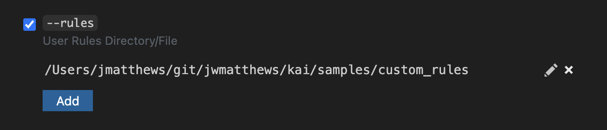

      - You can use the custom rules we supply at [samples/custom_rules](samples/custom_rules)

   1. Close the configuration editor by closing the configuration tab

1. Run the analysis

   1. Click on the triangular play button to Run the analysis
      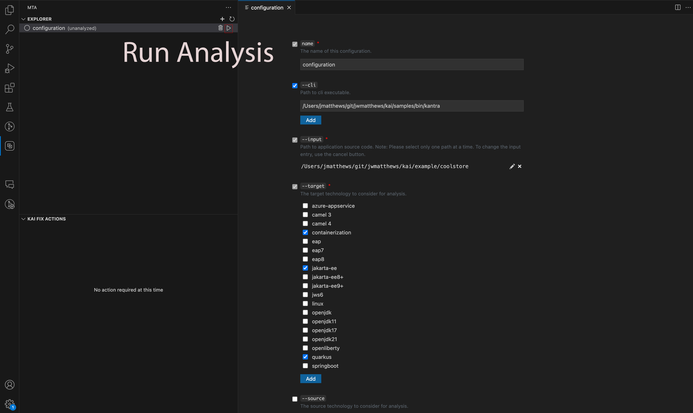
   1. Analysis will run for several minutes
      
   1. When complete you will see a popup in bottom right: 'Analysis Complete'
      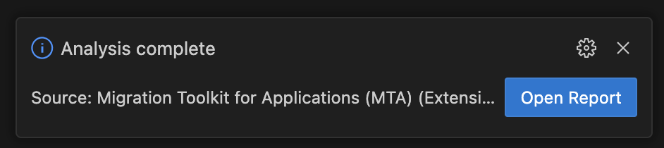
   1. [Optional]: You can open a webui view of the Analysis Report by clicking 'Open Report'
      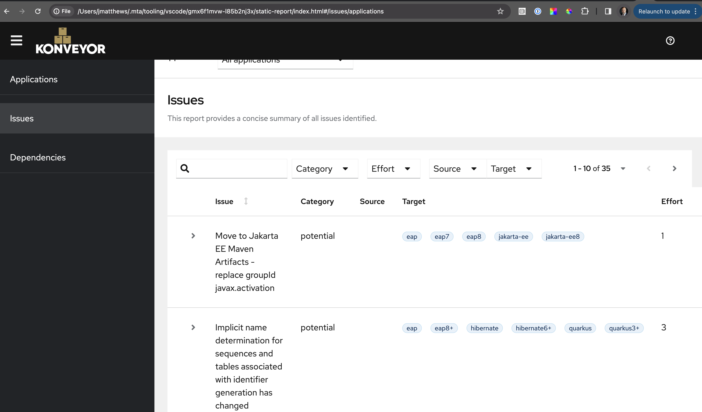

1. View the discovered issues
   1. A tree view is now populated organized by files that have issues associated
   1. You may click a specific file to open up and see where issues are identified
   1. You may click under the file name to see the 'Incidents'
   1. Right click for a popup menu to see 'View Details' of a specific incident
      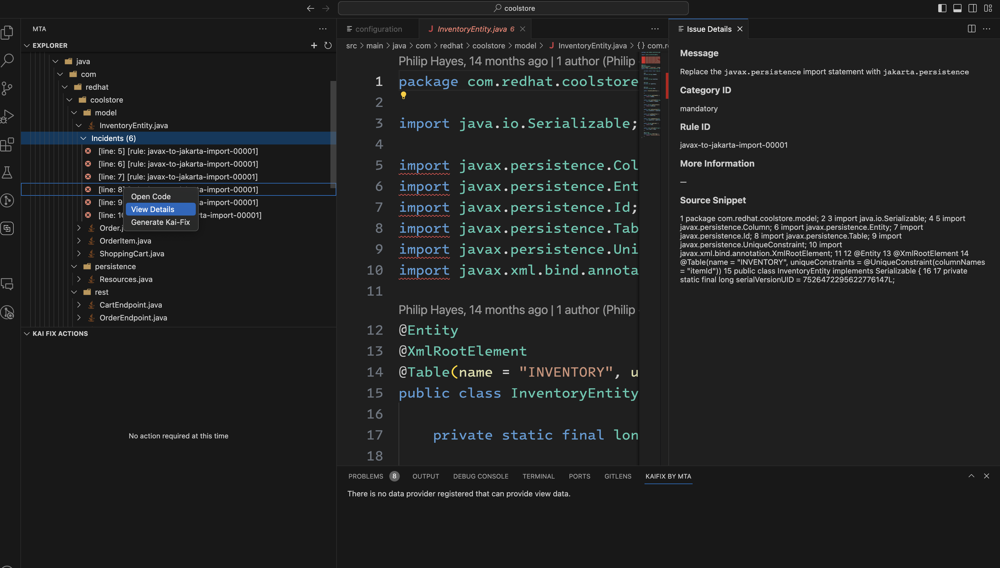
1. You may generate a fix for the file by right clicking on the file name and selecting 'Kai-Fix All'
   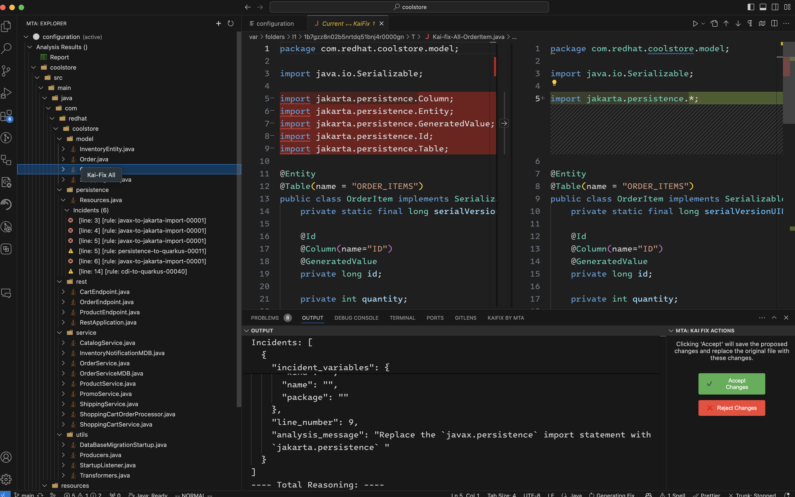
   1. After a fix has been generated you may accept or reject the changes.
   1. Accept will overwrite the original file with the updated fix, reject will discard the generated fix and leave the original file untouched.
